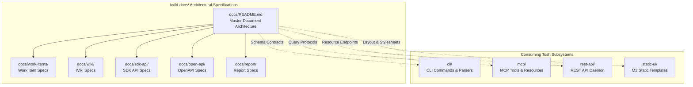
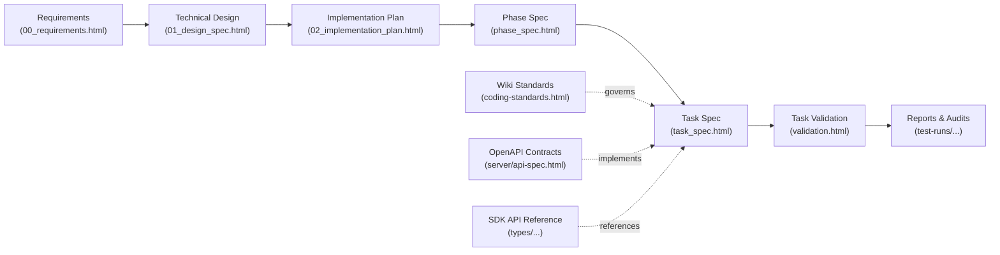

# TOSH Document System Specification

> The authoritative master architectural specification for the **Token Optimized Software Harness (`tosh`)** document ecosystem. This document defines the design-time requirements, structural schemas, metadata definitions, domain taxonomy, and granular querying models for all document types that `tosh` creates, manages, and consumes.

---

## Table of Contents

1. [Scope & Role within Build-Docs](#scope--role-within-build-docs)
2. [Core Principles & Token Economics](#core-principles--token-economics)
3. [Universal XHTML Document Standard](#universal-xhtml-document-standard)
4. [Document Domain Taxonomy](#document-domain-taxonomy)
   1. [Work Item Documents (`work-items/`)](#1-work-item-documents)
   2. [Project Wiki Documents (`wiki/`)](#2-project-wiki-documents)
   3. [SDK & Code API Documents (`sdk-api/`)](#3-sdk--code-api-documents)
   4. [OpenAPI Specifications (`open-api/`)](#4-openapi-specifications)
   5. [Report & Telemetry Documents (`report/`)](#5-report--telemetry-documents)
5. [Domain Specification Inventory & Blueprint](#domain-specification-inventory--blueprint)
6. [Target Project Runtime Layout (`.tosh/`)](#target-project-runtime-layout-tosh)
7. [Targeted Querying & XPath Extraction Patterns](#targeted-querying--xpath-extraction-patterns)
8. [Cross-Domain Graph Traversal & Traceability](#cross-domain-graph-traversal--traceability)
9. [Subsystem Integration Matrix](#subsystem-integration-matrix)
10. [Storage & Version Control Guidelines](#storage--version-control-guidelines)
11. [Rules & Constraints](#rules--constraints)
12. [Revisions](#revisions)

---

## Scope & Role within Build-Docs

During the product ideation and design phase, the [`build-docs/`](../README.md) directory establishes canonical specifications for constructing `tosh`. Within this hierarchy, `build-docs/docs/` serves as the master specification defining the data layer of the entire harness:

- **Normative Document Contracts:** Governs the required structure, XHTML schemas, semantic `<head>` metadata, and body sectioning for every artifact `tosh` generates.
- **Token-Optimized Schema Design:** Ensures documents are structured specifically for fast local extraction via XML parsers and XPath queries, minimizing LLM prompt bloat.
- **Single-Pane Visual Integration:** Guarantees every document complies with the Material Design 3 static UI specifications defined in [`build-docs/static-ui/`](../static-ui/README.md).
- **Subsystem Alignment:** Informs the command tree of the [`CLI`](../cli/README.md), the tool catalog of the [`MCP Server`](../mcp/README.md), and the data models of the [`REST API`](../rest-api/README.md).



---

## Core Principles & Token Economics

The TOSH document architecture is governed by four fundamental operational tenets:

1. **Local-First Processing:** All documents reside directly within the local workspace under `.tosh/`. Reading, querying, and updating documents occur locally without cloud latency or remote API roundtrips.
2. **Polyglot XHTML Standard:** Documents use strict XHTML 1.0/5 syntax. They are valid XML for programmatic engines (DOM, XPath, SAX) while functioning natively in standard web browsers with CSS and web components.
3. **Granular Sub-Tree Ingestion:** Agentic tools query specific XML subtrees (e.g., extracting only `//section[@id='acceptance-criteria']` or `/html/head/meta[@name='status']`). Delivering only necessary fragments achieves dramatic token savings (typically 80%–95% reduction compared to full document dumping).
4. **Graph Traceability via Metadata:** Documents maintain explicit parent-child and cross-domain references in standard `<head>` tags, forming a queryable directed acyclic graph (DAG) across requirements, designs, tasks, code, tests, and reports.

---

## Universal XHTML Document Standard

All documents across every domain inherit a standardized XHTML foundation.

### Universal Baseline Meta Tags

Every `.html` document must include these seven baseline metadata tags within the `<head>` element:

| Tag | Type | Purpose | Example |
|:---|:---|:---|:---|
| `doc-id` | String | Globally unique identifier within the workspace | `WI-20260830T170936Z:00:REQ` |
| `doc-type` | String | Classification of document schema | `requirements`, `wiki-page`, `api-class`, `report` |
| `schema-version` | SemVer | Document format schema version | `1.0.0` |
| `domain` | String | Functional document domain | `work-items`, `wiki`, `sdk-api`, `open-api`, `report` |
| `status` | Enum | Document lifecycle state | `pending`, `in-progress`, `completed`, `failed`, `blocked` |
| `created-at` | ISO-8601 | Document creation timestamp | `2026-08-30T17:10:00Z` |
| `updated-at` | ISO-8601 | Last modification timestamp | `2026-08-30T17:14:22Z` |

### Universal Base Shell

```xhtml
<!DOCTYPE html>
<html xmlns="http://www.w3.org/1999/xhtml" lang="en">
<head>
    <meta charset="UTF-8"/>
    <meta name="viewport" content="width=device-width, initial-scale=1.0"/>
    <title>Document Title</title>

    <!-- Universal Baseline Metadata -->
    <meta name="doc-id" content="DOC-UNIQUE-ID"/>
    <meta name="doc-type" content="document-type"/>
    <meta name="schema-version" content="1.0.0"/>
    <meta name="domain" content="work-items"/>
    <meta name="status" content="completed"/>
    <meta name="created-at" content="2026-09-05T18:00:00Z"/>
    <meta name="updated-at" content="2026-09-05T18:30:00Z"/>

    <!-- Domain-Specific Metadata Injected Here -->

    <!-- Material Design 3 Web Component Loader -->
    <link href="https://fonts.googleapis.com/css2?family=Roboto:wght@400;500;700&amp;display=swap" rel="stylesheet"/>
    <link href="https://fonts.googleapis.com/css2?family=Material+Symbols+Outlined" rel="stylesheet"/>
    <script type="importmap">
        {
          "imports": {
            "@material/web/": "https://esm.run/@material/web/"
          }
        }
    </script>
    <script type="module">
        import '@material/web/all.js';
        import {styles as typescaleStyles} from '@material/web/typography/md-typescale-styles.js';
        document.adoptedStyleSheets.push(typescaleStyles.styleSheet);
    </script>
</head>
<body>
    <main class="tosh-doc-container">
        <!-- Structured, semantic document content -->
    </main>
</body>
</html>
```

---

## Document Domain Taxonomy

The TOSH documentation ecosystem is partitioned into five distinct domains:

| Domain | Target Directory | Primary Focus | Canonical Specification |
|:---|:---|:---|:---|
| **Work Items** | `.tosh/work_items/` | End-to-end feature and bug execution lifecycle | [`work-items/README.md`](work-items/README.md) |
| **Project Wiki** | `.tosh/wiki/` | Long-term project knowledge, setup, standards, ADRs | [`wiki/README.md`](wiki/README.md) |
| **SDK & API** | `.tosh/sdk-api/` | Machine-indexed code structure, modules, signatures | [`sdk-api/README.md`](sdk-api/README.md) |
| **OpenAPI** | `.tosh/open-api/` | Host service schemas and consumed client contracts | [`open-api/README.md`](open-api/README.md) |
| **Reports** | `.tosh/reports/` | Token telemetry, execution audits, and validation metrics | [`report/README.md`](report/README.md) |

---

### 1. Work Item Documents

**Scope:** Work item documents orchestrate the tactical execution of a feature or bug fix from activation to pull request merge.

- **Purpose:** Provide an end-to-end audit trail and structured instructions for requirements, architecture design, multi-phase plans, individual tasks, automated verification, conversation logs, and telemetry.
- **Key Artifacts:**
  - `00_requirements.html`: Functional requirements, acceptance criteria, and constraints.
  - `01_design_spec.html`: Technical architecture, schema models, and component diagrams.
  - `02_implementation_plan.html`: High-level multi-phase roadmap and dependency tree.
  - `03_implementation_ledger.json`: Central state machine tracking task statuses and file links.
  - `03_plan_validation.html`: Pre-execution validation verdict.
  - `04_plan_summary.html`: Post-execution summary and final metrics.
  - `05_plan_conversation_summary.html`: Distilled LLM planning dialogue.
  - `06_plan_conversation_metrics.json`: Planning phase token usage and cost metrics.
  - `phases/phase_##/phase_spec.html`: Scope, prerequisites, and ordered task manifest.
  - `phases/phase_##/phase_validation.html`: Phase-level verification suite outputs and verdict.
  - `phases/phase_##/phase_summary.html`: Phase milestone completion summary.
  - `phases/phase_##/tasks/task_###/task_spec.html`: Granular task instructions and modified file targets.
  - `phases/phase_##/tasks/task_###/validation.html`: Unit/integration test results and verification logs.
  - `phases/phase_##/tasks/task_###/summary.html`: Implemented file changes, git diff summary, and PR links.
  - `phases/phase_##/tasks/task_###/conversation.jsonl`: Raw agentic interaction and tool invocation log.
  - `phases/phase_##/tasks/task_###/metrics.json`: Granular token, cost, and latency telemetry.
- **Detailed Specification:** See [`work-items/README.md`](work-items/README.md).

---

### 2. Project Wiki Documents

**Scope:** The project wiki serves as the repository for organizational and codebase knowledge that persists across work items (e.g., project overview, coding guidelines, architectural decisions, risk registry).

- **Current Status:** The specific document types, templates, and schemas for this domain are pending ideation and will be defined later.
- **Active Ideation Topic:** Tracked in [`TOPIC-002: Project Wiki Documents Domain Definition & Architecture`](../../topics/TOPIC-002-wiki-documents-domain-definition.md).
- **Detailed Specification:** See [`wiki/README.md`](wiki/README.md).

---

### 3. SDK & Code API Documents

**Scope:** Code-level API documents generated from codebase source code to provide parseable module, package, class, and interface specifications.

- **Current Status:** The specific document types, symbol representations, and generation boundaries for this domain are pending ideation and will be defined later.
- **Active Ideation Topic:** Tracked in [`TOPIC-004: SDK & Code API Documents Domain Definition & Architecture`](../../topics/TOPIC-004-sdk-api-documents-domain-definition.md).
- **Detailed Specification:** See [`sdk-api/README.md`](sdk-api/README.md).

---

### 4. OpenAPI Specifications

**Scope:** Formal service contract documentation covering both services exposed by the application and external APIs consumed by the application.

- **Confirmed Requirement:** OpenAPI-compliant JSON or YAML files will get rendered into the UI.
- **Current Status:** All other details (directory structure under `.tosh/open-api/`, transformation pipelines, endpoint querying, internal vs external service organization) are pending ideation and will be defined later.
- **Active Ideation Topic:** Tracked in [`TOPIC-003: OpenAPI Documents Rendering & Storage Architecture`](../../topics/TOPIC-003-openapi-documents-rendering-and-storage.md).
- **Detailed Specification:** See [`open-api/README.md`](open-api/README.md).

---

### 5. Report & Telemetry Documents

**Scope:** Historical, analytical, and audit documents summarizing execution performance, quality metrics, and cost economics across work items.

- **Current Status:** There is currently no definition of what reports will be in this domain. Specific report types, schemas, and aggregation mechanisms are pending ideation and will be defined later.
- **Active Ideation Topic:** Tracked in [`TOPIC-001: Report Documents Domain Definition & Architecture`](../../topics/TOPIC-001-report-documents-domain-definition.md).
- **Detailed Specification:** See [`report/README.md`](report/README.md).

---

## Domain Specification Inventory & Blueprint

To complete the design phase for the document ecosystem, each domain under `build-docs/docs/` defines canonical specifications matching the depth of `work-items/`:

| Domain Subfolder | Specification Status | Tracking Topic / Artifacts |
|:---|:---|:---|
| [`work-items/`](work-items/README.md) | **Complete (17 specs)** | 17 detailed specifications authored: `requirements.md`, `technical-design.md`, `implementation-plan.md`, `work-item-ledger.md`, `plan-validation.md`, `plan-summary.md`, `plan-conversation-summary.md`, `plan-conversation-metrics.md`, `plan-specification.md`, `phase-validation.md`, `phase-summary.md`, `task-specification.md`, `task-validation.md`, `task-summary.md`, `task-conversation.md`, `task-conversation-metrics.md`, `work-item-document-metadata-definition.md`. |
| [`wiki/`](wiki/README.md) | *Pending Ideation* | Tracked in [`TOPIC-002`](../../topics/TOPIC-002-wiki-documents-domain-definition.md) (Defining wiki document types, templates, and metadata). |
| [`sdk-api/`](sdk-api/README.md) | *Pending Ideation* | Tracked in [`TOPIC-004`](../../topics/TOPIC-004-sdk-api-documents-domain-definition.md) (Defining code API document types, granularity, and CodeGraph linkage). |
| [`open-api/`](open-api/README.md) | *In Discussion* | Tracked in [`TOPIC-003`](../../topics/TOPIC-003-openapi-documents-rendering-and-storage.md) (OpenAPI JSON/YAML rendering in UI; defining storage layout and querying). |
| [`report/`](report/README.md) | *Pending Ideation* | Tracked in [`TOPIC-001`](../../topics/TOPIC-001-report-documents-domain-definition.md) (Defining report document types, metrics, and aggregation). |

---

## Target Project Runtime Layout (`.tosh/`)

When `tosh` operates inside a project repository, it generates and maintains all document domains within a dedicated `.tosh/` root:

```
<repo-root>/
├── .tosh/
│   ├── tosh.config.json                     # Workspace configuration & schema settings
│   │
│   ├── work_items/                          # Work Item Documents Domain
│   │   ├── 20260830T170936Z_user_auth_service/
│   │   │   ├── 00_requirements.html
│   │   │   ├── 01_design_spec.html
│   │   │   ├── 02_implementation_plan.html
│   │   │   ├── 03_implementation_ledger.json
│   │   │   ├── 03_plan_validation.html
│   │   │   ├── 04_plan_summary.html
│   │   │   ├── 05_plan_conversation_summary.html
│   │   │   ├── 06_plan_conversation_metrics.json
│   │   │   └── phases/
│   │   │       ├── phase_01_database_migration/
│   │   │       │   ├── phase_spec.html
│   │   │       │   ├── phase_validation.html
│   │   │       │   ├── phase_summary.html
│   │   │       │   └── tasks/
│   │   │       │       ├── task_001_create_tables/
│   │   │       │       │   ├── task_spec.html
│   │   │       │       │   ├── validation.html
│   │   │       │       │   ├── summary.html
│   │   │       │       │   ├── conversation.jsonl
│   │   │       │       │   └── metrics.json
│   │   │       │       └── task_002_seed_data/
│   │   │       │           └── ...
│   │   │       └── phase_02_api_endpoints/
│   │   │           └── ...
│   │
│   ├── wiki/                                # Project Wiki Domain (Specification TBD - TOPIC-002)
│   │   └── ...                              # Document types and templates pending ideation
│   │
│   ├── sdk-api/                             # SDK & Code API Domain (Specification TBD - TOPIC-004)
│   │   └── ...                              # Symbol and interface documents pending ideation
│   │
│   ├── open-api/                            # OpenAPI Domain (Specification TBD - TOPIC-003)
│   │   ├── *.json / *.yaml                  # OpenAPI-compliant specs rendered into Static UI
│   │   └── ...                              # Subdirectory layout and storage architecture TBD
│   │
│   └── reports/                             # Report & Telemetry Domain (Specification TBD - TOPIC-001)
│       └── ...                              # Report types and telemetry schemas pending ideation
```

---

## Targeted Querying & XPath Extraction Patterns

The core mechanism for token conservation in `tosh` is selective XPath extraction. Instead of ingesting a 15,000-token document, the agent or CLI retrieves only the specific targeted XML subtree.

### High-Value Extraction Patterns

| Extraction Objective | Target Document | XPath Query Pattern |
|:---|:---|:---|
| **All Unfinished Tasks** | `03_implementation_ledger.json` | Direct JSON filter: `tasks[?status!='completed']` |
| **Task Acceptance Checklist** | `task_spec.html` | `//section[@id='acceptance-criteria']//md-list-item` |
| **Failed Validations** | Work item tree | `//meta[@name='doc-type' and @content='task-validation']/ancestor::head/meta[@name='validation-verdict' and @content='fail']` |
| **Target Modified Files** | `task_spec.html` | `//meta[@name='target-files']/@content` |
| **Specific Endpoint Schema** | `server/api-spec.html` | `//article[@data-endpoint='/api/v1/auth/login' and @data-method='POST']` |
| **Coding Style Rules** | `coding-standards.html` | `//section[@id='error-handling-conventions']` |
| **Method Signature & Types** | `types/AuthService.html` | `//div[@data-symbol='authenticateUser']` |

### Token Savings Comparison

```
Full Document Ingestion (Standard AI Dev Flow):
┌────────────────────────────────────────────────────────┐
│ Complete Task Spec + Design Spec + Requirements        │
│ ~12,500 Tokens                                         │
└────────────────────────────────────────────────────────┘

TOSH XPath Subtree Extraction:
┌───────────────────────────────────────┐
│ Target Checklist + File Manifest Only │
│ ~380 Tokens (96.9% reduction)         │
└───────────────────────────────────────┘
```

---

## Cross-Domain Graph Traversal & Traceability

Every document links to related entities via structured `<head>` metadata tags, enabling bi-directional navigation across domains:



### Traceability Metadata Pointers

- `implements-req`: Links designs and tasks back to requirement IDs (e.g., `REQ-001,REQ-002`).
- `parent-doc-id`: Direct parent node in the document hierarchy.
- `depends-on`: Preceding task or phase identifiers that block execution.
- `validates-artifact`: Verification documents linking to their corresponding spec or commit hash.
- `references-wiki`: Pointers to applicable coding guidelines or architectural ADRs.
- `references-api`: Links to relevant SDK type definitions or OpenAPI endpoints.

---

## Subsystem Integration Matrix

How `build-docs/docs/` specifications interact with other `build-docs/` subcomponents:

| Subsystem | Specification Path | Interface with Document System |
|:---|:---|:---|
| **CLI** | [`build-docs/cli/`](../cli/README.md) | Parses XHTML via XML DOM, evaluates XPath expressions, creates/updates ledger JSON, and runs schema validation. |
| **MCP Server** | [`build-docs/mcp/`](../mcp/README.md) | Exposes fine-grained tool calls (`tosh_query_doc`, `tosh_update_task`, `tosh_get_schema`) to LLMs without loading full files. |
| **REST API** | [`build-docs/rest-api/`](../rest-api/README.md) | Exposes document domains and ledgers as REST endpoints for third-party tooling, IDE extensions, or remote dashboards. |
| **Static UI** | [`build-docs/static-ui/`](../static-ui/README.md) | Provides the Material 3 web component templates and layout shells that render each document domain in a browser. |

---

## Storage & Version Control Guidelines

All documents under `.tosh/` are plain text (XHTML, JSON, JSONL, CSS) designed for Git version control:

1. **Source Control Tracking:** All `.tosh/` files must be committed to the repository alongside code changes. This synchronizes project knowledge across distributed human and agent collaborators.
2. **Deterministic Diffing:** Strict XHTML indentation and clean DOM hierarchy ensure human-readable git diffs during code reviews and PR evaluations.
3. **No Binary Blobs:** Binary assets (images, coverage graphs) must be linked externally or stored in dedicated assets directories; documents contain pure markup and embedded SVG where necessary.
4. **Automated State Commit:** The `tosh` CLI commits document state updates atomically with the corresponding code changes to maintain ledger integrity.

---

## Rules & Constraints

1. **Current State Design:** All documents in `build-docs/docs/` specify the active, normative design. They must contain no historical debate, rejected alternatives, or references to past superseded designs. Historical deliberations are recorded in [`topics/`](../../topics/README.md).
2. **Strict XHTML Well-Formedness:** Every document must parse successfully with an XML parser (`xml.etree`, `lxml`, `DOMParser`). Tags must be closed, attributes quoted, and ampersands escaped (`&amp;`).
3. **Mandatory Metadata:** Omission of any of the seven universal baseline tags is treated as a validation failure.
4. **Zero Runtime Bundling:** XHTML files must render natively in modern browsers with zero client-side compilation (no Webpack, Vite, or Babel step required).
5. **Revisions Section:** Every document must track modification history exclusively in the `## Revisions` table at the bottom.

---

## Revisions

| Date | Version | Description | Source |
|:---|:---|:---|:---|
| 2026-09-05 | 0.2.0 | Fully built out document ecosystem architecture: 5-domain taxonomy, specification blueprint inventory, subsystem integration matrix, `.tosh/` runtime layout, universal XHTML baseline, token querying patterns, cross-domain DAG, and linkage to ideation topics TOPIC-001 through TOPIC-004. | Build Docs Harmonization |
| 2026-08-30 | 0.1.0 | Initial outline of document domain breakdown. | Initial Document |