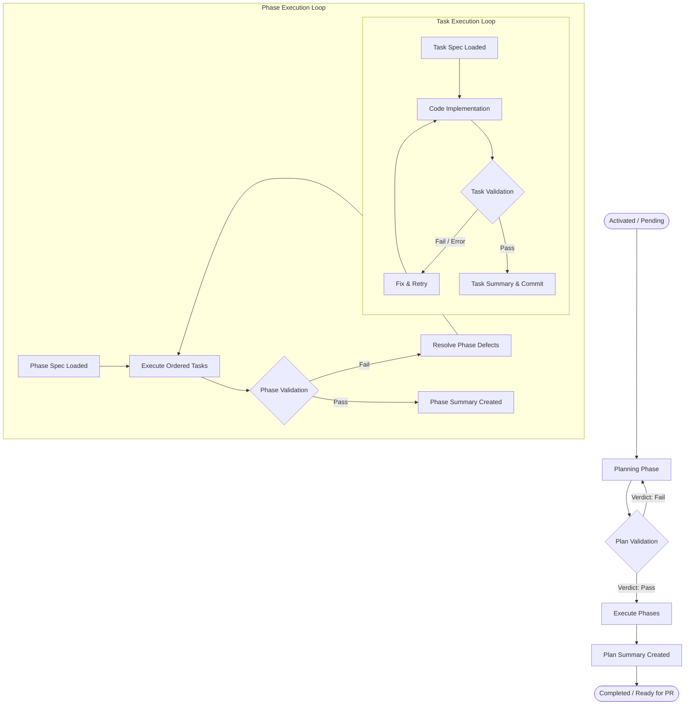
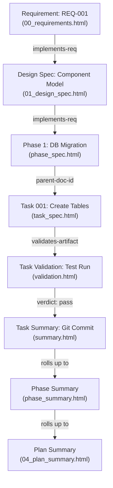

# Work Item Documents Architecture & Specification

> The authoritative master specification for the **Work Item Documents** domain within the **Token Optimized Software
Harness (`tosh`)**. This document defines the three-tier execution hierarchy, lifecycle state machine, universal XHTML
> metadata standards, directory conventions, and targeted query patterns that govern feature development from activation
> through pull request merge.

---

## Table of Contents

1. [Scope & Architectural Role](#scope--architectural-role)
2. [Three-Tier Execution Hierarchy](#three-tier-execution-hierarchy)
3. [Work Item Lifecycle & State Machine](#work-item-lifecycle--state-machine)
4. [Document Catalog & Tier Breakdown](#document-catalog--tier-breakdown)
    1. [Tier 1: Work-Item Level Documents](#tier-1-work-item-level-documents)
    2. [Tier 2: Phase Level Documents](#tier-2-phase-level-documents)
    3. [Tier 3: Task Level Documents](#tier-3-task-level-documents)
5. [Directory & File Organization Standards](#directory--file-organization-standards)
6. [Implementation Ledger (`03_implementation_ledger.json`)](#implementation-ledger-03_implementation_ledgerjson)
7. [Unified XHTML Header Metadata Standard](#unified-xhtml-header-metadata-standard)
8. [Document-Specification Metadata Matrix](#document-specification-metadata-matrix)
9. [Token Optimization & XPath Query Patterns](#token-optimization--xpath-query-patterns)
10. [Traceability & Bi-Directional Lineage](#traceability--bi-directional-lineage)
11. [Rules & Constraints](#rules--constraints)
12. [Revisions](#revisions)

---

## Scope & Architectural Role

Work item documents represent the technical execution core of `tosh`. While project wikis and API references provide
global context, work item documents drive the direct, tactical implementation of every software feature, bug fix, and
architectural refactor.

Each work item is self-contained within an isolated directory under `.tosh/work_items/`, containing all requirements,
architecture designs, implementation roadmaps, phase specifications, granular task instructions, verification test runs,
conversation transcripts, and token metrics.

### Dual-Purpose Consumption Model

Every work item document fulfills two simultaneous functions:

1. **Human Interface (Static UI):** Standalone XHTML documents render natively in standard web browsers using Material
   Design 3 Web Components (`@material/web` / **M3**). Developers navigate requirements, monitor execution progress,
   inspect diffs, and review test validation in a unified, single-pane visualizer without requiring client-side bundlers
   or runtime servers.
2. **Agent / Harness Interface (Machine Parseable):** Strict XHTML 1.0/5 compliance allows XML parsers (DOM, XPath, SAX)
   to extract granular sub-trees (e.g., acceptance checklists, modified file targets, test exit codes) in microseconds,
   delivering only essential fragments to agentic LLMs and saving 85%–97% in token consumption.

---

## Three-Tier Execution Hierarchy

To handle complex engineering workflows with deterministic control, work items decompose execution into a strict
three-tier hierarchy:

```
┌─────────────────────────────────────────────────────────────────────────┐
│ TIER 1: WORK ITEM ROOT                                                  │
│ Requirements (00) ──> Technical Design (01) ──> Implementation Plan (02)│
│ State Ledger (03) <──> Plan Validation (03) ──> Plan Summary (04)       │
└────────────────────────────────────┬────────────────────────────────────┘
                                     │
                                     ▼
┌─────────────────────────────────────────────────────────────────────────┐
│ TIER 2: PHASES                                                          │
│ Phase Specification (phase_spec.html)                                   │
│ Phase Validation (phase_validation.html)                                │
│ Phase Summary (phase_summary.html)                                      │
└────────────────────────────────────┬────────────────────────────────────┘
                                     │
                                     ▼
┌─────────────────────────────────────────────────────────────────────────┐
│ TIER 3: TASKS                                                           │
│ Task Specification (task_spec.html) ──> Verification (validation.html)  │
│ Task Summary (summary.html)         ──> Telemetry (metrics & logs)      │
└─────────────────────────────────────────────────────────────────────────┘
```

- **Tier 1 (Work Item Root):** Defines the macro problem statement, business requirements, architectural design,
  execution roadmap, centralized state ledger, pre-execution plan validation, post-execution summary, and planning
  conversation telemetry.
- **Tier 2 (Phases):** Partitions execution into ordered, logical engineering milestones (e.g., database migration,
  service layer, REST endpoints). Each phase defines strict prerequisites, blocking conditions, ordered task manifests,
  and a phase-level validation gate.
- **Tier 3 (Tasks):** The atomic unit of agent execution. Each task targets specific code files, defines granular
  instructions and checklists, executes automated tests, captures git diffs, and records raw LLM interactions and token
  telemetry.

---

## Work Item Lifecycle & State Machine

Every work item progresses through a deterministic lifecycle enforced by `03_implementation_ledger.json` and
`<meta name="status">` tags:



### Execution Gates & State Rules

1. **Plan Validation Gate:** No phase or task may begin execution until `03_plan_validation.html` records a
   `validation-verdict` of `pass`.
2. **Phase Dependency Guard:** Phase $N+1$ is blocked until Phase $N$'s `phase_validation.html` records `pass` and all
   tasks within Phase $N$ reach `status="completed"`.
3. **Task Dependency Guard:** An agent worker cannot begin a task until all task IDs listed in its `dependsOn` array in
   `03_implementation_ledger.json` are in `completed` status with passing validation verdicts.
4. **Failure Isolation:** If a task validation fails, execution halts for that task branch. The agent enters targeted
   remediation without corrupting or discarding prior successful task artifacts.

---

## Document Catalog & Tier Breakdown

The work item domain defines 16 specialized document types distributed across the three tiers:

### Tier 1: Work-Item Level Documents

| # | Document Name                 | Target Filename                     | Format | Purpose & Canonical Specification                                                                                                                                                                 |
|:--|:------------------------------|:------------------------------------|:-------|:--------------------------------------------------------------------------------------------------------------------------------------------------------------------------------------------------|
| 1 | **Requirements**              | `00_requirements.html`              | XHTML  | Captures user stories, functional/non-functional goals (RFC 2119), acceptance checklists, and Q&A. <br/>- Detailed Spec: [`requirements.md`](requirements.md)                                     |
| 2 | **Technical Design**          | `01_design_spec.html`               | XHTML  | Defines system architecture, schema models, API boundaries, micro-ADRs, AI components & tooling, and requirement traceability. <br/>- Detailed Spec: [`technical-design.md`](technical-design.md) |
| 3 | **Implementation Plan**       | `02_implementation_plan.html`       | XHTML  | Details high-level multi-phase execution strategy, phase breakdowns, dependencies, and risk mitigations. <br/>- Detailed Spec: [`implementation-plan.md`](implementation-plan.md)                 |
| 4 | **Implementation Ledger**     | `03_implementation_ledger.json`     | JSON   | Serves as the central state machine, task dependency DAG, and file pointer registry for the work item. <br/>- Detailed Spec: [`work-item-ledger.md`](work-item-ledger.md)                         |
| 5 | **Plan Validation**           | `03_plan_validation.html`           | XHTML  | Evaluates plan completeness, architectural soundness, security review, and execution readiness prior to coding. <br/>- Detailed Spec: [`plan-validation.md`](plan-validation.md)                  |
| 6 | **Plan Summary**              | `04_plan_summary.html`              | XHTML  | Post-execution rollup synthesizing overall duration, milestone achievements, completed phases/tasks, and final verdict. <br/>- Detailed Spec: [`plan-summary.md`](plan-summary.md)                |
| 7 | **Plan Conversation Summary** | `05_plan_conversation_summary.html` | XHTML  | Distills key agentic LLM dialogue, architectural decisions, and alternatives debated during planning. <br/>- Detailed Spec: [`plan-conversation-summary.md`](plan-conversation-summary.md)        |
| 8 | **Plan Conversation Metrics** | `06_plan_conversation_metrics.json` | JSON   | Captures aggregated token consumption, model latencies, tool invocations, and API costs during planning. <br/>- Detailed Spec: [`plan-conversation-metrics.md`](plan-conversation-metrics.md)     |

---

### Tier 2: Phase Level Documents

| #  | Document Name           | Target Filename                           | Format | Purpose & Canonical Specification                                                                                                                                                   |
|:---|:------------------------|:------------------------------------------|:-------|:------------------------------------------------------------------------------------------------------------------------------------------------------------------------------------|
| 9  | **Phase Specification** | `phases/{phase_id}/phase_spec.html`       | XHTML  | Details the boundaries, prerequisites, sequential task manifest, and blocking criteria for a specific phase. <br/>- Detailed Spec: [`plan-specification.md`](plan-specification.md) |
| 10 | **Phase Validation**    | `phases/{phase_id}/phase_validation.html` | XHTML  | Evaluates integration test results, cross-task deliverables, and gating criteria across all tasks in the phase. <br/>- Detailed Spec: [`phase-validation.md`](phase-validation.md)  |
| 11 | **Phase Summary**       | `phases/{phase_id}/phase_summary.html`    | XHTML  | Synthesizes execution outcomes, duration, git commit links, and roll-up metrics for a completed phase. <br/>- Detailed Spec: [`phase-summary.md`](phase-summary.md)                 |

---

### Tier 3: Task Level Documents

| #  | Document Name                 | Target Filename                      | Format | Purpose & Canonical Specification                                                                                                                                                              |
|:---|:------------------------------|:-------------------------------------|:-------|:-----------------------------------------------------------------------------------------------------------------------------------------------------------------------------------------------|
| 12 | **Task Specification**        | `tasks/{task_id}/task_spec.html`     | XHTML  | Outlines granular file modifications, technical implementation steps, and acceptance criteria for one task. <br/>- Detailed Spec: [`task-specification.md`](task-specification.md)             |
| 13 | **Task Validation**           | `tasks/{task_id}/validation.html`    | XHTML  | Records test execution logs, exit codes, assertion verdicts, and lint verification for a completed task. <br/>- Detailed Spec: [`task-validation.md`](task-validation.md)                      |
| 14 | **Task Summary**              | `tasks/{task_id}/summary.html`       | XHTML  | Documents modified file manifests, git diff statistics, PR links, and technical notes from task execution. <br/>- Detailed Spec: [`task-summary.md`](task-summary.md)                          |
| 15 | **Task Conversation**         | `tasks/{task_id}/conversation.jsonl` | JSONL  | Preserves the verbatim or structured agentic LLM interaction, prompt steps, reasoning, and tool executions. <br/>- Detailed Spec: [`task-conversation.md`](task-conversation.md)               |
| 16 | **Task Conversation Metrics** | `tasks/{task_id}/metrics.json`       | JSON   | Captures exact token counts (prompt, completion, cached), execution duration, cost (USD), and tool calls. <br/>- Detailed Spec: [`task-conversation-metrics.md`](task-conversation-metrics.md) |

---

## Directory & File Organization Standards

Work items adhere to strict naming conventions and directory structures under `.tosh/work_items/`:

```
<repo-root>/
└── .tosh/
    └── work_items/
        └── {YYYYMMDDTHHMMSSZ}_{work_item_slug}/
            ├── 00_requirements.html                # Feature Requirements & Acceptance Checklists
            ├── 01_design_spec.html                 # Technical Design & Architecture Specification
            ├── 02_implementation_plan.html         # High-Level Multi-Phase Implementation Roadmap
            ├── 03_implementation_ledger.json       # Central State Machine, DAG & Task Index
            ├── 03_plan_validation.html             # Pre-Execution Plan Validation Verdict
            ├── 04_plan_summary.html                # Overall Work Item Execution Summary
            ├── 05_plan_conversation_summary.html   # Distilled LLM Planning Dialogue
            ├── 06_plan_conversation_metrics.json   # Planning Phase Telemetry & Token Metrics
            │
            └── phases/
                ├── phase_01_{phase_slug}/
                │   ├── phase_spec.html             # Phase 1 Scope & Ordered Task Manifest
                │   ├── phase_validation.html       # Phase 1 Validation Suite & Gating Verdict
                │   ├── phase_summary.html          # Phase 1 Milestone Execution Summary
                │   │
                │   └── tasks/
                │       ├── task_001_{task_slug}/
                │       │   ├── task_spec.html      # Task 1 Implementation Spec & Checklist
                │       │   ├── validation.html     # Task 1 Test Execution & Verification Verdict
                │       │   ├── summary.html        # Task 1 Code Modifications & Git Diff Summary
                │       │   ├── conversation.jsonl  # Task 1 Raw Agent Interaction & Tool Logs
                │       │   └── metrics.json        # Task 1 Token Consumption & Cost Telemetry
                │       │
                │       └── task_002_{task_slug}/
                │           ├── task_spec.html
                │           ├── validation.html
                │           ├── summary.html
                │           ├── conversation.jsonl
                │           └── metrics.json
                │
                └── phase_02_{phase_slug}/
                    ├── phase_spec.html
                    ├── phase_validation.html
                    ├── phase_summary.html
                    └── tasks/
                        └── ...
```

### Naming Conventions

- **Work Item Directory:** `{UTC_TIMESTAMP}_{kebab-case-slug}` (e.g., `20260830T170936Z_user_auth_service`).
- **Sequential Root Prefixes:** `00_`, `01_`, `02_`, `03_`, `04_`, `05_`, `06_` enforce ordered discovery in filesystem
  explorers and CLI sorting.
- **Phase Directories:** `phase_{NN}_{kebab-case-slug}` with two-digit zero padding (e.g.,
  `phase_01_database_migration`).
- **Task Directories:** `task_{NNN}_{kebab-case-slug}` with three-digit zero padding (e.g., `task_001_create_tables`).

---

## Implementation Ledger (`03_implementation_ledger.json`)

The implementation ledger is the operational heartbeat of the work item. It maintains the single source of truth for
execution status, dependency graphs, file pointers, and rolled-up telemetry, eliminating the need for filesystem
traversal:

```json
{
  "$schema": "https://json-schema.org/draft/2020-12/schema",
  "workItemId": "20260830T170936Z_user_auth_service",
  "status": "in_progress",
  "timestamps": {
    "startedAt": "2026-08-30T17:09:36Z",
    "updatedAt": "2026-08-30T17:15:00Z",
    "completedAt": null
  },
  "metricsRollup": {
    "totalPhases": 2,
    "completedPhases": 0,
    "totalTasks": 4,
    "completedTasks": 1,
    "totalTokensUsed": 48210,
    "totalCostUsd": 0.1446
  },
  "phases": [
    {
      "phaseId": "phase_01_database_migration",
      "index": 1,
      "title": "Database Schema & Migration",
      "status": "in_progress",
      "paths": {
        "spec": "phases/phase_01_database_migration/phase_spec.html",
        "validation": "phases/phase_01_database_migration/phase_validation.html",
        "summary": "phases/phase_01_database_migration/phase_summary.html"
      },
      "tasks": [
        {
          "taskId": "task_001_create_tables",
          "index": 1,
          "title": "Create User & Token Tables",
          "category": "database",
          "status": "completed",
          "dependsOn": [],
          "validationVerdict": "pass",
          "paths": {
            "spec": "phases/phase_01_database_migration/tasks/task_001_create_tables/task_spec.html",
            "validation": "phases/phase_01_database_migration/tasks/task_001_create_tables/validation.html",
            "summary": "phases/phase_01_database_migration/tasks/task_001_create_tables/summary.html",
            "conversation": "phases/phase_01_database_migration/tasks/task_001_create_tables/conversation.jsonl",
            "metrics": "phases/phase_01_database_migration/tasks/task_001_create_tables/metrics.json"
          },
          "metrics": {
            "durationMs": 26200,
            "tokens": 12400,
            "costUsd": 0.0372
          }
        },
        {
          "taskId": "task_002_seed_data",
          "index": 2,
          "title": "Seed Initial RBAC Roles",
          "category": "database",
          "status": "in_progress",
          "dependsOn": [
            "task_001_create_tables"
          ],
          "validationVerdict": "pending",
          "paths": {
            "spec": "phases/phase_01_database_migration/tasks/task_002_seed_data/task_spec.html",
            "validation": "phases/phase_01_database_migration/tasks/task_002_seed_data/validation.html",
            "summary": "phases/phase_01_database_migration/tasks/task_002_seed_data/summary.html",
            "conversation": "phases/phase_01_database_migration/tasks/task_002_seed_data/conversation.jsonl",
            "metrics": "phases/phase_01_database_migration/tasks/task_002_seed_data/metrics.json"
          },
          "metrics": {
            "durationMs": 0,
            "tokens": 0,
            "costUsd": 0.0
          }
        }
      ]
    }
  ]
}
```

- See the complete schema and operational rules in [`work-item-ledger.md`](work-item-ledger.md).

---

## Unified XHTML Header Metadata Standard

Standardizing `<head>` `<meta>` tags across all `.html` documents establishes direct entity relationships, parent-child
lineage, and instant indexing for crawlers, CLI commands, and XPath extractors.

```html
<!DOCTYPE html>
<html xmlns="http://www.w3.org/1999/xhtml" lang="en">
<head>
    <meta charset="UTF-8"/>
    <meta name="viewport" content="width=device-width, initial-scale=1.0"/>
    <title>Task 001: Create Tables</title>

    <!-- 1. Universal Identity & Graph Lineage -->
    <meta name="doc-id" content="WI-20260830T170936Z:P01:T001:SPEC"/>
    <meta name="doc-type" content="task-spec"/>
    <meta name="schema-version" content="1.0.0"/>
    <meta name="domain" content="work-items"/>
    <meta name="work-item-id" content="20260830T170936Z_user_auth_service"/>
    <meta name="phase-id" content="phase_01_database_migration"/>
    <meta name="task-id" content="task_001_create_tables"/>
    <meta name="parent-doc-id" content="WI-20260830T170936Z:P01:SPEC"/>

    <!-- 2. Execution State & Timing -->
    <meta name="status" content="completed"/> <!-- pending | in-progress | completed | failed | blocked -->
    <meta name="created-at" content="2026-08-30T17:10:00Z"/>
    <meta name="updated-at" content="2026-08-30T17:14:22Z"/>
    <meta name="execution-duration-ms" content="26200"/>

    <!-- 3. Traceability & Dependencies -->
    <meta name="depends-on" content=""/>
    <meta name="implements-req" content="REQ-001,REQ-002"/>
    <meta name="validates-artifact" content=""/>

    <!-- 4. Agent Attribution & Model State -->
    <meta name="generated-by" content="agent:task-planner@v1.4"/>
    <meta name="model-version" content="claude-3-7-sonnet"/>
    <meta name="fingerprint-hash" content="sha256:e3b0c44298fc1c149afbf4c8996fb92427ae41e4649b934ca495991b7852b855"/>

    <!-- 5. Material Design 3 Web Component Loader -->
    <link href="https://fonts.googleapis.com/css2?family=Roboto:wght@400;500;700&amp;display=swap" rel="stylesheet"/>
    <link href="https://fonts.googleapis.com/css2?family=Material+Symbols+Outlined" rel="stylesheet"/>
    <script type="importmap">
        {
          "imports": {
            "@material/web/": "https://esm.run/@material/web/"
          }
        }
    </script>
    <script type="module">
        import '@material/web/all.js';
        import {styles as typescaleStyles} from '@material/web/typography/md-typescale-styles.js';

        document.adoptedStyleSheets.push(typescaleStyles.styleSheet);
    </script>
</head>
<body>
<main class="tosh-doc-container">
    <!-- Structured Document Body -->
</main>
</body>
</html>
```

- See the exhaustive tag definitions and attribute contracts in [
  `work-item-document-metadata-definition.md`](work-item-document-metadata-definition.md).

---

## Document-Specification Metadata Matrix

| Document Category           | Target Files                                                                       | Key Custom Metadata Attributes                                                                                             | XPath Lookup Utility                                   |
|:----------------------------|:-----------------------------------------------------------------------------------|:---------------------------------------------------------------------------------------------------------------------------|:-------------------------------------------------------|
| **Work Item Core**          | `00_requirements.html`<br/>`01_design_spec.html`<br/>`02_implementation_plan.html` | `req-version`<br/>`priority`<br/>`business-impact`<br/>`architectural-domain`<br/>`estimated-phases`                       | `/html/head/meta[@name='implements-req']/@content`     |
| **Phase Level**             | `phase_spec.html`<br/>`phase_validation.html`<br/>`phase_summary.html`             | `phase-sequence`<br/>`blocking`<br/>`validation-verdict (pass/fail)`<br/>`total-tasks`<br/>`completed-tasks`               | `/html/head/meta[@name='validation-verdict']/@content` |
| **Task Level**              | `task_spec.html`<br/>`validation.html`<br/>`summary.html`                          | `task-sequence`<br/>`task-category (db, api, ui, test)`<br/>`test-exit-code`<br/>`validation-verdict`<br/>`pr-link`        | `/html/head/meta[@name='status']/@content`             |
| **LLM Metrics & Telemetry** | `metrics.json`<br/>`conversation.jsonl`                                            | `total-tokens`<br/>`prompt-tokens`<br/>`completion-tokens`<br/>`total-cost-usd`<br/>`tool-call-count`<br/>`retry-attempts` | Direct JSON Key / jq queries                           |

---

## Token Optimization & XPath Query Patterns

Instead of loading whole work item documents, agents use targeted XPath queries to extract exact sub-trees.

### High-Value Extraction Examples

- **Extracting Active Task Acceptance Criteria:**
  ```xpath2
  //section[@id='acceptance-criteria']//md-list-item
  ```

- **Discovering All Failing Tasks across the Work Item:**
  ```xpath2
  //meta[@name='doc-type' and @content='task-validation']/ancestor::head/meta[@name='validation-verdict' and @content='fail']/ancestor::html//section[@id='failure-analysis']
  ```

- **Retrieving Target Modified Files for a Task:**
  ```xpath2
  //meta[@name='target-files']/@content
  ```

- **Querying Tasks Ready for Execution from Ledger:**
  ```json
  phases[*].tasks[?status=='pending' && length(dependsOn[?status!='completed']) == `0`]
  ```

- **Extracting Architecture Decisions (Micro-ADRs) from Design Spec:**
  ```xpath2
  //section[@id='technical-decisions']//md-outlined-card
  ```

---

## Traceability & Bi-Directional Lineage

Work item documents establish an unbroken line of custody from business intent to git commits:



- **Downward Pointers:** The implementation ledger (`03_implementation_ledger.json`) stores relative file paths to every
  phase and task document.
- **Upward Pointers:** Every child document specifies `parent-doc-id` and `work-item-id` in its `<head>` metadata,
  enabling immediate navigation back up the tree.
- **Lateral Pointers:** Tasks specify `implements-req` to bind directly to specific requirement IDs, and `depends-on` to
  enforce sequencing.

---

## Rules & Constraints

1. **Current State Design:** All documents represent the active, current-state specification. They must not contain
   references to past iterations, rejected alternatives, or deprecated decisions. Historical deliberations are recorded
   in [`topics/`](../../../topics/README.md).
2. **Strict XHTML Conformance:** All `.html` files must parse as valid XML (`xmlns="http://www.w3.org/1999/xhtml"`).
   Self-closing tags (`<meta .../>`, `<input .../>`), escaped entities (`&amp;`), and quoted attributes are mandatory.
3. **Mandatory Universal Baseline:** Every XHTML document must contain the universal baseline metadata tags (`doc-id`,
   `doc-type`, `schema-version`, `domain`, `status`, `created-at`, `updated-at`).
4. **Zero Runtime Bundling:** Pages must render directly in modern browsers via standard ES module importmaps without
   requiring Webpack, Vite, or client-side build tools.
5. **Atomic Commit Synchronization:** State changes in `03_implementation_ledger.json` must be committed atomically with
   code modifications to prevent drift.
6. **Revision Tracking:** Document revision history is tracked exclusively in the `## Revisions` table at the bottom of
   each document.

---

## Revisions

| Date       | Version | Description                                                                                                                                                                                             | Source                           |
|:-----------|:--------|:--------------------------------------------------------------------------------------------------------------------------------------------------------------------------------------------------------|:---------------------------------|
| 2026-09-05 | 0.2.0   | Established comprehensive architectural specification: 3-tier hierarchy, lifecycle state machine, full 16-document catalog, state ledger schema, XPath query patterns, and bi-directional traceability. | Work Item Architecture Alignment |
| 2026-08-30 | 0.1.0   | Initial baseline outline of work item document types and metadata headers.                                                                                                                              | Initial Specification            |