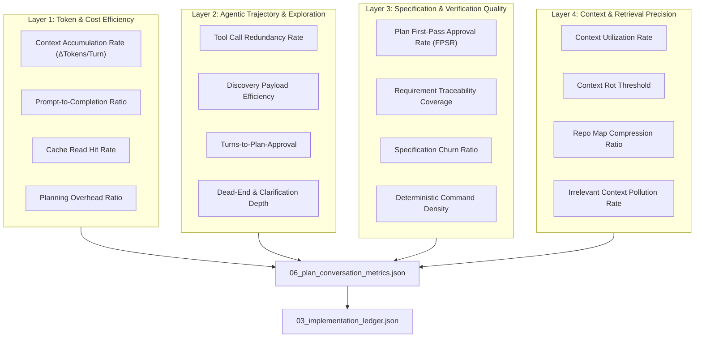
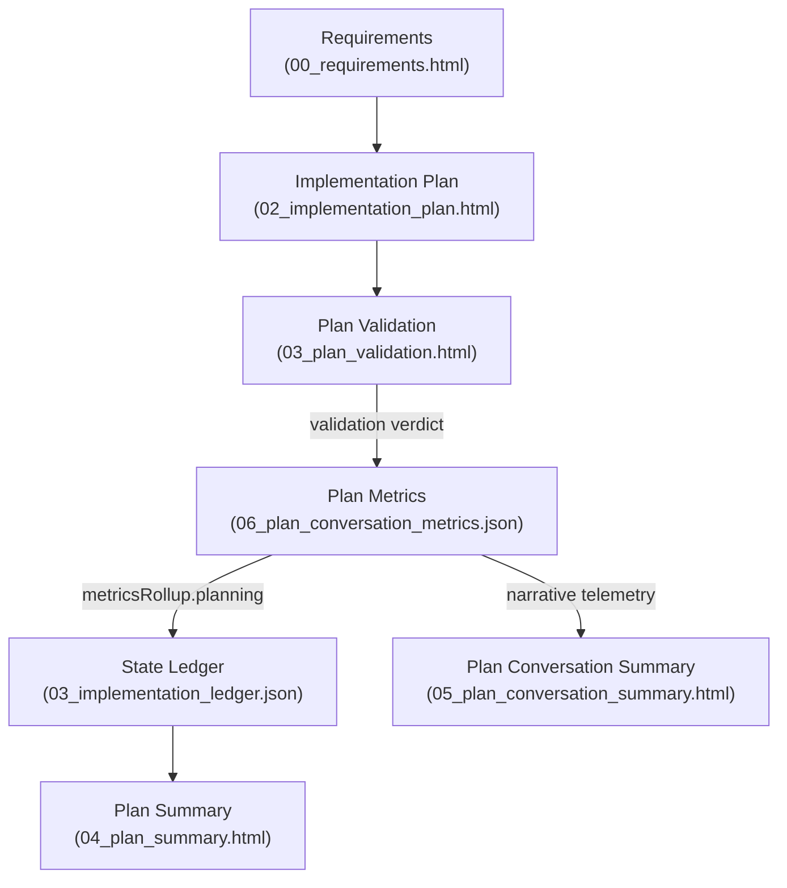

# Plan Conversation Metrics Document Definition

The **Plan Conversation Metrics Document** (`06_plan_conversation_metrics.json`) is the authoritative Tier 1 telemetry
record in the **Token Optimized Software Harness (`tosh`)** work item lifecycle. It aggregates token consumption, model
latencies, tool invocations, context accumulation, and pre-execution validation outcomes across the entire planning
phase before implementation begins.

In `tosh`, token optimization cannot be measured in isolation; premature token pruning during planning that causes
under-specified requirements, hallucinated schemas, or ambiguous tasks creates compounding multi-turn repair loops
during execution, dramatically increasing aggregate compute.

This document serves a dual purpose:

1. **Human & Platform Interface:** Provides structured, auditable telemetry for engineering managers, platform teams,
   and developers to benchmark planning models, track API expenditures, identify multi-agent debate bottlenecks, and
   assess planning efficiency.
2. **Agent / Harness Interface:** Serves as a deterministic JSON machine artifact queryable by the `tosh` CLI and
   evaluation runners to dynamically adjust context-injection budgets, refine system prompts, and optimize prompt
   caching strategies across future work items.

---

## Core Planning Paradigm: The 4-Layer Planning Telemetry Framework

To extract actionable signals from planning session transcripts, `tosh` organizes planning conversation telemetry across
four distinct analytical layers:



---

## Table of Contents

1. [File Location & Organization Standard](#1-file-location--organization-standard)
2. [The 4-Layer Planning Telemetry Framework](#2-the-4-layer-planning-telemetry-framework)
    - 2.1. [Layer 1: Token & Cost Efficiency Metrics](#21-layer-1-token--cost-efficiency-metrics)
    - 2.2. [Layer 2: Agentic Trajectory & Tool Optimization](#22-layer-2-agentic-trajectory--tool-optimization)
    - 2.3. [Layer 3: Specification & Pre-Execution Quality](#23-layer-3-specification--pre-execution-quality)
    - 2.4. [Layer 4: Context & Retrieval Precision](#24-layer-4-context--retrieval-precision)
3. [JSON Schema Specification (
   `06_plan_conversation_metrics.json`)](#3-json-schema-specification-06_plan_conversation_metricsjson)
4. [Turn-Level Session Log Schema (`plan_conversation.jsonl`)](#4-turn-level-session-log-schema-plan_conversationjsonl)
5. [Token Optimization, Analysis Patterns & CLI / jq Queries](#5-token-optimization-analysis-patterns--cli--jq-queries)
6. [Lineage, Traceability & Ledger Integration](#6-lineage-traceability--ledger-integration)
7. [Rules & Constraints](#7-rules--constraints)
8. [Revisions](#8-revisions)

---

## 1. File Location & Organization Standard

The plan conversation metrics file resides at the root of the work item directory alongside the core Tier 1 planning
documents:

```text
.tosh/
└── work_items/
    └── {YYYYMMDDTHHMMSSZ}_{work_item_slug}/
        ├── 00_requirements.html                # Requirements & Checklists
        ├── 01_design_spec.html                 # Technical Architecture & Micro-ADRs
        ├── 02_implementation_plan.html         # Multi-Phase Roadmap & Risk Strategy
        ├── 03_implementation_ledger.json       # State Machine & Task Dependency DAG
        ├── 03_plan_validation.html             # Pre-Execution Plan Gating Verdict
        ├── 04_plan_summary.html                # Execution Rollup Summary
        ├── 05_plan_conversation_summary.html   # Distilled Agent Dialogue & Decisions
        ├── 06_plan_conversation_metrics.json   # Authoritative Planning Telemetry
        └── phases/
            └── ...
```

- **File Name:** `06_plan_conversation_metrics.json`
- **Format:** Strict JSON (UTF-8, 2-space indentation).
- **Paired Log:** Session turns captured in `plan_conversation.jsonl` (or conversational memory store).
- **Summary Document:** Rendered human narrative documented in
  [
  `05_plan_conversation_summary.html`](plan-conversation-summary.md).

---

## 2. The 4-Layer Planning Telemetry Framework

### 2.1. Layer 1: Token & Cost Efficiency Metrics

These metrics detect prompt bloat, inefficient multi-agent routing, and runaway discovery loops during the planning
phase.

| Metric Name                                     | Formula / Measurement                                                                                   | Target Range                         | Purpose & Harness Improvement Area                                                                                                                                                                                                       |
|:------------------------------------------------|:--------------------------------------------------------------------------------------------------------|:-------------------------------------|:-----------------------------------------------------------------------------------------------------------------------------------------------------------------------------------------------------------------------------------------|
| **Context Accumulation Rate**                   | $\Delta\text{Tokens} / \text{Turn} = \frac{\text{Prompt Tokens}_{N} - \text{Prompt Tokens}_{1}}{N - 1}$ | Linear slope ($< 1,500$ tokens/turn) | Measures input token growth rate across planning exchanges. A steep or quadratic curve signals that the harness is naively dumping entire raw transcripts or unfiltered tool outputs rather than pruning or maintaining a rolling state. |
| **Prompt-to-Completion Ratio**                  | $\frac{\text{Prompt Tokens}}{\text{Completion Tokens}}$                                                 | $70:30$ to $85:15$                   | Planning requires analytical generation (ADRs, schemas, tasks). If ratio exceeds $95:5$, prompt templates are bloated with irrelevant background, or models are responding with terse, under-specified plans.                            |
| **Token Cost per Planned Task**                 | $\frac{\text{Total Planning Tokens}}{\text{Total Planned Tasks Count}}$                                 | $< 8,000$ tokens/task                | Establishes the planning overhead per planned unit of work. Highlights overly verbose architectural debates relative to task count.                                                                                                      |
| **Cache Read Hit Rate**                         | $\frac{\text{Cache Read Tokens}}{\text{Total Prompt Tokens}} \times 100\%$                              | $> 65\%$                             | Percentage of prompt tokens served by prefix caching (e.g., Anthropic Prompt Caching, OpenAI Cached Prompts). Verifies that static system instructions, repository maps, and guidelines remain at a stable prefix order.                 |
| **Planning Overhead Ratio** *(Suggested)*       | $\frac{\text{Total Planning Tokens}}{\text{Estimated Total Execution Tokens}}$                          | $10\% - 25\%$                        | Measures whether planning investment is proportional to execution scope. An overhead $> 40\%$ indicates over-engineering; $< 5\%$ indicates high risk of execution-time failures.                                                        |
| **Prefix Cache Stability Factor** *(Suggested)* | $1 - \frac{\text{Cache Invalidation Events}}{\text{Total Turns}}$                                       | $\ge 0.90$                           | Verifies that dynamic ephemeral context is strictly appended to the tail of the message array rather than breaking prefix cache blocks.                                                                                                  |

---

### 2.2. Layer 2: Agentic Trajectory & Tool Optimization

Planning overhead primarily stems from unfocused repository scanning, redundant file inspection, and circular debates
between specialized planning agents (e.g., PM, Architect, Security Auditor).

| Metric Name                               | Formula / Measurement                                                                 | Target Range           | Purpose & Harness Improvement Area                                                                                                                                                                                                         |
|:------------------------------------------|:--------------------------------------------------------------------------------------|:-----------------------|:-------------------------------------------------------------------------------------------------------------------------------------------------------------------------------------------------------------------------------------------|
| **Tool Call Redundancy Rate**             | $\frac{\text{Duplicate Tool Invocations}}{\text{Total Tool Invocations}}$             | $\le 5\%$              | Frequency of an agent calling the exact same tool with identical parameters (e.g., reading `pom.xml` or `package.json` 3 times without modifications). Resolved by harness scratchpads and stateful tool call caches.                      |
| **Discovery Payload Efficiency**          | $\frac{\text{Tokens Referenced in Specs}}{\text{Tokens Returned by Discovery Tools}}$ | $\ge 25\%$             | Ratio of tokens returned by exploration tools (`grep`, `find_by_name`, `view_file`) to tokens actually cited in `01_design_spec.html` or `02_implementation_plan.html`. Low ratios indicate the need for AST views and line-bounded reads. |
| **Turns-to-Plan-Approval**                | Total LLM turns to achieve approved plan                                              | $\le 12$ turns         | Round-trips required from requirement ingestion to passing `03_plan_validation.html`. Detects agent hesitation, circular debate, or unclear requirements.                                                                                  |
| **Dead-End & Clarification Depth**        | Consecutive turns resolving schema or constraint errors                               | $\le 2$ turns          | Turns spent recovering from invalid task JSON, malformed schema definitions, or contradictory requirements. Target improvement: strict JSON schema enforcement in tool calls.                                                              |
| **Discovery Fan-Out Ratio** *(Suggested)* | $\frac{\text{Candidate Files Inspected}}{\text{Files Targeted in Task Specs}}$        | $2.0 - 4.0$            | Tracks search focus. If an agent inspects 80 files to plan modifications on 2 files (ratio $40.0$), repository indexing or RAG ranking is pulling irrelevant files.                                                                        |
| **Agent Handoff Friction** *(Suggested)*  | $\frac{\text{Handoff Summary Tokens}}{\text{Total Multi-Agent Turns}}$                | $< 500$ tokens/handoff | In multi-agent harnesses, measures the token cost of transferring context between Planner, Architect, and Validator agents.                                                                                                                |

---

### 2.3. Layer 3: Specification & Pre-Execution Quality

A planning conversation is only successful if it produces specifications that are robust, testable, and
dependency-sound.

| Metric Name                                     | Formula / Measurement                                                                         | Target Range               | Purpose & Harness Improvement Area                                                                                                                          |
|:------------------------------------------------|:----------------------------------------------------------------------------------------------|:---------------------------|:------------------------------------------------------------------------------------------------------------------------------------------------------------|
| **Plan First-Pass Approval Rate (FPSR)**        | Passing `03_plan_validation.html` on first validation run                                     | $100\%$ ($1.0$)            | Evaluates whether the initial plan satisfied all feasibility, security, and architectural checks without requiring rework turns.                            |
| **Specification Churn Ratio**                   | $\frac{\text{Revised Plan Section Lines}}{\text{Net Accepted Plan Lines}}$                    | $\le 1.15$                 | High churn indicates the planner vacillated between architectures or hallucinated APIs that required extensive revision before passing validation.          |
| **Requirement Traceability Coverage**           | $\frac{\text{Mapped Requirement IDs}}{\text{Total Itemized Requirement IDs}} \times 100\%$    | $100\%$                    | Verifies that every requirement defined in `00_requirements.html` (`REQ-###`) is assigned to at least one task in `02_implementation_plan.html`.            |
| **Dependency DAG Soundness**                    | Graph validation boolean & cycle count                                                        | Cycles: `0`, Orphaned: `0` | Evaluates that task dependencies declared in `03_implementation_ledger.json` form a valid Directed Acyclic Graph with balanced breadth and depth.           |
| **Deterministic Command Density** *(Suggested)* | $\frac{\text{Tasks with Exact Shell Verifications}}{\text{Total Planned Tasks}} \times 100\%$ | $100\%$                    | Verifies that 100% of planned tasks declare explicit verification shell commands with expected exit codes (`0`) rather than subjective manual review steps. |
| **Edge Case Density** *(Suggested)*             | $\frac{\text{Total Itemized Edge Cases (EC-###)}}{\text{Total Planned Tasks}}$                | $\ge 2.0$ edge cases/task  | Confirms the planning agents anticipated negative paths and boundary hazards prior to implementation.                                                       |

---

### 2.4. Layer 4: Context & Retrieval Precision

Planning agents frequently query repository documentation, OpenAPI specs, and existing source trees. Evaluating the
relevance of ingested context prevents prompt poisoning and context window degradation.

| Metric Name                                         | Formula / Measurement                                                                                           | Target Range                | Purpose & Harness Improvement Area                                                                                                                                                           |
|:----------------------------------------------------|:----------------------------------------------------------------------------------------------------------------|:----------------------------|:---------------------------------------------------------------------------------------------------------------------------------------------------------------------------------------------|
| **Context Utilization Rate**                        | $\frac{\text{Retrieved Code/Doc Snippets Cited in Specs}}{\text{Total Injected Context Snippets}} \times 100\%$ | $\ge 60\%$                  | Percentage of retrieved workspace files, wiki pages, or class definitions that directly inform the technical design. Low rates signal poor RAG embeddings or broad wildcard file injections. |
| **Context Rot Threshold**                           | Token depth at which agent recall degrades                                                                      | $> 90\%$ of window limit    | Tracks the token watermark where the agent begins hallucinating non-existent classes, forgetting negative constraints, or dropping requirement IDs. Triggers automatic summarization turns.  |
| **Repo Map Compression Ratio** *(Suggested)*        | $\frac{\text{Uncompressed Directory Tokens}}{\text{Compact Symbol Map Tokens}}$                                 | $\ge 5.0\times$ compression | Ratio of raw file tree representation to the semantic symbol map ingested into the planning prompt.                                                                                          |
| **Irrelevant Context Pollution Rate** *(Suggested)* | $\frac{\text{Injected Files Unrelated to Domain}}{\text{Total Injected Files}} \times 100\%$                    | $\le 5\%$                   | Measures false positives in codebase retrieval that pollute the planner's reasoning.                                                                                                         |

---

## 3. JSON Schema Specification (`06_plan_conversation_metrics.json`)

The following JSON Schema governs the structure and validation of `06_plan_conversation_metrics.json`:

```json
{
  "$schema": "https://json-schema.org/draft/2020-12/schema",
  "$id": "https://tosh.dev/schemas/work-items/plan-conversation-metrics.schema.json",
  "title": "PlanConversationMetrics",
  "description": "Authoritative Tier 1 planning conversation metrics and telemetry record.",
  "type": "object",
  "required": [
    "docId",
    "docType",
    "schemaVersion",
    "workItemId",
    "status",
    "timestamps",
    "tokenEfficiency",
    "agenticTrajectory",
    "specificationQuality",
    "contextEngineering",
    "costRollup",
    "modelUsageBreakdown"
  ],
  "properties": {
    "docId": {
      "type": "string",
      "pattern": "^WI-[0-9]{8}T[0-9]{6}Z:METRICS$"
    },
    "docType": {
      "type": "string",
      "const": "plan-conversation-metrics"
    },
    "schemaVersion": {
      "type": "string",
      "const": "1.0.0"
    },
    "workItemId": {
      "type": "string",
      "pattern": "^[0-9]{8}T[0-9]{6}Z_[a-z0-9_]+$"
    },
    "status": {
      "type": "string",
      "enum": [
        "pending",
        "in-progress",
        "completed",
        "failed"
      ]
    },
    "timestamps": {
      "type": "object",
      "required": [
        "startedAt",
        "completedAt",
        "durationMs"
      ],
      "properties": {
        "startedAt": {
          "type": "string",
          "format": "date-time"
        },
        "completedAt": {
          "type": "string",
          "format": "date-time"
        },
        "durationMs": {
          "type": "integer",
          "minimum": 0
        }
      }
    },
    "tokenEfficiency": {
      "type": "object",
      "required": [
        "totalTokens",
        "promptTokens",
        "completionTokens",
        "cacheReadTokens",
        "cacheCreationTokens",
        "cacheReadHitRatePct",
        "promptToCompletionRatio",
        "contextAccumulationRateDeltaPerTurn",
        "tokenCostPerPlannedTask"
      ],
      "properties": {
        "totalTokens": {
          "type": "integer",
          "minimum": 0
        },
        "promptTokens": {
          "type": "integer",
          "minimum": 0
        },
        "completionTokens": {
          "type": "integer",
          "minimum": 0
        },
        "cacheReadTokens": {
          "type": "integer",
          "minimum": 0
        },
        "cacheCreationTokens": {
          "type": "integer",
          "minimum": 0
        },
        "cacheReadHitRatePct": {
          "type": "number",
          "minimum": 0,
          "maximum": 100
        },
        "promptToCompletionRatio": {
          "type": "string"
        },
        "contextAccumulationRateDeltaPerTurn": {
          "type": "number"
        },
        "tokenCostPerPlannedTask": {
          "type": "number",
          "minimum": 0
        },
        "planningOverheadRatio": {
          "type": "number",
          "minimum": 0
        }
      }
    },
    "agenticTrajectory": {
      "type": "object",
      "required": [
        "totalTurns",
        "totalToolCalls",
        "toolCallRedundancyRatePct",
        "toolPayloadEfficiencyPct",
        "deadEndTurnsCount",
        "discoveryFanOutRatio"
      ],
      "properties": {
        "totalTurns": {
          "type": "integer",
          "minimum": 1
        },
        "totalToolCalls": {
          "type": "integer",
          "minimum": 0
        },
        "toolCallRedundancyRatePct": {
          "type": "number",
          "minimum": 0,
          "maximum": 100
        },
        "toolPayloadEfficiencyPct": {
          "type": "number",
          "minimum": 0,
          "maximum": 100
        },
        "deadEndTurnsCount": {
          "type": "integer",
          "minimum": 0
        },
        "discoveryFanOutRatio": {
          "type": "number",
          "minimum": 0
        },
        "agentParticipantsCount": {
          "type": "integer",
          "minimum": 1
        }
      }
    },
    "specificationQuality": {
      "type": "object",
      "required": [
        "planFirstPassApproval",
        "planValidationIterations",
        "requirementTraceabilityPct",
        "totalRequirementsPlanned",
        "totalPhasesPlanned",
        "totalTasksPlanned",
        "deterministicCommandDensityPct",
        "edgeCaseDensity"
      ],
      "properties": {
        "planFirstPassApproval": {
          "type": "boolean"
        },
        "planValidationIterations": {
          "type": "integer",
          "minimum": 1
        },
        "requirementTraceabilityPct": {
          "type": "number",
          "minimum": 0,
          "maximum": 100
        },
        "totalRequirementsPlanned": {
          "type": "integer",
          "minimum": 1
        },
        "totalPhasesPlanned": {
          "type": "integer",
          "minimum": 1
        },
        "totalTasksPlanned": {
          "type": "integer",
          "minimum": 1
        },
        "deterministicCommandDensityPct": {
          "type": "number",
          "minimum": 0,
          "maximum": 100
        },
        "edgeCaseDensity": {
          "type": "number",
          "minimum": 0
        },
        "specificationChurnRatio": {
          "type": "number",
          "minimum": 1.0
        }
      }
    },
    "contextEngineering": {
      "type": "object",
      "required": [
        "contextUtilizationRatePct",
        "maxTurnTokenDepth",
        "contextRotDetected",
        "injectedFilesCount",
        "citedFilesCount"
      ],
      "properties": {
        "contextUtilizationRatePct": {
          "type": "number",
          "minimum": 0,
          "maximum": 100
        },
        "maxTurnTokenDepth": {
          "type": "integer",
          "minimum": 0
        },
        "contextRotDetected": {
          "type": "boolean"
        },
        "injectedFilesCount": {
          "type": "integer",
          "minimum": 0
        },
        "citedFilesCount": {
          "type": "integer",
          "minimum": 0
        },
        "repoMapCompressionRatio": {
          "type": "number",
          "minimum": 1.0
        }
      }
    },
    "costRollup": {
      "type": "object",
      "required": [
        "totalCostUsd",
        "currency"
      ],
      "properties": {
        "totalCostUsd": {
          "type": "number",
          "minimum": 0
        },
        "currency": {
          "type": "string",
          "const": "USD"
        }
      }
    },
    "modelUsageBreakdown": {
      "type": "array",
      "items": {
        "type": "object",
        "required": [
          "model",
          "role",
          "turns",
          "promptTokens",
          "completionTokens",
          "cacheReadTokens",
          "costUsd"
        ],
        "properties": {
          "model": {
            "type": "string"
          },
          "role": {
            "type": "string"
          },
          "turns": {
            "type": "integer",
            "minimum": 1
          },
          "promptTokens": {
            "type": "integer",
            "minimum": 0
          },
          "completionTokens": {
            "type": "integer",
            "minimum": 0
          },
          "cacheReadTokens": {
            "type": "integer",
            "minimum": 0
          },
          "costUsd": {
            "type": "number",
            "minimum": 0
          }
        }
      }
    }
  },
  "additionalProperties": false
}
```

### 3.1. Concrete Instance Example (`06_plan_conversation_metrics.json`)

```json
{
  "docId": "WI-20260830T170936Z:METRICS",
  "docType": "plan-conversation-metrics",
  "schemaVersion": "1.0.0",
  "workItemId": "20260830T170936Z_user_auth_service",
  "status": "completed",
  "timestamps": {
    "startedAt": "2026-08-30T17:09:36Z",
    "completedAt": "2026-08-30T17:15:20Z",
    "durationMs": 344000
  },
  "tokenEfficiency": {
    "totalTokens": 45200,
    "promptTokens": 32100,
    "completionTokens": 13100,
    "cacheReadTokens": 22400,
    "cacheCreationTokens": 4800,
    "cacheReadHitRatePct": 69.78,
    "promptToCompletionRatio": "71:29",
    "contextAccumulationRateDeltaPerTurn": 1120.5,
    "tokenCostPerPlannedTask": 3766.6,
    "planningOverheadRatio": 0.14
  },
  "agenticTrajectory": {
    "totalTurns": 10,
    "totalToolCalls": 18,
    "toolCallRedundancyRatePct": 0.0,
    "toolPayloadEfficiencyPct": 38.4,
    "deadEndTurnsCount": 0,
    "discoveryFanOutRatio": 2.25,
    "agentParticipantsCount": 2
  },
  "specificationQuality": {
    "planFirstPassApproval": true,
    "planValidationIterations": 1,
    "requirementTraceabilityPct": 100.0,
    "totalRequirementsPlanned": 8,
    "totalPhasesPlanned": 3,
    "totalTasksPlanned": 12,
    "deterministicCommandDensityPct": 100.0,
    "edgeCaseDensity": 2.5,
    "specificationChurnRatio": 1.04
  },
  "contextEngineering": {
    "contextUtilizationRatePct": 78.2,
    "maxTurnTokenDepth": 18450,
    "contextRotDetected": false,
    "injectedFilesCount": 9,
    "citedFilesCount": 7,
    "repoMapCompressionRatio": 6.8
  },
  "costRollup": {
    "totalCostUsd": 0.1356,
    "currency": "USD"
  },
  "modelUsageBreakdown": [
    {
      "model": "claude-3-7-sonnet",
      "role": "lead-architect",
      "turns": 6,
      "promptTokens": 19400,
      "completionTokens": 8200,
      "cacheReadTokens": 14200,
      "costUsd": 0.0882
    },
    {
      "model": "claude-3-5-haiku",
      "role": "codebase-explorer",
      "turns": 4,
      "promptTokens": 12700,
      "completionTokens": 4900,
      "cacheReadTokens": 8200,
      "costUsd": 0.0474
    }
  ]
}
```

---

## 4. Turn-Level Session Log Schema (`plan_conversation.jsonl`)

To compute these metrics deterministically, the planning session logger writes atomic JSON lines for every exchange:

```json
{
  "session_id": "sess-plan-20260830T170936Z",
  "turn_index": 4,
  "role": "assistant",
  "agent_role": "lead-architect",
  "model": "claude-3-7-sonnet",
  "timestamp": "2026-08-30T17:11:42Z",
  "usage": {
    "prompt_tokens": 14250,
    "completion_tokens": 820,
    "cache_read_tokens": 10500,
    "cache_creation_tokens": 0
  },
  "tool_calls": [
    {
      "name": "view_file",
      "args": {
        "path": "src/main/resources/application.yml"
      },
      "args_tokens": 42,
      "response_tokens": 310,
      "status": "success",
      "is_retry": false,
      "tokens_referenced_in_turn": 125
    }
  ],
  "verification": {
    "plan_section_drafted": "01_design_spec.html#architecture",
    "requirements_referenced": [
      "REQ-001",
      "REQ-002"
    ],
    "syntax_valid": true,
    "validation_errors": 0
  },
  "context_stats": {
    "injected_files_count": 3,
    "active_scratchpad_tokens": 620,
    "total_context_depth": 14250
  }
}
```

---

## 5. Token Optimization, Analysis Patterns & CLI / jq Queries

The `tosh` CLI and CI/CD pipelines use deterministic `jq` queries against `06_plan_conversation_metrics.json` and
`plan_conversation.jsonl` to detect planning inefficiencies:

### 5.1. Detecting Runaway Context Accumulation Rate

```bash
# Query delta tokens between turn 1 and last turn in session log
jq -s '
  (.[-1].usage.prompt_tokens - .[0].usage.prompt_tokens) / (length - 1)
' plan_conversation.jsonl
```

### 5.2. Calculating Planning Cache Read Hit Rate

```bash
# Verify prefix cache efficacy across planning session
jq '
  .tokenEfficiency.cacheReadHitRatePct
' 06_plan_conversation_metrics.json
```

### 5.3. Flagging Discovery Payload Inefficiency

```bash
# Identify tool calls where response tokens greatly exceeded referenced tokens
jq -c '
  select(.tool_calls[]? | .response_tokens > 1000 and (.tokens_referenced_in_turn / .response_tokens) < 0.10)
  | {turn: .turn_index, tool: .tool_calls[0].name, returned: .tool_calls[0].response_tokens, referenced: .tool_calls[0].tokens_referenced_in_turn}
' plan_conversation.jsonl
```

### 5.4. Validating 100% Deterministic Command Density

```bash
# Gating rule: Assert all planned tasks have deterministic terminal validation
jq -e '
  .specificationQuality.deterministicCommandDensityPct == 100.0
' 06_plan_conversation_metrics.json
```

---

## 6. Lineage, Traceability & Ledger Integration

The plan metrics file integrates directly into the work item's bi-directional lineage graph:



- **Upward Pointers:** `docId` references the work item root (`WI-{timestamp}:METRICS`), with `workItemId` anchoring to
  the root directory.
- **Narrative Binding:** Detailed conversational exchanges and trade-offs are summarized in
  [
  `05_plan_conversation_summary.html`](plan-conversation-summary.md),
  which links directly to `06_plan_conversation_metrics.json`.
- **Ledger Rollup:** Key aggregates (`totalTokens`, `totalCostUsd`, `cacheReadHitRatePct`) are copied into the
  `metricsRollup` object of
  [
  `03_implementation_ledger.json`](work-item-ledger.md).

---

## 7. Rules & Constraints

1. **Immutable Historical Telemetry:** Once `03_plan_validation.html` records `pass` and phase execution begins,
   `06_plan_conversation_metrics.json` is frozen and must not be mutated.
2. **Deterministic Token Counts:** All token metrics must be sourced directly from LLM API response usage metadata (or
   calibrated model tokenizers), not rough word-count heuristics.
3. **Prefix Stability Enforcement:** System prompts and static guidelines must be ordered first in prompts to maximize
   `cacheReadHitRatePct`. Ephemeral session messages must never precede cached system blocks.
4. **Tool Redundancy Ceiling:** Any planning session exhibiting `toolCallRedundancyRatePct > 10%` must trigger a lint
   warning in `tosh plan validate` to flag defective tool usage loops.
5. **Universal Traceability:** 100% of functional requirements (`REQ-###`) must be accounted for in the
   `requirementTraceabilityPct` metric before planning closure.

---

## 8. Revisions

| Date       | Version | Description                                                                                                                                                                                                | Source                 |
|:-----------|:--------|:-----------------------------------------------------------------------------------------------------------------------------------------------------------------------------------------------------------|:-----------------------|
| 2026-09-06 | 1.0.0   | Authoritative specification for Plan Conversation Metrics (`06_plan_conversation_metrics.json`) establishing the 4-layer telemetry framework, JSON schema, session log contract, and jq analysis patterns. | Feature Specification  |
| 2026-08-30 | 0.1.0   | Initial baseline stub in metadata definition.                                                                                                                                                              | Architecture Alignment |