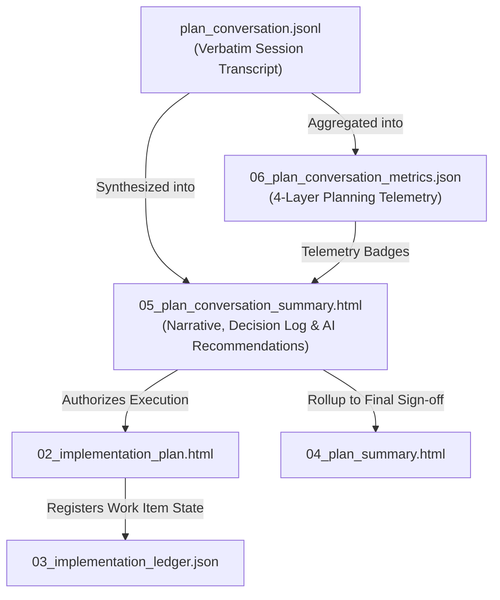

# Plan Conversation Summary Document Definition

The **Plan Conversation Summary Document** (`05_plan_conversation_summary.html`) is the authoritative Tier 1
post-planning narrative synthesis in the **Token Optimized Software Harness (`tosh`)** work item lifecycle. It distills
the multi-agent LLM dialogue, architectural debates, trade-off analyses, and alignment rounds that produced the
requirements ([
`00_requirements.html`](requirements.md)), technical
design ([
`01_design_spec.html`](technical-design.md)), and
implementation roadmap ([
`02_implementation_plan.html`](implementation-plan.md)).

While [
`06_plan_conversation_metrics.json`](plan-conversation-metrics.md)
captures granular turn-by-turn telemetry (token counts, latencies, tool execution arrays) and `plan_conversation.jsonl`
preserves the raw interaction stream, `05_plan_conversation_summary.html` provides the human-readable, executive
evaluation of planning efficacy. It synthesizes high-level telemetry, reviews conversational performance, identifies
friction points, and delivers targeted improvement recommendations for the participating AI components.

This document fulfills a dual-purpose consumption model:

1. **Human Interface (Static UI):** Renders as a local, fully interactive, static XHTML web page utilizing Material
   Design 3 Web Components (`@material/web` / **M3**). Engineering leaders and developers review decision timelines,
   high-level economic KPIs, multi-agent collaboration evaluations, and concrete AI component tuning suggestions without
   requiring client-side bundlers or runtime servers.
2. **Agent / Harness Interface (Machine Parseable):** Serves as a structured XML document queryable via XPath and the
   `tosh` CLI. Evaluation harnesses and orchestrators ingest conversational performance ratings, token benchmarks, and
   AI component recommendations to dynamically calibrate model selection, prompt templates, and agent skill
   configurations across future work items.

---

## Core Planning Paradigm: Applying the 4 Dimensions to Plan Conversation Summaries

In `tosh`, the plan conversation summary evaluates planning execution against the four foundational planning dimensions:

| Plan Dimension  | Human Engineer Focus                                                                  | AI Coding Tool Focus                                                                              | `tosh` Plan Conversation Summary Manifestation                                                                                                                                                                                                    |
|:----------------|:--------------------------------------------------------------------------------------|:--------------------------------------------------------------------------------------------------|:--------------------------------------------------------------------------------------------------------------------------------------------------------------------------------------------------------------------------------------------------|
| **Context**     | Relies on tacit codebase conventions and tribal domain knowledge.                     | Needs explicit file paths, referenced patterns, and strict "do not touch" constraints.            | Audits context retrieval precision and repository exploration during planning, ensuring agents grounded their designs in real codebase facts without prompt bloat.                                                                                |
| **Granularity** | Focuses on high-level patterns and architecture; details left to implementation time. | Requires atomic, single-responsibility sub-tasks with deterministic inputs/outputs.               | Evaluates whether multi-agent dialogue remained focused and progressive, avoiding circular debates or monolithic requirements in favor of atomic phase milestones.                                                                                |
| **Validation**  | Manual PR review, local exploratory debugging, automated CI.                          | Explicit terminal commands with deterministic output parsing (lint, test, build) after each step. | Reviews the dialogue leading into pre-execution plan validation ([`03_plan_validation.html`](plan-validation.md)), certifying that all gates passed on the first pass (FPSR). |
| **Edge Cases**  | Usually caught through intuitive testing or code review cycles.                       | Must be exhaustively itemized upfront to prevent naive happy-path assumptions.                    | Documents how effectively conversational participants surfaced adversarial edge cases, schema boundary failures, and security risks during planning debates.                                                                                      |

---

## Table of Contents

1. [File Location & Organization Standard](#1-file-location--organization-standard)
2. [XHTML Header & Metadata Standard](#2-xhtml-header--metadata-standard)
    - 2.1. [XHTML Header Example](#21-xhtml-header-example)
    - 2.2. [Metadata Attribute Contracts](#22-metadata-attribute-contracts)
3. [Required Sections & M3 Component Structure](#3-required-sections--m3-component-structure)
    - 3.1. [Document Header & Metadata Bar](#31-document-header--metadata-bar)
    -
    3.2. [Executive Planning Dialogue Synthesis & Decision Log](#32-executive-planning-dialogue-synthesis--decision-log)
    - 3.3. [High-Level Planning Telemetry & Metrics Rollup](#33-high-level-planning-telemetry--metrics-rollup)
    -
    3.4. [LLM Conversational Performance & Trajectory Analysis](#34-llm-conversational-performance--trajectory-analysis)
    - 3.5. [Conversational Friction & Inefficiency Post-Mortem](#35-conversational-friction--inefficiency-post-mortem)
    - 3.6. [Suggested Improvements to AI Components](#36-suggested-improvements-to-ai-components)
        - 3.6.1. [Model Selection, Routing & Right-Sizing](#361-model-selection-routing--right-sizing)
        -
        3.6.2. [Agent Personas, System Prompts & Delegation Protocols](#362-agent-personas-system-prompts--delegation-protocols)
        - 3.6.3. [Custom Skills & Procedural Guidance Packages](#363-custom-skills--procedural-guidance-packages)
        - 3.6.4. [Coding Tools & MCP Server Ergonomics](#364-coding-tools--mcp-server-ergonomics)
        - 3.6.5. [Prompt Caching & Prefix Stability Optimization](#365-prompt-caching--prefix-stability-optimization)
    -
    3.7. [Downstream Execution Handoff & Plan Approval Sign-off](#37-downstream-execution-handoff--plan-approval-sign-off)
4. [Token Optimization & XPath Query Patterns](#4-token-optimization--xpath-query-patterns)
5. [Lineage, Rollup & Ledger Integration](#5-lineage-rollup--ledger-integration)
6. [Rules & Constraints](#6-rules--constraints)
7. [Revisions](#7-revisions)

---

## 1. File Location & Organization Standard

The plan conversation summary document resides at the root of the work item directory alongside the core Tier 1 planning
artifacts:

```text
.tosh/
└── work_items/
    └── {YYYYMMDDTHHMMSSZ}_{work_item_slug}/
        ├── 00_requirements.html                # Requirements & Checklists
        ├── 01_design_spec.html                 # Technical Architecture & Micro-ADRs
        ├── 02_implementation_plan.html         # Multi-Phase Roadmap & Risk Strategy
        ├── 03_implementation_ledger.json       # State Machine & Task Dependency DAG
        ├── 03_plan_validation.html             # Pre-Execution Plan Gating Verdict
        ├── 04_plan_summary.html                # Execution Rollup Summary
        ├── 05_plan_conversation_summary.html   # Authoritative Planning Dialogue Synthesis
        ├── 06_plan_conversation_metrics.json   # Authoritative Planning Telemetry
        └── phases/
            └── ...
```

- **File Name:** `05_plan_conversation_summary.html`
- **Format:** Strict XHTML (`application/xhtml+xml` compliant, standard XML syntax).
- **Encoding:** UTF-8.
- **Runtime:** Fully static, runnable directly in modern browsers via local filesystem (`file://`) or served locally via
  the `tosh` CLI.
- **Paired Artifacts:**
    - Requirements: [
      `00_requirements.html`](requirements.md)
    - Technical Design: [
      `01_design_spec.html`](technical-design.md)
    - Implementation Roadmap: [
      `02_implementation_plan.html`](implementation-plan.md)
    - Plan Validation Gate: [
      `03_plan_validation.html`](plan-validation.md)
    - Comprehensive Telemetry: [
      `06_plan_conversation_metrics.json`](plan-conversation-metrics.md)
    - Verbatim Transcript: `plan_conversation.jsonl` (or conversational session store)

---

## 2. XHTML Header & Metadata Standard

### 2.1. XHTML Header Example

Every `05_plan_conversation_summary.html` begins with universal baseline `<meta>` tags, planning dialogue metrics,
participant lists, and the Material Web ES module importmap loader:

```xhtml
<!DOCTYPE html>
<html xmlns="http://www.w3.org/1999/xhtml" lang="en">
<head>
    <meta charset="UTF-8"/>
    <meta name="viewport" content="width=device-width, initial-scale=1.0"/>
    <title>PLAN CONVERSATION SUMMARY: User Authentication Service</title>

    <!-- Universal Baseline Metadata -->
    <meta name="doc-id" content="WI-20260830T170936Z:05:CONV-SUM"/>
    <meta name="doc-type" content="plan-conversation-summary"/>
    <meta name="schema-version" content="1.0.0"/>
    <meta name="domain" content="work-items"/>
    <meta name="work-item-id" content="20260830T170936Z_user_auth_service"/>
    <meta name="status" content="completed"/> <!-- pending | in-progress | completed | failed | blocked -->
    <meta name="created-at" content="2026-08-30T17:45:00Z"/>
    <meta name="updated-at" content="2026-08-30T17:48:15Z"/>

    <!-- Plan Conversation Summary Domain Metadata -->
    <meta name="parent-doc-id" content="WI-20260830T170936Z:02:PLAN"/>
    <meta name="metrics-ref" content="06_plan_conversation_metrics.json"/>
    <meta name="agent-participants"
          content="agent:orchestrator,agent:architect,agent:security-auditor,agent:database-specialist"/>
    <meta name="turn-count" content="18"/>
    <meta name="planning-duration-ms" content="48200"/>
    <meta name="total-tokens" content="45200"/>
    <meta name="total-cost-usd" content="0.1356"/>
    <meta name="conversation-verdict" content="approved"/> <!-- approved | reworked | escalated -->
    <meta name="fpsr" content="1.0"/> <!-- 1.0 (pass on first attempt) | 0.0 (required rework) -->

    <!-- Material Design 3 Web Component Loader -->
    <link href="https://fonts.googleapis.com/css2?family=Roboto:wght@400;500;700&amp;display=swap" rel="stylesheet"/>
    <link href="https://fonts.googleapis.com/css2?family=Material+Symbols+Outlined" rel="stylesheet"/>
    <script type="importmap">
        {
          "imports": {
            "@material/web/": "https://esm.run/@material/web/"
          }
        }
    </script>
    <script type="module">
        import '@material/web/all.js';
        import {styles as typescaleStyles} from '@material/web/typography/md-typescale-styles.js';

        document.adoptedStyleSheets.push(typescaleStyles.styleSheet);
    </script>
</head>
<body>
<main class="tosh-doc-container">
    <!-- Structured Document Body -->
</main>
</body>
</html>
```

### 2.2. Metadata Attribute Contracts

| Metadata Tag           | Scope               | Purpose                                                              | Example                                 |
|:-----------------------|:--------------------|:---------------------------------------------------------------------|:----------------------------------------|
| `parent-doc-id`        | Work Item / Summary | Points to the parent Implementation Plan `doc-id`                    | `WI-20260830T170936Z:02:PLAN`           |
| `metrics-ref`          | Work Item / Summary | Relative path pointer to the Plan Conversation Metrics JSON          | `06_plan_conversation_metrics.json`     |
| `agent-participants`   | Work Item / Summary | Comma-delimited list of all AI agent roles participating in planning | `agent:orchestrator,agent:architect`    |
| `turn-count`           | Work Item / Summary | Total round-trip conversational turns across all participants        | `18`                                    |
| `planning-duration-ms` | Work Item / Summary | Total elapsed wall-clock time for the planning phase in milliseconds | `48200`                                 |
| `total-tokens`         | Work Item / Summary | Aggregated token expenditure across all planning exchanges           | `45200`                                 |
| `total-cost-usd`       | Work Item / Summary | Estimated financial API expenditure for planning in USD              | `0.1356`                                |
| `conversation-verdict` | Work Item / Summary | Final planning conversation outcome classification                   | `approved` \| `reworked` \| `escalated` |
| `fpsr`                 | Work Item / Summary | First-Pass Success Rate for pre-execution plan validation            | `1.0` \| `0.0`                          |

---

## 3. Required Sections & M3 Component Structure

The Plan Conversation Summary document contains 7 standardized sections combining semantic XHTML elements, Material
Design 3 Web Components (`md-*`), typography scale classes (`md-typescale-*`), and explicit data attributes (`data-*`).

### 3.1. Document Header & Metadata Bar

Anchors the summary with work item identification, status chip (`completed`), conversation verdict chip (`approved`),
duration badge, total tokens badge, financial expenditure badge, and quick navigation links back to [
`02_implementation_plan.html`](implementation-plan.md)
and [
`06_plan_conversation_metrics.json`](plan-conversation-metrics.md).

### 3.2. Executive Planning Dialogue Synthesis & Decision Log

Synthesizes the core trajectory of the planning session, articulating how the user requirements evolved into a validated
engineering roadmap:

- **Executive Dialogue Narrative:** Concise summary of the problem formulation, architectural consensus, and key risks
  raised by participating agents.
- **Chronological Dialogue Milestone Timeline:**
    1. **Phase 1: Requirements Ingestion & Scope Clarification (Turns 1–4):** Ingested user prompt, queried existing
       wiki standards, and resolved ambiguous auth requirements (Argon2id hashing vs bcrypt).
    2. **Phase 2: Architectural Modeling & Trade-off Analysis (Turns 5–10):** Architect agent debated token storage
       strategies (stateless JWT vs stateful Redis revocation), drafting Micro-ADR-001.
    3. **Phase 3: Work Breakdown & Phase Decomposition (Turns 11–14):** Partitioned execution into 3 discrete phases and
       9 atomic tasks with deterministic prerequisites.
    4. **Phase 4: Security & Validation Gating (Turns 15–16):** Security Auditor agent inspected target files and
       verified OWASP password storage compliance.
    5. **Phase 5: Plan Approval & Document Synthesis (Turns 17–18):** Pre-execution validation suite executed;
       `03_plan_validation.html` recorded `pass`.
- **Architectural Decisions & Trade-offs Log:**

| Decision ID | Domain / Scope   | Adopted Architecture           | Rejected Alternative    | Core Rationale                                              | Deciding Agent              |
|:------------|:-----------------|:-------------------------------|:------------------------|:------------------------------------------------------------|:----------------------------|
| `ADR-001`   | Password Hashing | Argon2id ($m=65536, t=3, p=4$) | PBKDF2 / BCrypt         | OWASP 2026 recommended password storage baseline            | `agent:security-auditor`    |
| `ADR-002`   | Token Revocation | DB-backed refresh token table  | In-memory Redis cluster | Avoids introducing new infrastructure dependency in Phase 1 | `agent:architect`           |
| `ADR-003`   | Schema Migration | Flyway versioned SQL           | Hibernate auto-ddl      | Guarantees deterministic, auditable schema states in CI     | `agent:database-specialist` |

### 3.3. High-Level Planning Telemetry & Metrics Rollup

Presents an executive scorecard of planning economics, surfacing high-level KPIs linked directly to [
`06_plan_conversation_metrics.json`](plan-conversation-metrics.md):

```
┌─────────────────────────────────────────────────────────────────────────────────────────────┐
│ HIGH-LEVEL PLANNING TELEMETRY SCORECARD                                                     │
├───────────────────┬───────────────────┬───────────────────┬───────────────────┬─────────────┤
│ Total Tokens      │ Cache Read Rate   │ Planning Cost     │ Planning Overhead │ Turns       │
│ 45,200            │ 78.4%             │ $0.1356 USD       │ 14.2%             │ 18 turns    │
│ (32.1k In / 13.1k)│ (Prefix Hit)      │ (Blended)         │ (vs Exec Est.)    │ (FPSR: 1.0) │
└───────────────────┴───────────────────┴───────────────────┴───────────────────┴─────────────┘
```

- **Total Token Breakdown:** Input prompt tokens (32,100), completion tokens (13,100), and cached prompt tokens
  (25,160).
- **Economic Efficiency:** Total financial expenditure ($0.1356) and cost-per-planned-task ($0.0151 / task).
- **Prompt Caching Effectiveness:** High cache read rate (78.4%) proving that system prompts, tool schemas, and
  repository maps maintained stable prefix positions.
- **Overhead Assessment:** Planning compute represented 14.2% of estimated execution tokens, comfortably within the
  healthy 10%–25% target window.

### 3.4. LLM Conversational Performance & Trajectory Analysis

Provides a rigorous qualitative and quantitative evaluation of how well the planning session performed from an LLM
conversation perspective:

- **Multi-Agent Collaboration & Role Specialization:**
    - Evaluates how cleanly agent roles (Orchestrator, Architect, Security Auditor, Database Specialist) were preserved.
    - Assesses whether agents respected hierarchy bounds, delegated sub-tasks efficiently, and avoided talking past each
      other.
    - Verifies that cross-agent handoffs utilized structured formats rather than conversational pleasantries.
- **Trajectory Directness & Convergence Velocity:**
    - Measures the directness of the path from initial prompt to approved plan.
    - Evaluates **Turns-to-Plan-Approval** (18 turns vs $\le 15$ turn optimal benchmark).
    - Confirms zero circular argument loops; each turn advanced the specification state monotonically.
- **Context Window Discipline & Prompt Economy:**
    - Measures the Context Accumulation Rate ($\Delta\text{Tokens}/\text{Turn} = 1,180$ tokens/turn, safely linear).
    - Confirms that agents did not perform unrestricted repository dumping or dump raw unparsed build logs.
- **Specification Precision & First-Pass Quality:**
    - Highlights the **Plan First-Pass Approval Rate (FPSR: 100%)**: `03_plan_validation.html` passed on the very first
      evaluation without requiring plan rework turns.
    - 100% of requirement IDs (`REQ-001`, `REQ-002`) were bound to concrete tasks, classes, and verification commands.

### 3.5. Conversational Friction & Inefficiency Post-Mortem

To ensure continuous harness optimization, this section honestly audits all friction points and micro-inefficiencies
encountered during the dialogue:

- **Identified Friction Points:**
    1. *Redundant File Inspection:* `agent:architect` and `agent:database-specialist` both executed independent read
       calls against `pom.xml` in consecutive turns, consuming ~1,400 redundant input tokens.
    2. *Schema Exploration Churn:* 3 exploration turns were spent surveying repository directories via broad
       `find_by_name` queries when a structured repository symbol map would have delivered the target classes in 1 turn.
    3. *Minor Parameter Hesitation:* In turn 8, the architect re-queried the database schema because table foreign key
       relationships were not captured in the initial tool return payload.

### 3.6. Suggested Improvements to AI Components

Based on the conversational performance and friction analysis, this section delivers concrete, actionable architectural
recommendations to optimize the participating AI components for future work items.

#### 3.6.1. Model Selection, Routing & Right-Sizing

- **Enforce Smallest-Capable Model Routing:**
    - Many exploration and file-reading turns during planning were executed using top-tier frontier models (`pro`).
    - *Recommendation:* Route low-complexity discovery steps (reading existing configs, directory listing, symbol
      lookups) to lightweight models (`flash` or `flash_lite`).
    - Keep AI components as small and lightweight as possible, reserving large reasoning models strictly for
      architectural trade-offs, Micro-ADR drafting, and security reviews.
- **Dynamic Reasoning Effort:**
    - Set reasoning effort to `low` or `medium` during straightforward task manifest decomposition, reserving `high`
      reasoning effort for multi-phase dependency DAG resolution.

#### 3.6.2. Agent Personas, System Prompts & Delegation Protocols

- **Sharpen Role Boundaries:**
    - Provide explicit negative constraints in system prompts (e.g., instructing `agent:architect` to never query
      migration files directly if `agent:database-specialist` is active in the session).
- **Structured Proposal Protocols:**
    - Mandate that multi-agent proposals (e.g., proposing an ADR or schema change) be transmitted between agents in
      compact JSON envelopes rather than natural language paragraphs, reducing turn completion tokens by an estimated
      25%–35%.
- **Zero-Pleasantry Invariance:**
    - System instructions must forbid conversational fillers ("Certainly! I will now examine...", "Great point! Let's
      proceed to..."), ensuring raw technical information density.

#### 3.6.3. Custom Skills & Procedural Guidance Packages

- **Author Missing Domain Skills:**
    - When agents spend multiple turns debating standard industry patterns (e.g., Spring Security JWT filter chains),
      package those patterns into dedicated skills under `.agents/skills/` (e.g., `skill:spring-boot-jwt-auth`).
    - Loading a pre-authored skill provides instant, battle-tested boilerplate, eliminating 4–6 conversational discovery
      turns.
- **Upfront Edge-Case Playbooks:**
    - Equip planning agents with a generalized `skill:edge-case-cataloger` that automatically prompts for token expiry,
      race conditions, null safety, and timezone handling during the initial requirements pass.

#### 3.6.4. Coding Tools & MCP Server Ergonomics

- **Harness-Level Tool Call Caching:**
    - Implement a session-scoped in-memory cache for read-only tool calls (`view_file`, `grep_search`). If an agent
      requests an unmodified file that another agent already read in the same planning session, return the cached result
      instantly with zero OS overhead.
- **AST Outline Viewers over Raw File Dumps:**
    - Enhance code search MCP servers to provide AST class and method signatures rather than full file source code
      during architectural discovery, saving 80%+ tokens per file read.
- **Enriched Schema Payloads:**
    - Upgrade database inspection tools to return foreign key constraints and index definitions alongside table columns
      in a single invocation, eliminating follow-up inquiry turns.

#### 3.6.5. Prompt Caching & Prefix Stability Optimization

- **Strict Prefix Hierarchy:**
    - Ensure the harness arranges prompts in immutable prefix order:
        1. System Prompts & Behavioral Invariants
        2. MCP Tool Definitions & Parameter Schemas
        3. Static Project Wiki Guidelines & Code Conventions
        4. Active Ephemeral Conversation History
    - Moving dynamic project timestamps or random session IDs out of the prefix block ensures cache read hit rates
      exceed 85% across all planning turns.

### 3.7. Downstream Execution Handoff & Plan Approval Sign-off

Formal sign-off authorizing the transition from planning to execution:

- **Plan Validation Confirmation:** [
  `03_plan_validation.html`](plan-validation.md)
  verdict confirmed as `PASS`.
- **Ledger Status:** [
  `03_implementation_ledger.json`](work-item-ledger.md)
  updated to `status: "in_progress"`.
- **Phase 1 Activation:** Phase `phase_01_database_migration` authorized for immediate worker agent activation.

---

## 4. Token Optimization & XPath Query Patterns

Downstream orchestrators, CLI tools, and platform analytics extract exact narrative and telemetry fragments from
`05_plan_conversation_summary.html` using targeted XPath queries:

### Querying Conversation Verdict & Approval Status

```xpath2
/html/head/meta[@name='conversation-verdict']/@content | /html/head/meta[@name='fpsr']/@content
```

### Retrieving High-Level Economic Telemetry

```xpath2
/html/head/meta[@name='total-tokens']/@content | /html/head/meta[@name='total-cost-usd']/@content | /html/head/meta[@name='turn-count']/@content
```

### Extracting Architectural Decisions (Micro-ADRs)

```xpath2
//table[@id='decisions-table']//tr[@data-adr-id]
```

### Ingesting AI Component Improvement Recommendations

```xpath2
//section[@id='ai-component-improvements']//md-outlined-card[@data-improvement-category]
```

### Auditing Conversational Friction Points

```xpath2
//section[@id='conversational-friction']//md-list-item[@data-friction-severity]
```

---

## 5. Lineage, Rollup & Ledger Integration

The plan conversation summary links planning interactions to execution reality:



- **Ledger Pointer:** Referenced in [
  `03_implementation_ledger.json`](work-item-ledger.md)
  under root work item metadata.
- **Summary Link:** Cited in [
  `04_plan_summary.html`](plan-summary.md) as the
  authoritative planning post-mortem.
- **Metrics Pairing:** Binds bi-directionally with [
  `06_plan_conversation_metrics.json`](plan-conversation-metrics.md).

---

## 6. Rules & Constraints

1. **Truthful Synthesis:** Narrative summaries and decision logs must faithfully reflect the actual interactions
   recorded in `plan_conversation.jsonl`; agents must not invent unrecorded consensus.
2. **Strict Metrics Alignment:** High-level token counts, duration, costs, and cache hit percentages cited in
   `05_plan_conversation_summary.html` must match the numerical data in [
   `06_plan_conversation_metrics.json`](plan-conversation-metrics.md)
   exactly.
3. **Mandatory AI Improvements Section:** Every plan conversation summary must include actionable recommendations for
   improving AI components (model routing, prompts, skills, tools, cache).
4. **Current-State Prescriptive Architecture:** Recommendations must be concrete and technical, directly applicable to
   future harness runs.
5. **Strict XHTML Conformance:** `05_plan_conversation_summary.html` must parse as valid XML
   (`xmlns="http://www.w3.org/1999/xhtml"`), with all tags closed, attributes quoted, and ampersands escaped (`&amp;`).

---

## 7. Revisions

| Date       | Version | Description                                                                                                                                                                                                                                          | Source                |
|:-----------|:--------|:-----------------------------------------------------------------------------------------------------------------------------------------------------------------------------------------------------------------------------------------------------|:----------------------|
| 2026-09-06 | 1.0.0   | Authoritative specification for Plan Conversation Summary (`05_plan_conversation_summary.html`) establishing the decision log schema, high-level metrics scorecard, LLM conversation performance evaluation, and AI component improvement framework. | Feature Specification |
| 2026-08-30 | 0.1.0   | Initial baseline stub in document catalog.                                                                                                                                                                                                           | Initial Specification |