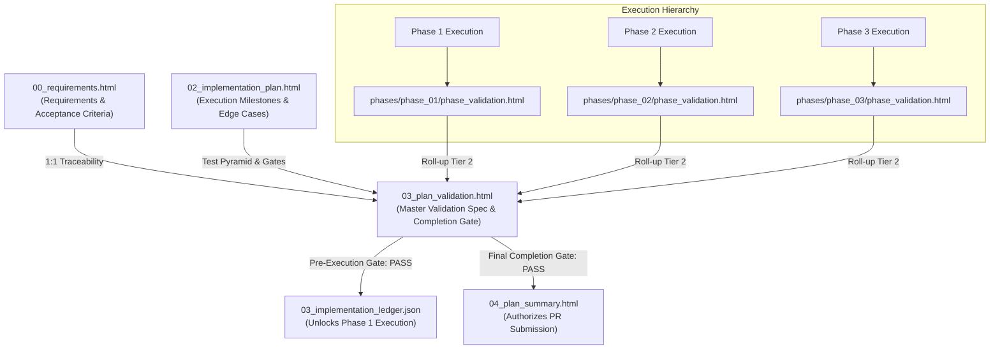

# Plan Validation Document Definition

The **Plan Validation Document** (`03_plan_validation.html`) is the authoritative Tier 1 master verification contract
and gating authority in the **Token Optimized Software Harness (`tosh`)** work item lifecycle. It establishes the
exhaustive verification criteria, test suites, deterministic command assertions, and quality standards that must be
validated in order for the work item's code implementation to be certified as 100% complete and ready for pull request
merge.

While [`00_requirements.html`](file:///C:/Users/samue/IdeaProjects/tosh/build-docs/docs/work-items/requirements.md)
defines *what* business goals and acceptance criteria must be achieved, and [
`02_implementation_plan.html`](file:///C:/Users/samue/IdeaProjects/tosh/build-docs/docs/work-items/implementation-plan.md)
defines *how* the execution is partitioned into milestones, `03_plan_validation.html` defines *how the implemented code
will be proven correct*. It guarantees that code delivery is not subjective, but verified through deterministic
commands, test pyramids, non-functional quality gates, edge-case validations, and explicit manual sign-offs.

`03_plan_validation.html` operates across a **dual-stage lifecycle**:

1. **Pre-Execution Stage (Master Validation Plan & Pre-Execution Gating):** Authored upfront during the planning phase
   prior to writing code. It establishes the complete verification strategy, maps 100% of requirements and acceptance
   criteria to deterministic verification commands, defines the multi-level test pyramid, catalogs negative/edge-case
   tests, and validates that the implementation plan itself is complete, sound, and fully verifiable before the harness
   unlocks task execution.
2. **Execution Completion Stage (Final Completion Gate & Roll-up Audit):** Progressively updated as phases complete, and
   finalized once all phases finish. It executes work-item-wide end-to-end suites, audits the rollup of all Tier 2 Phase
   Validations ([
   `phase_validation.html`](file:///C:/Users/samue/IdeaProjects/tosh/build-docs/docs/work-items/phase-validation.md))
   and Tier 3 Task Validations ([
   `validation.html`](file:///C:/Users/samue/IdeaProjects/tosh/build-docs/docs/work-items/task-validation.md)), verifies
   acceptance criteria fulfillment, records manual sign-offs, and renders the authoritative completion verdict (`pass` |
   `fail` | `warn`) authorizing [
   `04_plan_summary.html`](file:///C:/Users/samue/IdeaProjects/tosh/build-docs/docs/work-items/plan-summary.md)
   generation and pull request submission.

This document fulfills a dual-purpose consumption model:

1. **Human Interface (Static UI):** Renders as a local, fully interactive, static XHTML web page utilizing Material
   Design 3 Web Components (`@material/web` / **M3**). Engineering leads, QA specialists, and reviewers inspect test
   pass gauges, requirement verification matrices, command execution logs, and sign-off checklists directly in any
   browser without requiring client-side bundlers or runtime servers.
2. **Agent / Harness Interface (Machine Parseable):** Serves as a deterministic, structured XML document queryable via
   XPath and the `tosh` CLI. The harness mechanically enforces this document as a hard gate: worker agents cannot
   proceed to coding if the pre-execution plan validation fails, and the work item cannot reach `completed` status in [
   `03_implementation_ledger.json`](file:///C:/Users/samue/IdeaProjects/tosh/build-docs/docs/work-items/work-item-ledger.md)
   until the final completion validation verdict is `pass`.

---

## Core Planning Paradigm: Applying the 4 Dimensions to Plan Validation

In `tosh`, plan validation shifts verification from retrospective, informal human spot-checks to deterministic,
upfront-defined gating across the four core planning dimensions:

| Plan Dimension  | Human Engineer Focus                                                                  | AI Coding Tool Focus                                                                              | `tosh` Plan Validation Manifestation                                                                                                                                                        |
|:----------------|:--------------------------------------------------------------------------------------|:--------------------------------------------------------------------------------------------------|:--------------------------------------------------------------------------------------------------------------------------------------------------------------------------------------------|
| **Context**     | Relies on tacit codebase conventions and tribal domain knowledge.                     | Needs explicit file paths, referenced patterns, and strict "do not touch" constraints.            | Formally catalogs test environments, databases, mock services, test fixtures, environment variables, and protected repository file boundaries ("do not touch") required for test execution. |
| **Granularity** | Focuses on high-level patterns and architecture; details left to implementation time. | Requires atomic, single-responsibility sub-tasks with deterministic inputs/outputs.               | Structures validation into a multi-level testing pyramid: Tier 3 atomic unit/task assertions, Tier 2 phase integration suites, and Tier 1 work-item-wide end-to-end user journeys.          |
| **Validation**  | Manual PR review, local exploratory debugging, automated CI.                          | Explicit terminal commands with deterministic output parsing (lint, test, build) after each step. | Mandates verbatim command lines, expected numeric exit codes (`0`), stdout/stderr regex patterns, assertion count thresholds, and explicit manual sign-off protocols.                       |
| **Edge Cases**  | Usually caught through intuitive testing or code review cycles.                       | Must be exhaustively itemized upfront to prevent naive happy-path assumptions.                    | Pre-defines exhaustive negative test cases, adversarial input injection, security boundary scans, rate-limit thresholds, concurrency race checks, and fault injection tests.                |

---

## Table of Contents

1. [File Location & Organization Standard](#1-file-location--organization-standard)
2. [XHTML Header & Metadata Standard](#2-xhtml-header--metadata-standard)
    - 2.1. [XHTML Header Example](#21-xhtml-header-example)
    - 2.2. [Metadata Attribute Contracts](#22-metadata-attribute-contracts)
3. [Required Sections & M3 Component Structure](#3-required-sections--m3-component-structure)
    - 3.1. [Document Header & Metadata Bar](#31-document-header--metadata-bar)
    - 3.2. [Executive Validation Strategy & Completion Definition](#32-executive-validation-strategy--completion-definition)
    - 3.3. [Requirements & Acceptance Criteria Verification Matrix](#33-requirements--acceptance-criteria-verification-matrix)
    - 3.4. [Multi-Level Testing Pyramid & Verification Command Suites](#34-multi-level-testing-pyramid--verification-command-suites)
        - 3.4.1. [Tier 3 Unit & Component Verification Suites](#341-tier-3-unit--component-verification-suites)
        - 3.4.2. [Tier 2 Integration & API Contract Suites](#342-tier-2-integration--api-contract-suites)
        - 3.4.3. [Tier 1 Work-Item-Wide End-to-End (E2E) & System Suites](#343-tier-1-work-item-wide-end-to-end-e2e--system-suites)
    - 3.5. [Non-Functional, Security & Code Quality Gates](#35-non-functional-security--code-quality-gates)
    - 3.6. [Edge Case, Negative & Boundary Verification](#36-edge-case-negative--boundary-verification)
    - 3.7. [Phase & Task Validation Roll-up Audit](#37-phase--task-validation-roll-up-audit)
    - 3.8. [Manual Verification & Human Sign-Off Protocol](#38-manual-verification--human-sign-off-protocol)
    - 3.9. [Defect Remediation Log & Gating Verdict](#39-defect-remediation-log--gating-verdict)
4. [Token Optimization & XPath Query Patterns](#4-token-optimization--xpath-query-patterns)
5. [Lineage, Rollup & Ledger Integration](#5-lineage-rollup--ledger-integration)
6. [Rules & Constraints](#6-rules--constraints)
7. [Revisions](#7-revisions)

---

## 1. File Location & Organization Standard

The plan validation document resides at the root of the work item directory alongside the core Tier 1 planning
artifacts:

```text
.tosh/
└── work_items/
    └── {YYYYMMDDTHHMMSSZ}_{work_item_slug}/
        ├── 00_requirements.html                # Requirements & Acceptance Checklists
        ├── 01_design_spec.html                 # Technical Architecture & Micro-ADRs
        ├── 02_implementation_plan.html         # Multi-Phase Roadmap & Milestones
        ├── 03_implementation_ledger.json       # State Machine & Task Dependency DAG
        ├── 03_plan_validation.html             # Authoritative Plan Validation Gate
        ├── 04_plan_summary.html                # Final Work Item Execution Summary
        ├── 05_plan_conversation_summary.html   # Distilled LLM Planning Dialogue
        ├── 06_plan_conversation_metrics.json   # Planning Telemetry & Token Metrics
        └── phases/
            └── ...
```

- **File Name:** `03_plan_validation.html`
- **Format:** Strict XHTML (`application/xhtml+xml` compliant, standard XML syntax).
- **Encoding:** UTF-8.
- **Runtime:** Fully static, runnable directly in modern browsers via local filesystem (`file://`) or served locally via
  the `tosh` CLI.
- **Paired Artifacts:**
    - Requirements: [
      `00_requirements.html`](file:///C:/Users/samue/IdeaProjects/tosh/build-docs/docs/work-items/requirements.md)
    - Technical Design: [
      `01_design_spec.html`](file:///C:/Users/samue/IdeaProjects/tosh/build-docs/docs/work-items/technical-design.md)
    - Implementation Plan: [
      `02_implementation_plan.html`](file:///C:/Users/samue/IdeaProjects/tosh/build-docs/docs/work-items/implementation-plan.md)
    - Implementation Ledger: [
      `03_implementation_ledger.json`](file:///C:/Users/samue/IdeaProjects/tosh/build-docs/docs/work-items/work-item-ledger.md)
    - Phase Validations: `phases/{phase_id}/phase_validation.html`
    - Task Validations: `tasks/{task_id}/validation.html`
    - Execution Rollup: [
      `04_plan_summary.html`](file:///C:/Users/samue/IdeaProjects/tosh/build-docs/docs/work-items/plan-summary.md)

---

## 2. XHTML Header & Metadata Standard

### 2.1. XHTML Header Example

Every `03_plan_validation.html` begins with universal baseline `<meta>` tags, validation lifecycle state, test
statistics, and the Material Web ES module importmap loader:

```xhtml
<!DOCTYPE html>
<html xmlns="http://www.w3.org/1999/xhtml" lang="en">
<head>
    <meta charset="UTF-8"/>
    <meta name="viewport" content="width=device-width, initial-scale=1.0"/>
    <title>PLAN VALIDATION: User Authentication Service</title>

    <!-- Universal Baseline Metadata -->
    <meta name="doc-id" content="WI-20260830T170936Z:03:VAL"/>
    <meta name="doc-type" content="plan-validation"/>
    <meta name="schema-version" content="1.0.0"/>
    <meta name="domain" content="work-items"/>
    <meta name="work-item-id" content="20260830T170936Z_user_auth_service"/>
    <meta name="status" content="completed"/> <!-- pending | in-progress | completed | failed | blocked -->
    <meta name="created-at" content="2026-08-30T17:40:00Z"/>
    <meta name="updated-at" content="2026-08-30T18:14:20Z"/>

    <!-- Plan Validation Domain Metadata -->
    <meta name="parent-doc-id" content="WI-20260830T170936Z:02:PLAN"/>
    <meta name="validation-stage"
          content="final-completion-verdict"/> <!-- pre-execution-spec | final-completion-verdict -->
    <meta name="validation-verdict" content="pass"/> <!-- pass | fail | warn | pending -->
    <meta name="validation-scope" content="completeness,feasibility,security,acceptance,e2e"/>
    <meta name="tests-planned" content="42"/>
    <meta name="tests-executed" content="42"/>
    <meta name="tests-passed" content="42"/>
    <meta name="tests-failed" content="0"/>
    <meta name="tests-skipped" content="0"/>
    <meta name="blocking-issues-count" content="0"/>
    <meta name="fpsr" content="1.0"/> <!-- 1.0 (pass on first attempt) | 0.0 (required rework) -->
    <meta name="manual-verification-required" content="true"/>
    <meta name="manual-sign-off-status" content="approved"/> <!-- pending | approved | rejected | n/a -->

    <!-- Material Design 3 Web Component Loader -->
    <link href="https://fonts.googleapis.com/css2?family=Roboto:wght@400;500;700&amp;display=swap" rel="stylesheet"/>
    <link href="https://fonts.googleapis.com/css2?family=Material+Symbols+Outlined" rel="stylesheet"/>
    <script type="importmap">
        {
          "imports": {
            "@material/web/": "https://esm.run/@material/web/"
          }
        }
    </script>
    <script type="module">
        import '@material/web/all.js';
        import {styles as typescaleStyles} from '@material/web/typography/md-typescale-styles.js';

        document.adoptedStyleSheets.push(typescaleStyles.styleSheet);
    </script>
</head>
<body>
<main class="tosh-doc-container">
    <!-- Structured Document Body -->
</main>
</body>
</html>
```

### 2.2. Metadata Attribute Contracts

| Metadata Tag                   | Scope                  | Purpose                                                              | Example                                            |
|:-------------------------------|:-----------------------|:---------------------------------------------------------------------|:---------------------------------------------------|
| `parent-doc-id`                | Work Item / Validation | Points to parent Implementation Plan `doc-id`                        | `WI-20260830T170936Z:02:PLAN`                      |
| `validation-stage`             | Work Item / Validation | Lifecycle phase of the validation document                           | `pre-execution-spec` \| `final-completion-verdict` |
| `validation-verdict`           | Work Item / Validation | Formal validation gating verdict                                     | `pass` \| `fail` \| `warn` \| `pending`            |
| `validation-scope`             | Work Item / Validation | Comma-delimited list of evaluated verification domains               | `completeness,feasibility,security,acceptance,e2e` |
| `tests-planned`                | Work Item / Validation | Total number of test assertions/cases defined in the plan            | `42`                                               |
| `tests-executed`               | Work Item / Validation | Number of test assertions/cases executed to date                     | `42`                                               |
| `tests-passed`                 | Work Item / Validation | Total number of passing test assertions                              | `42`                                               |
| `tests-failed`                 | Work Item / Validation | Total number of failing test assertions                              | `0`                                                |
| `tests-skipped`                | Work Item / Validation | Number of intentionally skipped test cases with justification        | `0`                                                |
| `blocking-issues-count`        | Work Item / Validation | Tally of open defects preventing plan approval or completion         | `0`                                                |
| `fpsr`                         | Work Item / Validation | First-Pass Success Rate (`1.0` if passed without remediation rework) | `1.0` \| `0.0`                                     |
| `manual-verification-required` | Work Item / Validation | Indicates whether human sign-off items exist in the checklist        | `true` \| `false`                                  |
| `manual-sign-off-status`       | Work Item / Validation | Status of required manual verification items                         | `pending` \| `approved` \| `rejected` \| `n/a`     |

---

## 3. Required Sections & M3 Component Structure

The Plan Validation document contains 9 standardized sections combining semantic XHTML elements, Material Design 3 Web
Components (`md-*`), typography scale classes (`md-typescale-*`), and explicit data attributes (`data-*`).

### 3.1. Document Header & Metadata Bar

Anchors the document with the work item identification, validation stage badge (`pre-execution-spec` or
`final-completion-verdict`), validation verdict chip (`pass`, `fail`, `warn`), test pass gauge, blocking issue counter,
and navigation links back to [
`00_requirements.html`](file:///C:/Users/samue/IdeaProjects/tosh/build-docs/docs/work-items/requirements.md) and [
`02_implementation_plan.html`](file:///C:/Users/samue/IdeaProjects/tosh/build-docs/docs/work-items/implementation-plan.md).


### 3.2. Executive Validation Strategy & Completion Definition

Articulates the overarching verification philosophy and establishes the unambiguous, objective definition of what "100%
complete" means for the work item:

- **Definition of Done (DoD):** Explicit checklist of mandatory conditions that must be met before coding is certified
  complete:
    1. 100% of functional requirements and acceptance criteria in [
       `00_requirements.html`](file:///C:/Users/samue/IdeaProjects/tosh/build-docs/docs/work-items/requirements.md) pass
       automated verification.
    2. All Tier 2 Phase Validations ([
       `phase_validation.html`](file:///C:/Users/samue/IdeaProjects/tosh/build-docs/docs/work-items/phase-validation.md))
       report `validation-verdict="pass"` with zero blocking issues.
    3. All Tier 3 Task Validations ([
       `validation.html`](file:///C:/Users/samue/IdeaProjects/tosh/build-docs/docs/work-items/task-validation.md))
       report `validation-verdict="pass"` and clean exit code `0`.
    4. Work-item-wide end-to-end integration and system test suite passes with zero regressions.
    5. Zero protected "do not touch" file boundaries violated.
    6. Code quality, linting, formatting, and security vulnerability scans pass with zero errors.
    7. All mandatory manual verification checklist items are formally signed off.
- **Verification Governance:** Deterministic gating rules executed by the `tosh` harness. A single failing test or
  unhandled requirement halts completion and triggers the automated remediation loop.

### 3.3. Requirements & Acceptance Criteria Verification Matrix

The authoritative 1:1 traceability registry mapping every requirement ID and acceptance criterion from [
`00_requirements.html`](file:///C:/Users/samue/IdeaProjects/tosh/build-docs/docs/work-items/requirements.md) to concrete
verification commands, automated test assertions, and pass/fail evidence:

- **Completeness Invariant:** If any requirement ID from `00_requirements.html` is absent from this matrix,
  `03_plan_validation.html` fails pre-execution validation with `blocking-issues-count >= 1`.

### 3.4. Multi-Level Testing Pyramid & Verification Command Suites

Structures verification across the testing pyramid, detailing verbatim terminal commands, execution contexts, and
deterministic output parsing rules:

#### 3.4.1. Tier 3 Unit & Component Verification Suites

- **Purpose:** Verifies atomic functions, domain models, utility classes, and validation logic in total isolation.
- **Mocking Policy:** External dependencies (database, network, message queues) must be mocked or stubbed.
- **Verification Command:** Verbatim terminal invocation (e.g., `mvn test -Dtest=*UnitTest`, `pytest tests/unit/`,
  `npm run test:unit`).
- **Assertion Criteria:** 100% assertions pass, line coverage meets project threshold (e.g. $\ge 80\%$), zero uncaught
  exceptions.

#### 3.4.2. Tier 2 Integration & API Contract Suites

- **Purpose:** Verifies cross-component interaction, database migrations, persistence repositories, and HTTP/REST
  contract boundaries.
- **Environment:** Embedded test database (Testcontainers PostgreSQL, H2) or local mock server.
- **Verification Command:** Verbatim terminal invocation (e.g., `mvn verify -Pintegration-tests`,
  `pytest tests/integration/`).
- **Assertion Criteria:** HTTP status codes match OpenAPI contracts, database transactions commit/rollback accurately,
  schema constraints enforced.

#### 3.4.3. Tier 1 Work-Item-Wide End-to-End (E2E) & System Suites

- **Purpose:** Validates the entire user journey spanning multiple phases, exercising complete end-to-end workflows in
  an integrated environment.
- **Verification Command:** Verbatim terminal invocation (e.g., `npm run test:e2e`, `mvn verify -Pe2e-tests`).
- **Execution Evidence:** Detailed terminal output, assertions passed, and latency metrics:

### 3.5. Non-Functional, Security & Code Quality Gates

Verifies that the code meets architectural, security, and maintainability baselines.

### 3.6. Edge Case, Negative & Boundary Verification

Exhaustively records validation of the negative paths, error handling, adversarial inputs, and edge cases cataloged in [
`02_implementation_plan.html`](file:///C:/Users/samue/IdeaProjects/tosh/build-docs/docs/work-items/implementation-plan.md):

| Edge Case ID | Category       | Scenario / Adversarial Input                   | Expected System Behavior                                         | Verifying Test Case                         | Verdict |
|:-------------|:---------------|:-----------------------------------------------|:-----------------------------------------------------------------|:--------------------------------------------|:--------|
| `EDGE-001`   | Authentication | Replay attack with expired refresh token       | Entire refresh token family revoked; HTTP 401 emitted            | `TokenRotationE2ETest#testReplayAttack`     | `PASS`  |
| `EDGE-002`   | Input Boundary | Password length = 0 or > 128 characters        | HTTP 400 Bad Request with field-specific validation error        | `UserValidationTest#testPasswordBoundaries` | `PASS`  |
| `EDGE-003`   | Concurrency    | Simultaneous registration with identical email | Exactly one user record created; second request returns HTTP 409 | `ConcurrencyRegistrationTest#testRace`      | `PASS`  |
| `EDGE-004`   | Infrastructure | Database connection timeout during auth        | HTTP 503 Service Unavailable; no unhandled stack traces leaked   | `FaultInjectionTest#testDbTimeout`          | `PASS`  |

### 3.7. Phase & Task Validation Roll-up Audit

Evaluates the roll-up integrity across the work item's execution hierarchy. For `03_plan_validation.html` to reach a
`pass` verdict, all underlying phase and task validations must have completed successfully.

- **Roll-up Rule:** If any phase validation reports `fail` or `warn`, or any task validation has exit code $\ne 0$, the
  plan validation verdict cannot be `pass`.

### 3.8. Manual Verification & Human Sign-Off Protocol

Accommodates verification steps that require human sensory inspection, exploratory testing, UX review, or compliance
sign-off.

- If `manual-verification-required="true"`, any item in `pending` or `rejected` status blocks final plan validation
  approval.

### 3.9. Defect Remediation Log & Gating Verdict

The formal gating verdict authorizing work item transitions, combined with the defect remediation history:

- **Formal Verdict:** High-visibility chip or banner indicating:
    - `PASS`: All automated suites, quality gates, rollups, and manual items passed. Work item is authorized for [
      `04_plan_summary.html`](file:///C:/Users/samue/IdeaProjects/tosh/build-docs/docs/work-items/plan-summary.md)
      generation and pull request creation.
    - `FAIL`: One or more blocking issues detected. The harness dispatches targeted remediation tasks back to worker
      agents.
    - `WARN`: Non-blocking advisories detected (e.g., minor performance deviation or optional warning). Conditional
      progress allowed upon human acknowledgement.
- **Defect Remediation History:** Itemizes any defects uncovered during pre-execution or post-execution validation,
  detailing root cause, remediation commits, and re-test verification evidence.

---

## 4. Token Optimization & XPath Query Patterns

Downstream CI/CD runners, orchestrator agents, and release automation extract validation data from
`03_plan_validation.html` using targeted XPath queries without loading the entire document into context:

### Querying Validation Verdict & Stage

```xpath2
/html/head/meta[@name='validation-verdict']/@content | /html/head/meta[@name='validation-stage']/@content
```

### Checking Blocking Issue Count & Test Counts

```xpath2
/html/head/meta[@name='blocking-issues-count']/@content | /html/head/meta[@name='tests-passed']/@content | /html/head/meta[@name='tests-failed']/@content
```

### Retrieving Failing Requirements in the Traceability Matrix

```xpath2
//table[@id='req-matrix-table']//tr[@data-status='fail']
```

### Extracting E2E Verification Command & Output

```xpath2
//section[@id='e2e-command-suite']//code | //section[@id='e2e-command-suite']//pre
```

### Verifying Quality Gate Compliance

```xpath2
//table[@id='quality-gates-table']//tr[@data-status!='pass']
```

### Auditing Manual Sign-Off Status

```xpath2
/html/head/meta[@name='manual-sign-off-status']/@content | //table[@id='manual-checks-table']//tr[@data-status='pending']
```

---

## 5. Lineage, Rollup & Ledger Integration

The plan validation document anchors the entire verification lifecycle from planning to pull request authorization:



- **Pre-Execution Gating:** The harness checks `/html/head/meta[@name='validation-verdict']/@content` in
  `03_plan_validation.html`. If not `pass` (or conditional `warn`), phase execution is mechanically locked in
  `03_implementation_ledger.json`.
- **Hierarchical Roll-up:** All Tier 3 task validations roll up into their parent Tier 2 phase validations, and all
  phase validations roll up into `03_plan_validation.html`.
- **Final Completion Gate:** Once all phases complete and work-item-wide E2E suites pass, `validation-verdict` is
  finalized as `pass`, authorizing [
  `04_plan_summary.html`](file:///C:/Users/samue/IdeaProjects/tosh/build-docs/docs/work-items/plan-summary.md)
  generation.

---

## 6. Rules & Constraints

1. **100% Requirement Coverage Invariant:** Every single functional requirement and acceptance criterion defined in [
   `00_requirements.html`](file:///C:/Users/samue/IdeaProjects/tosh/build-docs/docs/work-items/requirements.md) must
   have a corresponding entry in the Requirements & Acceptance Criteria Verification Matrix. Zero unverified
   requirements are permitted.
2. **Deterministic Command Execution:** All automated test entries must specify exact, runnable terminal commands with
   deterministic expected exit codes (`0`) and stdout/stderr assertions. Generic phrases like "run test suite" are
   strictly forbidden.
3. **Dual-Stage Lifecycle Preservation:** The document must record both its pre-execution specification baseline and its
   final completion execution verdict. The transition from `pre-execution-spec` to `final-completion-verdict` must
   reflect actual executed test runs.
4. **Zero-Tolerance Defect Gating:** Any failing test, unresolved blocker, or unapproved mandatory manual check strictly
   prevents `validation-verdict` from reaching `pass`.
5. **Strict XHTML Conformance:** `03_plan_validation.html` must parse as valid XML
   (`xmlns="http://www.w3.org/1999/xhtml"`), with all tags self-closed or closed, attributes quoted, and ampersands
   escaped (`&amp;`).
6. **No Deliberative History:** In accordance with repository principles, the document must capture only the
   authoritative verification criteria, execution commands, and factual outcomes. Deliberative debate belongs
   exclusively in [
   `05_plan_conversation_summary.html`](file:///C:/Users/samue/IdeaProjects/tosh/build-docs/docs/work-items/plan-conversation-summary.md).

---

## 7. Revisions

| Date       | Version | Description                                                                                                                                                                                                                                                                                     | Source                |
|:-----------|:--------|:------------------------------------------------------------------------------------------------------------------------------------------------------------------------------------------------------------------------------------------------------------------------------------------------|:----------------------|
| 2026-09-06 | 1.0.0   | Canonical specification for Plan Validation (`03_plan_validation.html`) establishing the dual-stage lifecycle, 1:1 requirements verification matrix, multi-level testing pyramid, non-functional quality gates, phase/task roll-up audits, manual sign-off protocols, and XPath query patterns. | Feature Specification |
| 2026-08-30 | 0.1.0   | Initial baseline stub in document catalog.                                                                                                                                                                                                                                                      | Initial Specification |