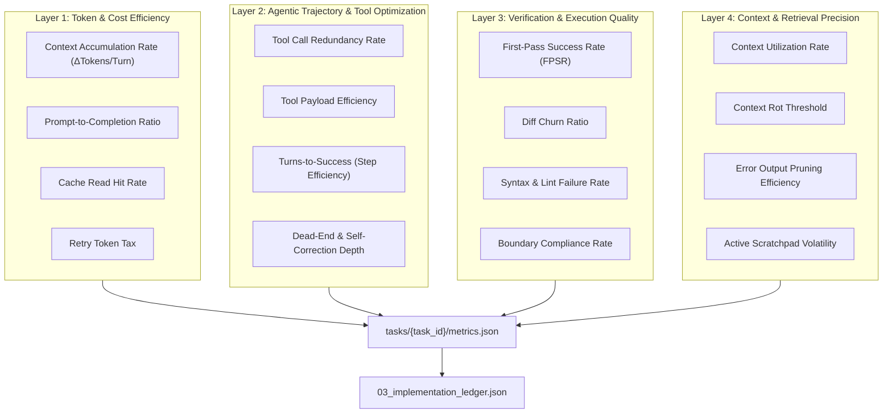
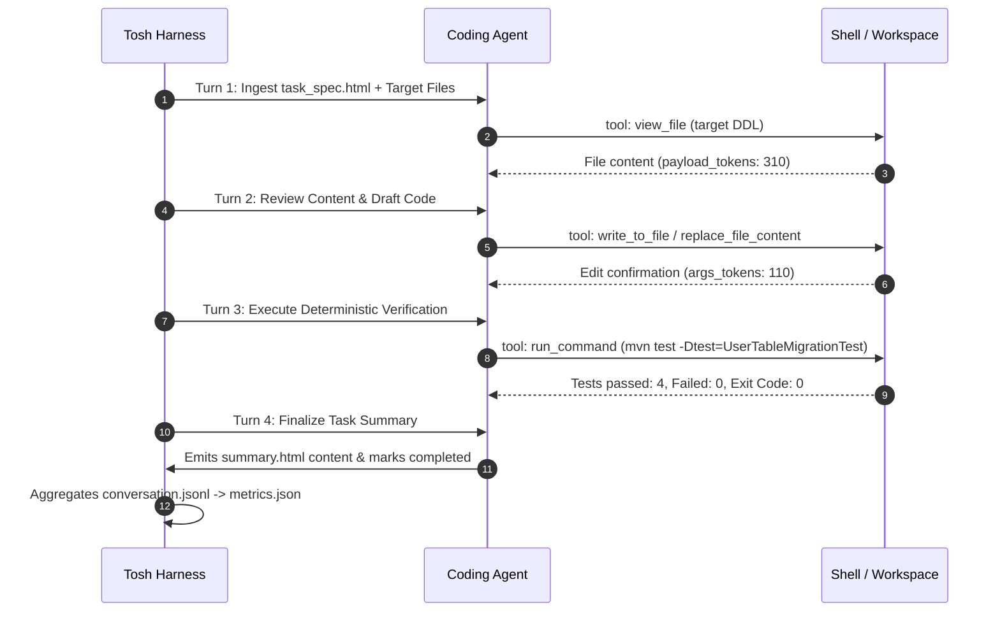
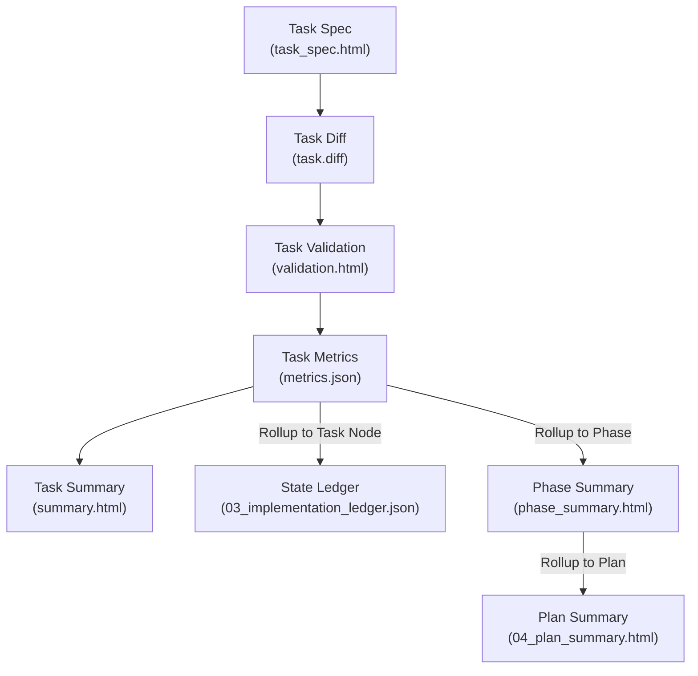

# Task Conversation Metrics Document Definition

The **Task Conversation Metrics Document** (`tasks/{task_id}/metrics.json`) is the authoritative Tier 3 telemetry record
in the **Token Optimized Software Harness (`tosh`)** work item lifecycle. It records exact token consumption, model
usage, prompt caching efficiency, tool execution trajectories, diff churn, and verification outcomes for an atomic
engineering task.

In `tosh`, token optimization cannot be evaluated in isolation. Token savings achieved by withholding file context,
stripping type definitions, or aggressively truncating compiler errors frequently backfires into multi-turn repair
loops, premature failure, and bloated diff churn that exponentially increases aggregate compute.

This document serves a dual purpose:

1. **Human & Platform Interface:** Enables platform engineers, engineering managers, and developers to audit task-level
   token expenditure, diagnose runaway agent repair loops, compare model cost-to-performance ratios, and inspect
   surgical diff efficiency.
2. **Agent / Harness Interface:** Serves as a deterministic JSON machine artifact queryable by the `tosh` CLI and
   evaluators for automated task gating, ledger state synchronization, and dynamic prompt-cache tuning.

---

## Core Execution Paradigm: The 4-Layer Task Telemetry Framework

To extract actionable signals from raw task session logs (`conversation.jsonl`), `tosh` organizes task-level telemetry
across four operational layers:



---

## Table of Contents

1. [File Location & Organization Standard](#1-file-location--organization-standard)
2. [The 4-Layer Task Telemetry Framework](#2-the-4-layer-task-telemetry-framework)
    - 2.1. [Layer 1: Token & Cost Efficiency Metrics](#21-layer-1-token--cost-efficiency-metrics)
    - 2.2. [Layer 2: Agentic Trajectory & Tool Optimization](#22-layer-2-agentic-trajectory--tool-optimization)
    - 2.3. [Layer 3: Verification & Execution Quality](#23-layer-3-verification--execution-quality)
    - 2.4. [Layer 4: Context & Retrieval Precision](#24-layer-4-context--retrieval-precision)
3. [JSON Schema Specification (`tasks/{task_id}/metrics.json`)](#3-json-schema-specification-taskstask_idmetricsjson)
4. [Turn-Level Session Log Schema (`conversation.jsonl`)](#4-turn-level-session-log-schema-conversationjsonl)
5. [Token Optimization, Analysis Patterns & CLI / jq Queries](#5-token-optimization-analysis-patterns--cli--jq-queries)
6. [Lineage, Rollup & Ledger Integration](#6-lineage-rollup--ledger-integration)
7. [Rules & Constraints](#7-rules--constraints)
8. [Revisions](#8-revisions)

---

## 1. File Location & Organization Standard

Each task conversation metrics document resides directly inside its isolated task directory within its parent phase:

```text
.tosh/
└── work_items/
    └── {work-item-id}/
        └── phases/
            └── phase_{NN}_{phase_slug}/
                └── tasks/
                    └── task_{NNN}_{task_slug}/
                        ├── task_spec.html          # Scope, Target Files & Acceptance Criteria
                        ├── validation.html         # Test Runs, Exit Codes & Verdict
                        ├── task.diff               # Task File Diff
                        ├── summary.html            # File Touchpoints & Git Diff Summary
                        ├── conversation.jsonl      # Turn-by-Turn Session Log
                        └── metrics.json            # Authoritative Task Conversation Metrics
```

- **File Name:** `metrics.json`
- **Format:** Strict JSON (UTF-8, 2-space indentation).
- **Paired Log:** Session turns captured in [
  `conversation.jsonl`](task-conversation.md).
- **Paired Documents:**
    - Instructions: [
      `task_spec.html`](task-specification.md)
    - Verification: [
      `validation.html`](task-validation.md)
    - Diff: [task.diff](task-diff.md)
    - Outcome: [`summary.html`](task-summary.md)

---

## 2. The 4-Layer Task Telemetry Framework

### 2.1. Layer 1: Token & Cost Efficiency Metrics

These metrics track token burn rate, prompt caching performance, and the economic efficiency of code implementation.

| Metric Name                                 | Formula / Measurement                                                                                   | Target Range                         | Purpose & Harness Improvement Area                                                                                                                                                                      |
|:--------------------------------------------|:--------------------------------------------------------------------------------------------------------|:-------------------------------------|:--------------------------------------------------------------------------------------------------------------------------------------------------------------------------------------------------------|
| **Context Accumulation Rate**               | $\Delta\text{Tokens} / \text{Turn} = \frac{\text{Prompt Tokens}_{N} - \text{Prompt Tokens}_{1}}{N - 1}$ | Linear slope ($< 1,200$ tokens/turn) | Measures input token expansion per repair turn. Steep quadratic growth indicates the harness is naively dumping entire build logs or raw file dumps into prompts instead of surgical diffs.             |
| **Prompt-to-Completion Ratio**              | $\frac{\text{Prompt Tokens}}{\text{Completion Tokens}}$                                                 | $80:20$ to $92:8$                    | Coding agents are inherently input-heavy. If the ratio exceeds $98:2$, system prompts are bloated, or the model is making microscopic edits across excessive round-trips.                               |
| **Token Cost per Resolved Task**            | Total task tokens consumed                                                                              | $< 15,000$ tokens/task               | The primary benchmark for prompt compression, tool schema ergonomics, and harness efficiency.                                                                                                           |
| **Cache Read Hit Rate**                     | $\frac{\text{Cache Read Tokens}}{\text{Total Prompt Tokens}} \times 100\%$                              | $> 75\%$                             | Percentage of input tokens served by prefix caching during multi-turn test/repair cycles. Identifies whether prefix ordering (system prompt $\to$ tools $\to$ static specs $\to$ history) is preserved. |
| **Retry Token Tax** *(Suggested)*           | $\frac{\text{Tokens Consumed in Repair Turns}}{\text{Total Task Tokens}} \times 100\%$                  | $\le 20\%$                           | Measures the token penalty incurred after the first test failure. High values highlight unstable initial implementations or poor compiler error diagnostics.                                            |
| **Cost per Net Accepted LOC** *(Suggested)* | $\frac{\text{Total Cost (USD)}}{\text{Net Accepted Lines of Code}}$                                     | $<\$0.005$ / line                    | Evaluates direct financial cost per accepted line of production code.                                                                                                                                   |

---

### 2.2. Layer 2: Agentic Trajectory & Tool Optimization

Agentic execution waste manifests as redundant tool executions, dead-end repair cycles, and oversized tool payloads.

| Metric Name                                      | Formula / Measurement                                                                  | Target Range                                              | Purpose & Harness Improvement Area                                                                                                                                                                        |
|:-------------------------------------------------|:---------------------------------------------------------------------------------------|:----------------------------------------------------------|:----------------------------------------------------------------------------------------------------------------------------------------------------------------------------------------------------------|
| **Tool Call Redundancy Rate**                    | $\frac{\text{Duplicate Tool Invocations}}{\text{Total Tool Invocations}}$              | $\le 5\%$                                                 | Frequency of an agent calling the exact same tool with identical arguments (e.g., reading the same unmodified file twice, re-running `git status` repeatedly). Remedied by in-memory tool result caching. |
| **Tool Payload Efficiency**                      | $\frac{\text{Tokens Referenced in Subsequent Action}}{\text{Tokens Returned by Tool}}$ | $\ge 40\%$                                                | Ratio of tokens returned by tools (e.g., terminal test output, file contents) to tokens actually acted upon. Requires output truncation, targeted AST viewers, and line-bounded reads.                    |
| **Turns-to-Success (Step Efficiency)**           | Total LLM round-trips to complete task                                                 | $\le 5$ turns                                             | Round-trips required from task specification load to passing `validation.html`. Detects agent hesitation or underspecified task instructions.                                                             |
| **Dead-End & Self-Correction Depth**             | Consecutive turns spent recovering from errors                                         | $\le 2$ turns                                             | Turns spent in unbroken failure loops (compiler errors, failing tests, invalid tool calls). High depth indicates unrecoverable code drift requiring early circuit breaking.                               |
| **Terminal Command Success Ratio** *(Suggested)* | $\frac{\text{Commands with Exit Code 0}}{\text{Total Commands Executed}}$              | $\ge 70\%$                                                | Measures terminal command precision. Excessively low ratios signal guesswork in build or test commands.                                                                                                   |
| **Tool Action Distribution** *(Suggested)*       | Turn breakdown: Read vs Edit vs Exec vs Thinking                                       | Balanced (e.g., 20% Read, 30% Edit, 30% Test, 20% Verify) | Detects imbalanced agent behavior (e.g., spending 80% of turns reading without editing).                                                                                                                  |

---

### 2.3. Layer 3: Verification & Execution Quality

Token savings are worthless if the generated code fails to compile, breaks regression tests, or generates sprawling
churn.

| Metric Name                                 | Formula / Measurement                                                          | Target Range    | Purpose & Harness Improvement Area                                                                                                                                               |
|:--------------------------------------------|:-------------------------------------------------------------------------------|:----------------|:---------------------------------------------------------------------------------------------------------------------------------------------------------------------------------|
| **First-Pass Success Rate (FPSR)**          | Passing lint, build, and tests on attempt 1                                    | $1.0$ ($100\%$) | Percentage of tasks that succeed on the very first execution attempt without entering a self-correction repair loop.                                                             |
| **Diff Churn Ratio**                        | $\frac{\text{Generated Lines Changed}}{\text{Net Accepted Lines}}$             | $1.0 - 1.25$    | Detects full-file rewrites versus surgical unified diffs. A ratio $> 2.0$ indicates sloppy refactors, deleted comments, or unnecessary whitespace reformatting.                  |
| **Syntax & Lint Failure Rate**              | $\frac{\text{Syntax/Lint Errors}}{\text{Total Verification Attempts}}$         | $0\%$           | Frequency of edits failing due to parse errors, missing imports, invalid regex, or linter complaints. High rates justify pre-LLM linting or AST patch validators in the harness. |
| **Boundary Violation Rate** *(Suggested)*   | $\frac{\text{Edits Attempted on Protected Files}}{\text{Total Edit Attempts}}$ | $0\%$ ($0.0$)   | Strict compliance with "do not touch" manifests defined in `task_spec.html`. Any non-zero value indicates prompt boundary leakage.                                               |
| **Regression Induction Rate** *(Suggested)* | Existing passing tests broken by task                                          | $0$             | Measures code safety. High regression counts suggest inadequate pre-context or missing integration test checks.                                                                  |

---

### 2.4. Layer 4: Context & Retrieval Precision

Coding agents must work with surgically scoped context. Ingesting whole repositories degrades reasoning and wastes
tokens.

| Metric Name                                       | Formula / Measurement                                                                      | Target Range            | Purpose & Harness Improvement Area                                                                                                    |
|:--------------------------------------------------|:-------------------------------------------------------------------------------------------|:------------------------|:--------------------------------------------------------------------------------------------------------------------------------------|
| **Context Utilization Rate**                      | $\frac{\text{Injected Snippets Referenced/Modified}}{\text{Total Injected File Snippets}}$ | $\ge 75\%$              | Percentage of retrieved workspace context files or interfaces actually referenced, imported, or modified in the final patch.          |
| **Context Rot Threshold**                         | Token depth where recall degrades                                                          | $> 85\%$ of window      | Point during multi-turn debugging where agent forgets earlier instructions, drops edge cases, or violates "do not touch" constraints. |
| **Error Output Pruning Efficiency** *(Suggested)* | $\frac{\text{Sanitized Error Hunk Tokens}}{\text{Raw Terminal stderr Tokens}}$             | $\le 20\%$ (80% pruned) | Harness efficiency in stripping verbose stack traces, dependency notices, and ANSI codes down to actionable failure lines.            |
| **Active Scratchpad Volatility** *(Suggested)*    | $\Delta\text{Scratchpad Tokens} / \text{Turn}$                                             | Stable ($\pm 15\%$)     | Tracks whether task memory remains focused or accumulates obsolete debug notes.                                                       |

---

## 3. JSON Schema Specification (`tasks/{task_id}/metrics.json`)

The following JSON Schema governs the structure and validation of `tasks/{task_id}/metrics.json`:

```json
{
  "$schema": "https://json-schema.org/draft/2020-12/schema",
  "$id": "https://tosh.dev/schemas/work-items/task-conversation-metrics.schema.json",
  "title": "TaskConversationMetrics",
  "description": "Authoritative Tier 3 task execution metrics and telemetry record.",
  "type": "object",
  "required": [
    "docId",
    "docType",
    "schemaVersion",
    "workItemId",
    "phaseId",
    "taskId",
    "status",
    "timestamps",
    "tokenEfficiency",
    "agenticTrajectory",
    "executionQuality",
    "contextEngineering",
    "diffMetrics",
    "costRollup"
  ],
  "properties": {
    "docId": {
      "type": "string",
      "pattern": "^WI-[0-9]{8}T[0-9]{6}Z:P[0-9]{2}:T[0-9]{3}:METRICS$"
    },
    "docType": {
      "type": "string",
      "const": "task-conversation-metrics"
    },
    "schemaVersion": {
      "type": "string",
      "const": "1.0.0"
    },
    "workItemId": {
      "type": "string",
      "pattern": "^[0-9]{8}T[0-9]{6}Z_[a-z0-9_]+$"
    },
    "phaseId": {
      "type": "string",
      "pattern": "^phase_[0-9]{2}_[a-z0-9_]+$"
    },
    "taskId": {
      "type": "string",
      "pattern": "^task_[0-9]{3}_[a-z0-9_]+$"
    },
    "status": {
      "type": "string",
      "enum": [
        "pending",
        "in-progress",
        "completed",
        "failed"
      ]
    },
    "timestamps": {
      "type": "object",
      "required": [
        "startedAt",
        "completedAt",
        "executionDurationMs"
      ],
      "properties": {
        "startedAt": {
          "type": "string",
          "format": "date-time"
        },
        "completedAt": {
          "type": "string",
          "format": "date-time"
        },
        "executionDurationMs": {
          "type": "integer",
          "minimum": 0
        }
      }
    },
    "tokenEfficiency": {
      "type": "object",
      "required": [
        "totalTokens",
        "promptTokens",
        "completionTokens",
        "cacheReadTokens",
        "cacheCreationTokens",
        "cacheReadHitRatePct",
        "promptToCompletionRatio",
        "contextAccumulationRateDeltaPerTurn",
        "retryTokenTaxPct"
      ],
      "properties": {
        "totalTokens": {
          "type": "integer",
          "minimum": 0
        },
        "promptTokens": {
          "type": "integer",
          "minimum": 0
        },
        "completionTokens": {
          "type": "integer",
          "minimum": 0
        },
        "cacheReadTokens": {
          "type": "integer",
          "minimum": 0
        },
        "cacheCreationTokens": {
          "type": "integer",
          "minimum": 0
        },
        "cacheReadHitRatePct": {
          "type": "number",
          "minimum": 0,
          "maximum": 100
        },
        "promptToCompletionRatio": {
          "type": "string"
        },
        "contextAccumulationRateDeltaPerTurn": {
          "type": "number"
        },
        "retryTokenTaxPct": {
          "type": "number",
          "minimum": 0,
          "maximum": 100
        },
        "costPerNetAcceptedLoc": {
          "type": "number",
          "minimum": 0
        }
      }
    },
    "agenticTrajectory": {
      "type": "object",
      "required": [
        "turnsToSuccess",
        "totalToolCalls",
        "toolCallRedundancyRatePct",
        "toolPayloadEfficiencyPct",
        "deadEndTurnsCount",
        "terminalCommandSuccessRatioPct"
      ],
      "properties": {
        "turnsToSuccess": {
          "type": "integer",
          "minimum": 1
        },
        "totalToolCalls": {
          "type": "integer",
          "minimum": 0
        },
        "toolCallRedundancyRatePct": {
          "type": "number",
          "minimum": 0,
          "maximum": 100
        },
        "toolPayloadEfficiencyPct": {
          "type": "number",
          "minimum": 0,
          "maximum": 100
        },
        "deadEndTurnsCount": {
          "type": "integer",
          "minimum": 0
        },
        "terminalCommandSuccessRatioPct": {
          "type": "number",
          "minimum": 0,
          "maximum": 100
        }
      }
    },
    "executionQuality": {
      "type": "object",
      "required": [
        "firstPassSuccess",
        "diffChurnRatio",
        "syntaxLintFailureRatePct",
        "testAssertionsPassed",
        "testAssertionsFailed",
        "boundaryViolationsCount"
      ],
      "properties": {
        "firstPassSuccess": {
          "type": "boolean"
        },
        "diffChurnRatio": {
          "type": "number",
          "minimum": 1.0
        },
        "syntaxLintFailureRatePct": {
          "type": "number",
          "minimum": 0,
          "maximum": 100
        },
        "testAssertionsPassed": {
          "type": "integer",
          "minimum": 0
        },
        "testAssertionsFailed": {
          "type": "integer",
          "minimum": 0
        },
        "boundaryViolationsCount": {
          "type": "integer",
          "minimum": 0
        }
      }
    },
    "contextEngineering": {
      "type": "object",
      "required": [
        "contextUtilizationRatePct",
        "injectedFilesCount",
        "modifiedFilesCount",
        "errorOutputPruningEfficiencyPct",
        "contextRotDetected"
      ],
      "properties": {
        "contextUtilizationRatePct": {
          "type": "number",
          "minimum": 0,
          "maximum": 100
        },
        "injectedFilesCount": {
          "type": "integer",
          "minimum": 0
        },
        "modifiedFilesCount": {
          "type": "integer",
          "minimum": 0
        },
        "errorOutputPruningEfficiencyPct": {
          "type": "number",
          "minimum": 0,
          "maximum": 100
        },
        "contextRotDetected": {
          "type": "boolean"
        }
      }
    },
    "diffMetrics": {
      "type": "object",
      "required": [
        "linesAdded",
        "linesDeleted",
        "netAcceptedLines",
        "generatedLinesChanged"
      ],
      "properties": {
        "linesAdded": {
          "type": "integer",
          "minimum": 0
        },
        "linesDeleted": {
          "type": "integer",
          "minimum": 0
        },
        "netAcceptedLines": {
          "type": "integer",
          "minimum": 0
        },
        "generatedLinesChanged": {
          "type": "integer",
          "minimum": 0
        }
      }
    },
    "costRollup": {
      "type": "object",
      "required": [
        "totalCostUsd",
        "model",
        "currency"
      ],
      "properties": {
        "totalCostUsd": {
          "type": "number",
          "minimum": 0
        },
        "model": {
          "type": "string"
        },
        "currency": {
          "type": "string",
          "const": "USD"
        }
      }
    }
  },
  "additionalProperties": false
}
```

### 3.1. Concrete Instance Example (`tasks/{task_id}/metrics.json`)

```json
{
  "docId": "WI-20260830T170936Z:P01:T001:METRICS",
  "docType": "task-conversation-metrics",
  "schemaVersion": "1.0.0",
  "workItemId": "20260830T170936Z_user_auth_service",
  "phaseId": "phase_01_database_migration",
  "taskId": "task_001_create_tables",
  "status": "completed",
  "timestamps": {
    "startedAt": "2026-08-30T17:10:00Z",
    "completedAt": "2026-08-30T17:14:22Z",
    "executionDurationMs": 262000
  },
  "tokenEfficiency": {
    "totalTokens": 12400,
    "promptTokens": 8900,
    "completionTokens": 3500,
    "cacheReadTokens": 6800,
    "cacheCreationTokens": 1200,
    "cacheReadHitRatePct": 76.40,
    "promptToCompletionRatio": "72:28",
    "contextAccumulationRateDeltaPerTurn": 780.0,
    "retryTokenTaxPct": 0.0,
    "costPerNetAcceptedLoc": 0.00044
  },
  "agenticTrajectory": {
    "turnsToSuccess": 4,
    "totalToolCalls": 6,
    "toolCallRedundancyRatePct": 0.0,
    "toolPayloadEfficiencyPct": 62.5,
    "deadEndTurnsCount": 0,
    "terminalCommandSuccessRatioPct": 100.0
  },
  "executionQuality": {
    "firstPassSuccess": true,
    "diffChurnRatio": 1.05,
    "syntaxLintFailureRatePct": 0.0,
    "testAssertionsPassed": 8,
    "testAssertionsFailed": 0,
    "boundaryViolationsCount": 0
  },
  "contextEngineering": {
    "contextUtilizationRatePct": 85.0,
    "injectedFilesCount": 2,
    "modifiedFilesCount": 2,
    "errorOutputPruningEfficiencyPct": 18.2,
    "contextRotDetected": false
  },
  "diffMetrics": {
    "linesAdded": 84,
    "linesDeleted": 0,
    "netAcceptedLines": 84,
    "generatedLinesChanged": 88
  },
  "costRollup": {
    "totalCostUsd": 0.0372,
    "model": "claude-3-5-sonnet",
    "currency": "USD"
  }
}
```

---

## 4. Turn-Level Session Log Schema (`conversation.jsonl`)

Every LLM exchange during task execution writes an immutable telemetry record into `conversation.jsonl`:

```json
{
  "session_id": "sess-wi-20260830T170936Z-p01-t001",
  "turn_index": 3,
  "role": "assistant",
  "model": "claude-3-5-sonnet",
  "timestamp": "2026-08-30T17:12:15Z",
  "usage": {
    "prompt_tokens": 14250,
    "completion_tokens": 320,
    "cache_read_tokens": 10500,
    "cache_creation_tokens": 0
  },
  "tool_calls": [
    {
      "name": "replace_file_content",
      "args_tokens": 110,
      "response_tokens": 45,
      "status": "success",
      "is_retry": false,
      "tokens_referenced_in_turn": 45
    }
  ],
  "verification": {
    "compiled": true,
    "tests_passed": 4,
    "tests_failed": 0,
    "lint_errors": 0
  },
  "context_stats": {
    "injected_files_count": 3,
    "active_scratchpad_tokens": 480
  }
}
```

### 4.1. Lifecycle Turn Flow Example

A typical passing atomic task generates a tight, deterministic sequence of entries:



---

## 5. Token Optimization, Analysis Patterns & CLI / jq Queries

Filter `.jsonl` and `.json` logs to isolate runaway sessions, identify prefix cache breakage, and spot surgical diff
failures:

### 5.1. Finding High-Cost / High-Step Outliers (Edge Cases)

```bash
# Surface tasks with high token consumption or runaway steps
find .tosh/work_items -name "metrics.json" -exec jq -r '
  select(.tokenEfficiency.totalTokens > 30000 or .agenticTrajectory.turnsToSuccess > 8)
  | "\(.taskId): \(.tokenEfficiency.totalTokens) tokens, \(.agenticTrajectory.turnsToSuccess) turns, $\(.costRollup.totalCostUsd)"
' {} +
```

### 5.2. Detecting Bloated File Rewrites (High Diff Churn)

```bash
# Flag tasks generating full-file rewrites rather than surgical diffs
jq -e '
  select(.executionQuality.diffChurnRatio > 1.5)
  | {task: .taskId, churn: .executionQuality.diffChurnRatio, gen: .diffMetrics.generatedLinesChanged, net: .diffMetrics.netAcceptedLines}
' metrics.json
```

### 5.3. Inspecting Dead-End Self-Correction Depth

```bash
# Query turns where consecutive tool calls or verifications failed
jq -s '
  map(select(.verification.tests_failed > 0 or .tool_calls[0].status == "error"))
  | length
' conversation.jsonl
```

### 5.4. Auditing Prefix Cache Read Hit Rate Across Turns

```bash
# Monitor cache read percentage across each turn
jq -r '
  "Turn \(.turn_index): CacheHitRate = \((.usage.cache_read_tokens / .usage.prompt_tokens) * 100 | round)%"
' conversation.jsonl
```

---

## 6. Lineage, Rollup & Ledger Integration

The task metrics file acts as the atomic sensor feeding upward telemetry into the phase and work item layers:



- **Direct Ledger Sync:** Upon task completion, `tosh` writes the task's execution duration, token count, and USD cost
  directly into `phases[].tasks[].metrics` of
  [
  `03_implementation_ledger.json`](work-item-ledger.md).
- **Phase Milestone Rollup:** [
  `phase_summary.html`](phase-summary.md)
  aggregates all task `metrics.json` records to report cumulative phase tokens, cache hit rates, and total cost.
- **Root Rollup:** [
  `04_plan_summary.html`](plan-summary.md)
  computes the global project metrics rollup across all phases.

---

## 7. Rules & Constraints

1. **Deterministic Verification:** Every completed task must record passing test assertions (`testAssertionsPassed > 0`,
   `testAssertionsFailed == 0`) from
   [`validation.html`](task-validation.md).
2. **Zero Boundary Violations:** `boundaryViolationsCount` must be strictly `0`. Any write to a file outside
   `targetFiles` or listed in "do not touch" halts task promotion.
3. **Atomic Generation:** `metrics.json` is generated deterministically by the harness from `conversation.jsonl` upon
   task completion; it must never be handwritten or modified manually.
4. **Stable Prefix Ordering:** The harness must assemble prompts in strict order: System Instructions $\to$ Tool
   Definitions $\to$ Static Task Spec $\to$ Ephemeral Conversation History to preserve high `cacheReadHitRatePct`.
5. **Circuit Breaker on Dead-Ends:** If an agent reaches `deadEndTurnsCount >= 4` without passing verification, the
   harness must halt execution and trigger human intervention rather than burning unbounded tokens.

---

## 8. Revisions

| Date       | Version | Description                                                                                                                                                                                           | Source                 |
|:-----------|:--------|:------------------------------------------------------------------------------------------------------------------------------------------------------------------------------------------------------|:-----------------------|
| 2026-09-06 | 1.1.0   | Added `task.diff` to task directory layout, paired documents list, and traceability graph.                                                                                                            | Feature Specification  |
| 2026-09-06 | 1.0.0   | Authoritative specification for Task Conversation Metrics (`tasks/{task_id}/metrics.json`) establishing the 4-layer telemetry framework, JSON schema, session log contract, and jq analysis patterns. | Feature Specification  |
| 2026-08-30 | 0.1.0   | Initial baseline stub in metadata definition.                                                                                                                                                         | Architecture Alignment |