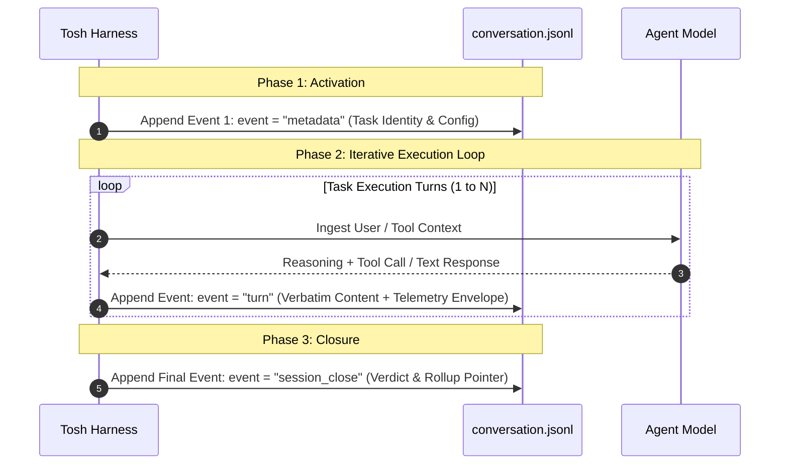
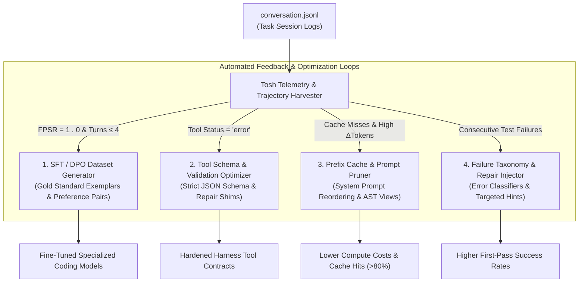
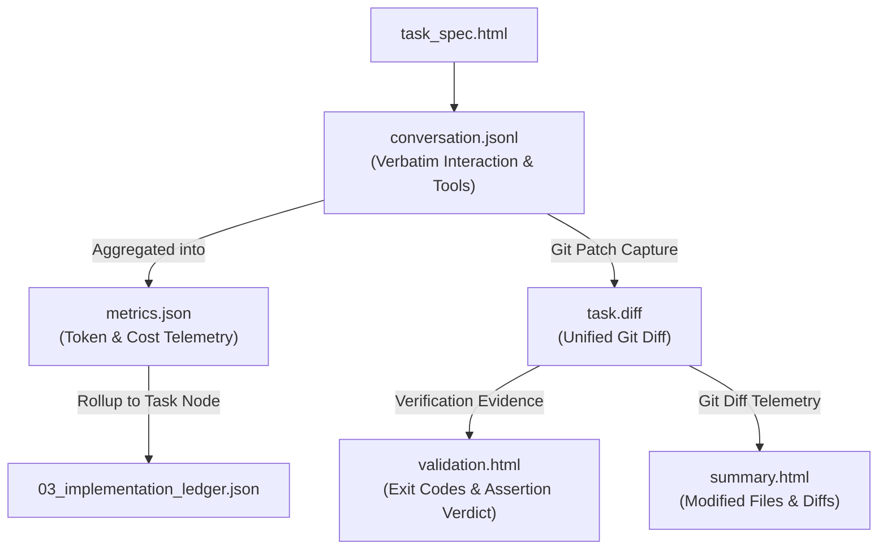

# Task Conversation Log Document Definition

The **Task Conversation Log Document** (`tasks/{task_id}/conversation.jsonl`) is the authoritative Tier 3 interaction
record in the **Token Optimized Software Harness (`tosh`)** work item lifecycle. It provides an immutable, append-only,
turn-by-turn log of the entire agentic LLM dialogue, system prompts, reasoning traces, tool executions, terminal command
streams, and verification feedback from atomic task activation through task closure.

In `tosh`, task conversation logs are not mere debugging dumps. They form the foundational telemetry data lake powering
**systemic feedback loops**, including:

- **Offline Model Fine-Tuning & Distillation (SFT/DPO):** Mining successful execution trajectories for high-performance
  coding models.
- **Harness Tool Ergonomics Optimization:** Pinpointing confusing tool argument schemas, high-failure bash invocations,
  and uninformative error outputs.
- **Prompt Engineering & Context Pruning:** Experimenting with context compression algorithms against historical session
  replays to maximize prompt-cache hit rates without degrading code correctness.

This document serves a dual purpose:

1. **Human & Platform Interface:** Enables developers and platform teams to inspect the full verbatim dialogue, audit
   agent decision-making, evaluate chain-of-thought reasoning, and investigate execution anomalies in a standardized,
   streamable format.
2. **Agent / Harness Interface:** Serves as the machine-parseable event stream from which the harness deterministically
   derives [
   `metrics.json`](task-conversation-metrics.md),
   validates boundary compliance, and feeds downstream dataset generators.

---

## Core Execution Paradigm: Applying the 4 Dimensions to Task Conversations

In `tosh`, the task conversation log mechanically records the agent's interaction across the four core planning
dimensions:

| Plan Dimension  | Human Engineer Focus                                                                  | AI Coding Tool Focus                                                                              | `tosh` Task Conversation Log Manifestation                                                                                                    |
|:----------------|:--------------------------------------------------------------------------------------|:--------------------------------------------------------------------------------------------------|:----------------------------------------------------------------------------------------------------------------------------------------------|
| **Context**     | Relies on tacit codebase conventions and tribal domain knowledge.                     | Needs explicit file paths, referenced patterns, and strict "do not touch" constraints.            | Logs exact system prompt states, injected file contents, and scratchpad memory for every turn, tracking context drift and cache invalidation. |
| **Granularity** | Focuses on high-level patterns and architecture; details left to implementation time. | Requires atomic, single-responsibility sub-tasks with deterministic inputs/outputs.               | Strictly isolates conversation turns to the bounded lifecycle of an individual task, eliminating multi-task chatter and context dilution.     |
| **Validation**  | Manual PR review, local exploratory debugging, automated CI.                          | Explicit terminal commands with deterministic output parsing (lint, test, build) after each step. | Captures verbatim terminal tool inputs, stdout, stderr, process return codes, and test assertions that prompted agent code adjustments.       |
| **Edge Cases**  | Usually caught through intuitive testing or code review cycles.                       | Must be exhaustively itemized upfront to prevent naive happy-path assumptions.                    | Records the exact dialogue steps where the agent encountered, reasoned through, and satisfied the task's itemized edge cases (`EC-###`).      |

---

## Table of Contents

1. [File Location & Organization Standard](#1-file-location--organization-standard)
2. [Event Stream Architecture & Hybrid Schema Standard](#2-event-stream-architecture--hybrid-schema-standard)
    - 2.1. [Session Metadata Header Event (`event: metadata`)](#21-session-metadata-header-event-event-metadata)
    - 2.2. [Turn Interaction Event (`event: turn`)](#22-turn-interaction-event-event-turn)
    - 2.3. [Session Closure Event (`event: session_close`)](#23-session-closure-event-event-session_close)
3. [Complete Multi-Turn JSONL Walkthrough Example](#3-complete-multi-turn-jsonl-walkthrough-example)
4. [Downstream Feedback Loop Engine & Optimization Use Cases](#4-downstream-feedback-loop-engine--optimization-use-cases)
    -
    4.1. [Supervised Fine-Tuning (SFT) & Direct Preference Optimization (DPO)](#41-supervised-fine-tuning-sft--direct-preference-optimization-dpo)
    - 4.2. [Tool Schema & Ergonomics Refinement](#42-tool-schema--ergonomics-refinement)
    - 4.3. [Deterministic Context Pruning & Prompt Cache Tuning](#43-deterministic-context-pruning--prompt-cache-tuning)
    - 4.4. [Automated Failure Taxonomy & Repair Shim Injection](#44-automated-failure-taxonomy--repair-shim-injection)
5. [Token Optimization, Analysis Patterns & CLI / jq Queries](#5-token-optimization-analysis-patterns--cli--jq-queries)
6. [Lineage, Rollup & Ledger Integration](#6-lineage-rollup--ledger-integration)
7. [Rules & Constraints](#7-rules--constraints)
8. [Revisions](#8-revisions)

---

## 1. File Location & Organization Standard

The task conversation log resides directly inside the isolated task directory alongside its paired specification,
validation, summary, and telemetry documents:

```text
.tosh/
└── work_items/
    └── {work-item-id}/
        └── phases/
            └── phase_{NN}_{phase_slug}/
                └── tasks/
                    └── task_{NNN}_{task_slug}/
                        ├── task_spec.html          # Scope, File Targets & Verification Commands
                        ├── validation.html         # Test Runs, Exit Codes & Formal Verdict
                        ├── task.diff               # Task File Diff 
                        ├── summary.html            # File Touchpoints & Git Diff Summary
                        ├── conversation.jsonl      # Authoritative Turn-by-Turn Interaction Log
                        └── metrics.json            # Derived Token, Trajectory & Cost Telemetry
```

- **File Name:** `conversation.jsonl` (also referenced as `task-conversation.jsonl` in conversational workflows).
- **Format:** JSON Lines (`application/x-ndjson`, UTF-8, exactly one JSON object per line).
- **Lifecycle Scope:** Initiated when the task is activated (`status: "in-progress"`) and closed when validation passes
  and `summary.html` is committed.
- **Paired Artifacts:**
    - Instructions: [`task_spec.html`](task-specification.md)
    - Verification Evidence: [`validation.html`](task-validation.md)
    - Diff: [task.diff](task-diff.md) 
    - Commit Summary: [`summary.html`](task-summary.md)
    - Aggregated Telemetry: [`metrics.json`](task-conversation-metrics.md)

---

## 2. Event Stream Architecture & Hybrid Schema Standard

`conversation.jsonl` implements a **comprehensive hybrid model**: it pairs verbatim LLM inputs and outputs (full
prompts, assistant reasoning, and raw tool payloads) with structured telemetry metadata envelopes (usage, prompt
caching, intermediate verification checks, and context statistics).

The event stream follows a 3-phase structural lifecycle:



---

### 2.1. Session Metadata Header Event (`event: metadata`)

Line 1 of every `conversation.jsonl` is a dedicated metadata event establishing session lineage, model configuration,
and parent work-item coordinates:

```json
{
  "event": "metadata",
  "docId": "WI-20260830T170936Z:P01:T001:CONV",
  "docType": "task-conversation-log",
  "schemaVersion": "1.0.0",
  "workItemId": "20260830T170936Z_user_auth_service",
  "phaseId": "phase_01_database_migration",
  "taskId": "task_001_create_tables",
  "sessionId": "sess-wi-20260830T170936Z-p01-t001",
  "agent": {
    "role": "backend-engineer",
    "model": "claude-3-5-sonnet",
    "temperature": 0.0,
    "harnessVersion": "tosh-v0.2.0"
  },
  "paths": {
    "spec": "phases/phase_01_database_migration/tasks/task_001_create_tables/task_spec.html",
    "validation": "phases/phase_01_database_migration/tasks/task_001_create_tables/validation.html",
    "diff": "phases/phase_01_database_migration/tasks/task_001_create_tables/task.diff",
    "summary": "phases/phase_01_database_migration/tasks/task_001_create_tables/summary.html",
    "metrics": "phases/phase_01_database_migration/tasks/task_001_create_tables/metrics.json"
  },
  "createdAt": "2026-08-30T17:10:00Z"
}
```

---

### 2.2. Turn Interaction Event (`event: turn`)

Every exchange between the harness, the LLM, and execution tools appends a `turn` event containing both the verbatim
conversational data and structured telemetry:

```json
{
  "event": "turn",
  "sessionId": "sess-wi-20260830T170936Z-p01-t001",
  "turnIndex": 3,
  "timestamp": "2026-08-30T17:12:15Z",
  "role": "assistant",
  "model": "claude-3-5-sonnet",
  "thinking": "The table definition in V1__init_auth.sql is missing a NOT NULL constraint on user_uuid. Modifying lines 12-18 surgically.",
  "content": [
    {
      "type": "text",
      "text": "I am updating `V1__init_auth.sql` to add the missing NOT NULL constraint and foreign key index."
    }
  ],
  "usage": {
    "prompt_tokens": 14250,
    "completion_tokens": 320,
    "cache_read_tokens": 10500,
    "cache_creation_tokens": 0
  },
  "tool_calls": [
    {
      "callId": "call_edit_001",
      "name": "replace_file_content",
      "args": {
        "TargetFile": "src/main/resources/db/migration/V1__init_auth.sql",
        "StartLine": 12,
        "EndLine": 18,
        "TargetContent": "  user_uuid VARCHAR(36),\n  username VARCHAR(64) UNIQUE,",
        "ReplacementContent": "  user_uuid VARCHAR(36) NOT NULL,\n  username VARCHAR(64) NOT NULL UNIQUE,"
      },
      "args_tokens": 110,
      "response": {
        "status": "success",
        "message": "Replaced content successfully in V1__init_auth.sql."
      },
      "response_tokens": 45,
      "status": "success",
      "is_retry": false,
      "tokens_referenced_in_turn": 45,
      "durationMs": 48
    }
  ],
  "verification": {
    "compiled": true,
    "tests_passed": 4,
    "tests_failed": 0,
    "lint_errors": 0,
    "exitCode": 0
  },
  "context_stats": {
    "injected_files_count": 3,
    "active_scratchpad_tokens": 480,
    "cumulative_prompt_tokens": 35600
  }
}
```

---

### 2.3. Session Closure Event (`event: session_close`)

The final entry records formal task termination, linking to the passing validation verdict and generated metrics:

```json
{
  "event": "session_close",
  "sessionId": "sess-wi-20260830T170936Z-p01-t001",
  "taskId": "task_001_create_tables",
  "status": "completed",
  "finalVerdict": "pass",
  "totalTurns": 4,
  "completedAt": "2026-08-30T17:14:22Z",
  "executionDurationMs": 262000,
  "metricsRollupRef": "phases/phase_01_database_migration/tasks/task_001_create_tables/metrics.json"
}
```

---

## 3. Complete Multi-Turn JSONL Walkthrough Example

The following annotated JSONL excerpt demonstrates a clean, 4-turn execution of an atomic database migration task:

```json
{
  "event": "metadata",
  "docId": "WI-20260830T170936Z:P01:T001:CONV",
  "docType": "task-conversation-log",
  "schemaVersion": "1.0.0",
  "workItemId": "20260830T170936Z_user_auth_service",
  "phaseId": "phase_01_database_migration",
  "taskId": "task_001_create_tables",
  "sessionId": "sess-wi-20260830T170936Z-p01-t001",
  "agent": {
    "role": "backend-engineer",
    "model": "claude-3-5-sonnet",
    "temperature": 0.0
  },
  "createdAt": "2026-08-30T17:10:00Z"
}
{
  "event": "turn",
  "turnIndex": 1,
  "timestamp": "2026-08-30T17:10:05Z",
  "role": "user",
  "content": [
    {
      "type": "text",
      "text": "Execute task task_001_create_tables according to phases/phase_01_database_migration/tasks/task_001_create_tables/task_spec.html"
    }
  ],
  "usage": {
    "prompt_tokens": 4200,
    "completion_tokens": 0,
    "cache_read_tokens": 0,
    "cache_creation_tokens": 4200
  },
  "tool_calls": [],
  "verification": null,
  "context_stats": {
    "injected_files_count": 1,
    "active_scratchpad_tokens": 0
  }
}
{
  "event": "turn",
  "turnIndex": 2,
  "timestamp": "2026-08-30T17:10:45Z",
  "role": "assistant",
  "thinking": "I must first inspect existing migration files to align with flyway naming conventions before writing V1__init_auth.sql.",
  "content": [
    {
      "type": "text",
      "text": "Reading existing migration directory to determine active flyway version prefix."
    }
  ],
  "usage": {
    "prompt_tokens": 4250,
    "completion_tokens": 120,
    "cache_read_tokens": 4200,
    "cache_creation_tokens": 0
  },
  "tool_calls": [
    {
      "callId": "call_view_01",
      "name": "view_file",
      "args": {
        "AbsolutePath": "/repo/src/main/resources/db/migration/README.md"
      },
      "args_tokens": 35,
      "response": {
        "status": "success",
        "content": "Flyway migrations follow V{version}__{description}.sql"
      },
      "response_tokens": 85,
      "status": "success",
      "is_retry": false
    }
  ],
  "verification": null,
  "context_stats": {
    "injected_files_count": 2,
    "active_scratchpad_tokens": 110
  }
}
{
  "event": "turn",
  "turnIndex": 3,
  "timestamp": "2026-08-30T17:11:50Z",
  "role": "assistant",
  "thinking": "Now authoring the initial Flyway migration script V1__init_auth.sql containing user_accounts and refresh_tokens tables as specified in task_spec.html.",
  "content": [
    {
      "type": "text",
      "text": "Authoring Flyway migration file `V1__init_auth.sql`."
    }
  ],
  "usage": {
    "prompt_tokens": 4480,
    "completion_tokens": 420,
    "cache_read_tokens": 4200,
    "cache_creation_tokens": 0
  },
  "tool_calls": [
    {
      "callId": "call_write_01",
      "name": "write_to_file",
      "args": {
        "TargetFile": "/repo/src/main/resources/db/migration/V1__init_auth.sql",
        "CodeContent": "CREATE TABLE user_accounts (\n  id UUID PRIMARY KEY,\n  username VARCHAR(64) NOT NULL UNIQUE\n);"
      },
      "args_tokens": 120,
      "response": {
        "status": "success",
        "message": "File created successfully."
      },
      "response_tokens": 30,
      "status": "success",
      "is_retry": false
    }
  ],
  "verification": {
    "compiled": true,
    "tests_passed": 0,
    "tests_failed": 0,
    "lint_errors": 0
  },
  "context_stats": {
    "injected_files_count": 3,
    "active_scratchpad_tokens": 220
  }
}
{
  "event": "turn",
  "turnIndex": 4,
  "timestamp": "2026-08-30T17:13:30Z",
  "role": "assistant",
  "thinking": "Executing deterministic terminal test command defined in task_spec.html: mvn test -Dtest=FlywayMigrationTest.",
  "content": [
    {
      "type": "text",
      "text": "Running validation test suite to confirm migration compiles and applies cleanly to test database."
    }
  ],
  "usage": {
    "prompt_tokens": 5100,
    "completion_tokens": 180,
    "cache_read_tokens": 4800,
    "cache_creation_tokens": 0
  },
  "tool_calls": [
    {
      "callId": "call_exec_01",
      "name": "run_command",
      "args": {
        "CommandLine": "mvn test -Dtest=FlywayMigrationTest"
      },
      "args_tokens": 45,
      "response": {
        "exitCode": 0,
        "stdout": "[INFO] Tests run: 4, Failures: 0, Errors: 0, Skipped: 0\n[INFO] BUILD SUCCESS"
      },
      "response_tokens": 95,
      "status": "success",
      "is_retry": false
    }
  ],
  "verification": {
    "compiled": true,
    "tests_passed": 4,
    "tests_failed": 0,
    "lint_errors": 0,
    "exitCode": 0
  },
  "context_stats": {
    "injected_files_count": 3,
    "active_scratchpad_tokens": 220
  }
}
{
  "event": "session_close",
  "sessionId": "sess-wi-20260830T170936Z-p01-t001",
  "taskId": "task_001_create_tables",
  "status": "completed",
  "finalVerdict": "pass",
  "totalTurns": 4,
  "completedAt": "2026-08-30T17:14:22Z",
  "executionDurationMs": 262000,
  "metricsRollupRef": "phases/phase_01_database_migration/tasks/task_001_create_tables/metrics.json"
}
```

---

## 4. Downstream Feedback Loop Engine & Optimization Use Cases

`conversation.jsonl` session logs provide the high-fidelity input signal for continuous engineering harness improvement:



### 4.1. Supervised Fine-Tuning (SFT) & Direct Preference Optimization (DPO)

- **Positive Trajectory Extraction:** Filter session logs where `verification.tests_passed > 0`,
  `verification.tests_failed == 0`, and `diffChurnRatio <= 1.1`. Transform these turns into OpenAI or Anthropic
  fine-tuning formats for domain-specific agent models.
- **Preference Pair Creation (DPO):** When an agent fails a turn (e.g., generates invalid syntax) and subsequently
  repairs it in turn $N+1$, the pair forms an ideal $(y_w, y_l)$ preference sample:
    - $y_w$ (Winning response): Surgical patch from turn $N+1$.
    - $y_l$ (Losing response): Broken/rejected patch from turn $N$.

### 4.2. Tool Schema & Ergonomics Refinement

- By running aggregations across all `tool_calls` where `status == "error"`, harness architects detect tools with
  brittle parameters (e.g., unescaped quotes in regexes, confusing line-number indexing).
- Enables harness developers to add client-side sanitizers, deterministic parameter coercers, or simpler macro tools
  before passing calls to the host operating system.

### 4.3. Deterministic Context Pruning & Prompt Cache Tuning

- Session logs record `cache_read_tokens` turn-by-turn. If `cache_read_tokens` drops to zero mid-session, the harness
  detects prefix cache invalidation (e.g., dynamic timestamps or randomized UUIDs injected into the system prompt).
- Offline replay harnesses simulate different pruning strategies (e.g., omitting unchanged files or using AST skeletons)
  against historical logs to measure potential token savings without breaking test verifications.

### 4.4. Automated Failure Taxonomy & Repair Shim Injection

- Clusters common compiler stderr signatures (e.g., TypeScript `TS2304: Cannot find name`, Rust
  `E0382: borrow of moved value`)
  and correlates them with the number of repair turns required to fix them.
- When high-repair-depth errors are identified, the harness automatically injects targeted few-shot repair prompts or
  pre-linting shims directly into future task execution templates.

---

## 5. Token Optimization, Analysis Patterns & CLI / jq Queries

Filter and query `.jsonl` files directly to extract operational signals without custom parsing infrastructure:

### 5.1. Extracting Full Verbatim Conversation for Fine-Tuning

```bash
# Extract user and assistant message pairs from passing sessions
jq -c '
  select(.event == "turn" and (.role == "user" or .role == "assistant"))
  | {role: .role, content: .content[0].text, thinking: .thinking}
' conversation.jsonl
```

### 5.2. Detecting Runaway Self-Correction Loops

```bash
# Isolate turns where test failures occurred
jq -c '
  select(.event == "turn" and .verification.tests_failed? > 0)
  | {turn: .turnIndex, failed: .verification.tests_failed, stdout: .tool_calls[0].response.stdout?}
' conversation.jsonl
```

### 5.3. Tracking Input Token Growth Turn-by-Turn

```bash
# Monitor context expansion rate across turns
jq -r '
  select(.event == "turn")
  | "Turn \(.turnIndex): PromptTokens = \(.usage.prompt_tokens), CacheRead = \(.usage.cache_read_tokens)"
' conversation.jsonl
```

### 5.4. Auditing Tool Execution Durations & Failure Rates

```bash
# Identify slow or failing tool invocations
jq -c '
  select(.event == "turn")
  | .tool_calls[]?
  | select(.status != "success" or .durationMs > 5000)
  | {tool: .name, status: .status, durationMs: .durationMs}
' conversation.jsonl
```

---

## 6. Lineage, Rollup & Ledger Integration

The task conversation log anchors the lowest level of execution evidence, feeding into summaries and state ledgers:



- **Ledger Pointer:** Registered in `03_implementation_ledger.json` under
  `phases[].tasks[].paths.conversation` (`phases/{phase}/tasks/{task}/conversation.jsonl`).
- **Telemetry Derivation:** [
  `metrics.json`](task-conversation-metrics.md)
  is deterministically compiled from `conversation.jsonl` upon task completion.
- **Audit Lineage:** Cited in `summary.html` and `validation.html` as the authoritative execution transcript.

---

## 7. Rules & Constraints

1. **Strict Append-Only Invariance:** Once a line is written to `conversation.jsonl`, it must never be overwritten,
   edited, or re-ordered.
2. **Deterministic Formatting:** Every line must parse as an independent, valid JSON object (`\n` separated).
3. **Secret & PII Sanitization:** The harness must deterministically redact known environment secrets, API tokens, and
   credentials before flushing turn events to disk.
4. **Verbatim Fidelity:** Model responses, chain-of-thought `<thinking>` blocks, and tool arguments must be preserved
   with full structural fidelity without lossy truncation.
5. **Mandatory Header & Closure:** A compliant conversation log must begin with an `event: "metadata"` line and conclude
   with an `event: "session_close"` line.

---

## 8. Revisions

| Date       | Version | Description                                                                                                                                                                                                     | Source                 |
|:-----------|:--------|:----------------------------------------------------------------------------------------------------------------------------------------------------------------------------------------------------------------|:-----------------------|
| 2026-09-06 | 1.1.0   | Added `task.diff` path to metadata event schema and updated execution lineage graph.                                                                                                                            | Feature Specification  |
| 2026-09-06 | 1.0.0   | Authoritative specification for Task Conversation Log (`tasks/{task_id}/conversation.jsonl`) defining the hybrid event stream schema, multi-turn walkthrough, and downstream feedback loop optimization engine. | Feature Specification  |
| 2026-08-30 | 0.1.0   | Initial baseline stub in metadata definition.                                                                                                                                                                   | Architecture Alignment |