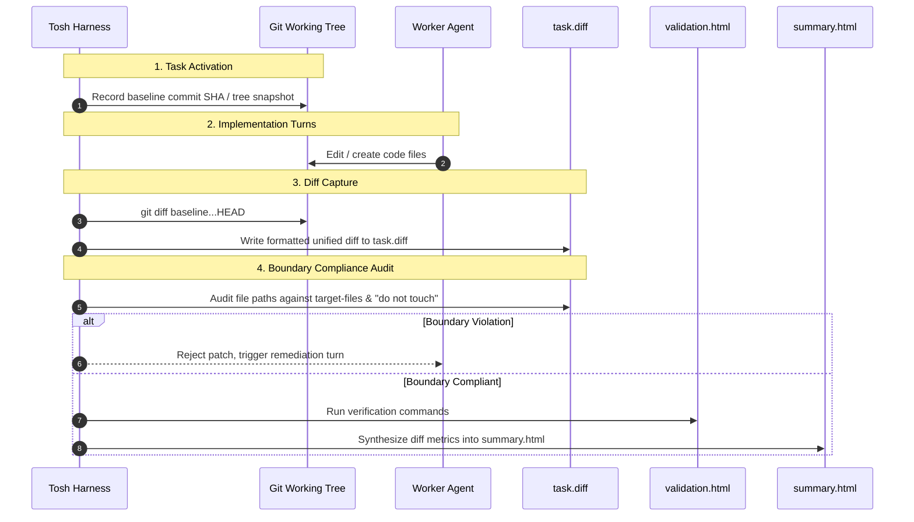
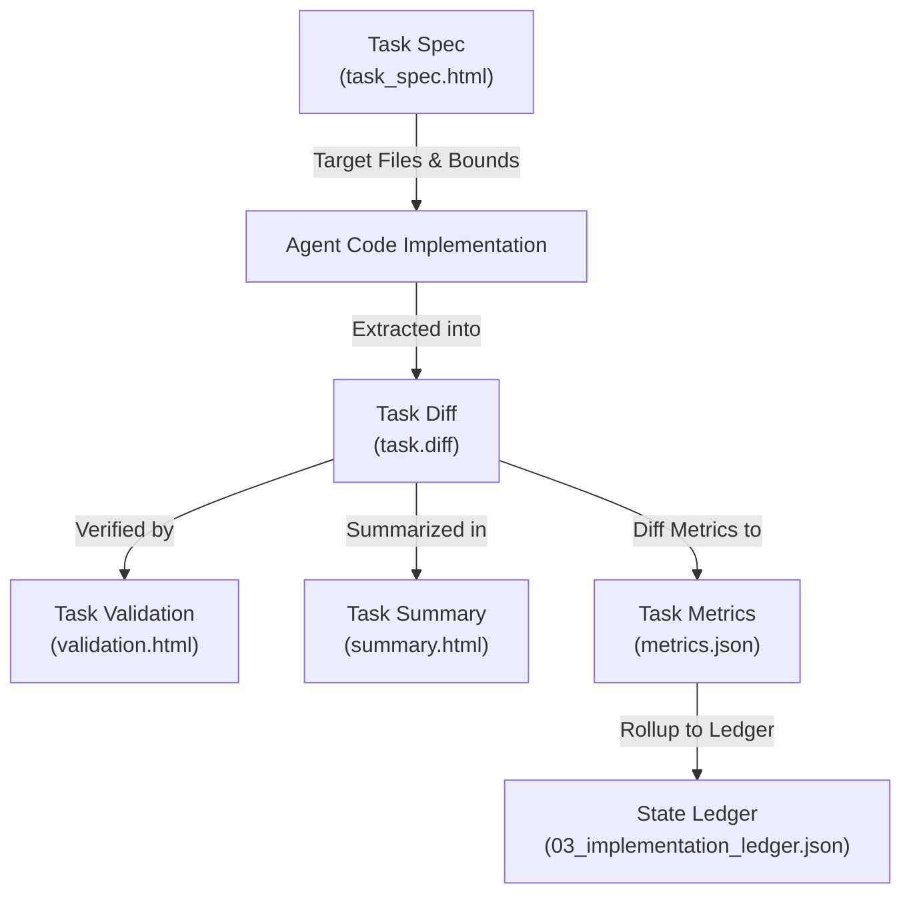

# Task Diff Document Definition

The Task Diff Document (`tasks/{task_id}/task.diff`) is the authoritative Tier 3 code patch artifact in the `tosh` work
item lifecycle. It records the deterministic, unified git diff of all source code modifications, file creations, and
deletions performed by an agent during atomic task execution.

While [`task_spec.html`](task-specification.md)
declares upfront modification instructions and [
`summary.html`](task-summary.md) renders
human-friendly M3 visual cards and summary metrics, `task.diff` is the pure, portable code patch file (`text/x-diff`,
UTF-8). It provides an immutable, machine-applicable code diff that directly bridges agent code generation with version
control systems, verification suites, and automated patch review pipelines.

This document serves a dual purpose:

1. **Harness & Tooling Interface (Deterministic Patch Portability):** Strict POSIX/Git Unified Diff format (`diff -u`,
   `git diff`) allowing automated harness components to validate patches (`git apply --check`), apply changes, revert
   changes, perform AST-level impact analysis, or supply context to code-review agents without parsing XHTML.
2. **Auditability & Boundary Verification:** Serves as an immutable artifact for verifying that only `target-files`
   declared in `task_spec.html` were altered and no files declared in the "do not touch" manifest were modified.
   Directly feeds into the `diffChurnRatio` calculations in [
   `metrics.json`](task-conversation-metrics.md).

---

## Core Planning Paradigm: Applying the 4 Dimensions to Task Diffs

In `tosh`, task diffs document and enforce execution compliance against the four foundational planning dimensions:

| Plan Dimension  | Human Engineer Focus                                                                  | AI Coding Tool Focus                                                                              | `tosh` Task Diff Manifestation                                                                                                                                      |
|:----------------|:--------------------------------------------------------------------------------------|:--------------------------------------------------------------------------------------------------|:--------------------------------------------------------------------------------------------------------------------------------------------------------------------|
| **Context**     | Relies on tacit codebase conventions and tribal domain knowledge.                     | Needs explicit file paths, referenced patterns, and strict "do not touch" constraints.            | Formally catalogs the exact diff hunks applied to the repository, proving zero unauthorized modifications to protected or "do not touch" files.                     |
| **Granularity** | Focuses on high-level patterns and architecture; details left to implementation time. | Requires atomic, single-responsibility sub-tasks with deterministic inputs/outputs.               | Isolates code changes strictly to the atomic task's bounded responsibility, ensuring surgical diff hunks without cross-task feature bleed or unrelated refactoring. |
| **Validation**  | Manual PR review, local exploratory debugging, automated CI.                          | Explicit terminal commands with deterministic output parsing (lint, test, build) after each step. | Provides a standardized patch file that can be dry-run verified via `git apply --check` before test execution recorded in `validation.html`.                        |
| **Edge Cases**  | Usually caught through intuitive testing or code review cycles.                       | Must be exhaustively itemized upfront to prevent naive happy-path assumptions.                    | Proves that all edge case requirements (`EC-###`) from the specification are concretely realized in the newly introduced code branches, guards, and assertions.     |

---

## Table of Contents

1. [File Location & Organization Standard](#1-file-location--organization-standard)
2. [Format Specification & Patch Architecture](#2-format-specification--patch-architecture)
    - 2.1. [Standard Git Unified Diff Format](#21-standard-git-unified-diff-format)
    - 2.2. [Patch Header & Chunk Anatomy](#22-patch-header--chunk-anatomy)
    - 2.3. [File Lifecycle Representations](#23-file-lifecycle-representations)
    - 2.4. [Hunk Context & Precision](#24-hunk-context--precision)
3. [Concrete Patch Example (`task.diff`)](#3-concrete-patch-example-taskdiff)
4. [Harness Lifecycle & Diff Generation Workflow](#4-harness-lifecycle--diff-generation-workflow)
    - 4.1. [Working Tree Baseline & Snapshotting](#41-working-tree-baseline--snapshotting)
    - 4.2. [Automated Diff Extraction](#42-automated-diff-extraction)
    - 4.3. [Boundary & "Do Not Touch" Compliance Auditing](#43-boundary--do-not-touch-compliance-auditing)
    - 4.4. [Patch Application, Staging, and Reversion](#44-patch-application-staging-and-reversion)
5. [Diff Churn, Surgical Patching & Token Optimization](#5-diff-churn-surgical-patching--token-optimization)
    - 5.1. [Calculating Diff Churn Ratio](#51-calculating-diff-churn-ratio)
    - 5.2. [Downstream Agent Ingestion Patterns](#52-downstream-agent-ingestion-patterns)
6. [Tooling, Analysis Patterns & Terminal Workflows](#6-tooling-analysis-patterns--terminal-workflows)
7. [Lineage, Rollup & Ledger Integration](#7-lineage-rollup--ledger-integration)
8. [Rules & Constraints](#8-rules--constraints)
9. [Revisions](#9-revisions)

---

## 1. File Location & Organization Standard

Each task diff artifact resides directly inside its isolated task directory, paired alongside its specification,
validation, summary, conversation log, and metrics:

```text
.tosh/
└── work_items/
    └── {work-item-id}/
        └── phases/
            └── phase_{NN}_{phase_slug}/
                └── tasks/
                    └── task_{NNN}_{task_slug}/
                        ├── task_spec.html          # Scope, File Targets & Verification Commands
                        ├── validation.html         # Test Runs, Exit Codes & Formal Verdict
                        ├── task.diff               # Authoritative Task Unified Git Diff
                        ├── summary.html            # File Touchpoints & Git Diff Summary
                        ├── conversation.jsonl      # Authoritative Turn-by-Turn Interaction Log
                        └── metrics.json            # Derived Token, Trajectory & Cost Telemetry
```

- **File Name:** `task.diff`
- **Format:** Unified Diff format (`text/x-diff`, UTF-8, POSIX line endings `\n`).
- **Lifecycle Scope:** Generated upon completion of task execution turns once code changes are made, preserved immutably
  when [`validation.html`](task-validation.md)
  passes, and committed alongside [
  `summary.html`](task-summary.md).
- **Paired Artifacts:**
    - Instructions: [`task_spec.html`](task-specification.md)
    - Verification Evidence: [`validation.html`](task-validation.md)
    - Commit Summary: [`summary.html`](task-summary.md)
    - Verbatim Transcript: [`conversation.jsonl`](task-conversation.md)
    - Aggregated Telemetry: [`metrics.json`](task-conversation-metrics.md)

---

## 2. Format Specification & Patch Architecture

### 2.1. Standard Git Unified Diff Format

`task.diff` strictly conforms to the standard Git Unified Diff format generated by `git diff` or `git diff -U3`. It
contains one or more file patches concatenated in alphabetical or execution order.

### 2.2. Patch Header & Chunk Anatomy

Each modified file within `task.diff` consists of:

1. **Git Diff Command Header:** `diff --git a/{path} b/{path}`
2. **Extended Index Header:** `index {old_hash}..{new_hash} {mode}` (or file mode indicator)
3. **File Path Markers:**
    - `--- a/{path}` (source version, or `--- /dev/null` for newly created files)
    - `+++ b/{path}` (target version, or `+++ /dev/null` for deleted files)
4. **Hunk Headers:** `@@ -{old_start},{old_len} +{new_start},{new_len} @@ {optional_context_heading}`
5. **Hunk Lines:**
    - ` ` (single space prefix): Context line unchanged
    - `-` (minus prefix): Deleted line
    - `+` (plus prefix): Added line

### 2.3. File Lifecycle Representations

- **New File Created:**
  ```diff
  diff --git a/src/main/resources/db/migration/V1__init_auth.sql b/src/main/resources/db/migration/V1__init_auth.sql
  new file mode 100644
  index 0000000..7a8b9c0
  --- /dev/null
  +++ b/src/main/resources/db/migration/V1__init_auth.sql
  @@ -0,0 +1,48 @@
  +CREATE TABLE user_accounts (
  ...
  ```
- **Existing File Modified:**
  ```diff
  diff --git a/src/test/resources/fixtures/auth_seed.sql b/src/test/resources/fixtures/auth_seed.sql
  index 1234567..89abcdef 100644
  --- a/src/test/resources/fixtures/auth_seed.sql
  +++ b/src/test/resources/fixtures/auth_seed.sql
  @@ -15,4 +15,6 @@ INSERT INTO roles (id, name) VALUES (1, 'ROLE_USER');
  +INSERT INTO roles (id, name) VALUES (2, 'ROLE_ADMIN');
  ```
- **File Deleted:**
  ```diff
  diff --git a/legacy/old_auth.sql b/legacy/old_auth.sql
  deleted file mode 100644
  index 456789a..0000000
  --- a/legacy/old_auth.sql
  +++ /dev/null
  @@ -1,15 +0,0 @@
  -...
  ```

### 2.4. Hunk Context & Precision

- **Context Window:** Default 3 lines of context (`-U3`) above and below changes.
- **Whitespace Cleanliness:** No trailing whitespace or inconsistent line ending mutations.
- **Surgical Bounds:** Edits must not touch unaffected methods, reformat unrelated blocks, or strip comments from
  adjacent code.

---

## 3. Concrete Patch Example (`task.diff`)

Below is a complete, realistic example of `task.diff` produced during `task_001_create_tables`:

```diff
diff --git a/src/main/resources/db/migration/V1__init_auth.sql b/src/main/resources/db/migration/V1__init_auth.sql
new file mode 100644
index 0000000..6b453e1
--- /dev/null
+++ b/src/main/resources/db/migration/V1__init_auth.sql
@@ -0,0 +1,28 @@
+-- V1__init_auth.sql: Initialize user accounts and authentication tables
+
+CREATE TABLE user_accounts (
+    id BIGSERIAL PRIMARY KEY,
+    username VARCHAR(64) NOT NULL UNIQUE,
+    email VARCHAR(255) NOT NULL UNIQUE,
+    password_hash VARCHAR(255) NOT NULL,
+    is_active BOOLEAN NOT NULL DEFAULT TRUE,
+    created_at TIMESTAMP WITH TIME ZONE NOT NULL DEFAULT CURRENT_TIMESTAMP,
+    updated_at TIMESTAMP WITH TIME ZONE NOT NULL DEFAULT CURRENT_TIMESTAMP
+);
+
+CREATE TABLE refresh_tokens (
+    id BIGSERIAL PRIMARY KEY,
+    user_id BIGINT NOT NULL REFERENCES user_accounts(id) ON DELETE CASCADE,
+    token VARCHAR(512) NOT NULL UNIQUE,
+    expires_at TIMESTAMP WITH TIME ZONE NOT NULL,
+    revoked BOOLEAN NOT NULL DEFAULT FALSE,
+    created_at TIMESTAMP WITH TIME ZONE NOT NULL DEFAULT CURRENT_TIMESTAMP
+);
+
+CREATE INDEX idx_user_accounts_username ON user_accounts(username);
+CREATE INDEX idx_user_accounts_email ON user_accounts(email);
+CREATE INDEX idx_refresh_tokens_token ON refresh_tokens(token);
+CREATE INDEX idx_refresh_tokens_user_id ON refresh_tokens(user_id);
diff --git a/src/test/resources/fixtures/auth_seed.sql b/src/test/resources/fixtures/auth_seed.sql
index a1b2c3d..e4f5a6b 100644
--- a/src/test/resources/fixtures/auth_seed.sql
+++ b/src/test/resources/fixtures/auth_seed.sql
@@ -10,3 +10,7 @@ INSERT INTO permissions (id, code) VALUES (1, 'READ_PRIVILEGES');
 INSERT INTO permissions (id, code) VALUES (2, 'WRITE_PRIVILEGES');
+
+-- Seed baseline test accounts for validation suite
+INSERT INTO user_accounts (id, username, email, password_hash)
+VALUES (1, 'testuser', 'testuser@example.com', '$argon2id$v=19$m=65536,t=3,p=4$dummy_hash');
```

---

## 4. Harness Lifecycle & Diff Generation Workflow

The `tosh` harness integrates `task.diff` generation throughout the task execution lifecycle:



### 4.1. Working Tree Baseline & Snapshotting

Before an agent begins execution of an atomic task:

1. The harness captures the clean git tree state or baseline commit SHA.
2. Any untracked files prior to task activation are indexed to avoid conflating environmental artifacts with task
   outputs.

### 4.2. Automated Diff Extraction

Upon completion of code modification turns, the harness extracts the working tree changes:

```bash
git diff --no-color -U3 > .tosh/work_items/{work_item_id}/phases/{phase_id}/tasks/{task_id}/task.diff
```

For new untracked files, the harness stages them intent-to-add (`git add -N`) before generating the diff so newly
created files appear with `new file mode 100644`.

### 4.3. Boundary & "Do Not Touch" Compliance Auditing

Once `task.diff` is written, the harness parses the file headers (`diff --git a/{path} b/{path}`) and cross-references
them against `task_spec.html`:

1. **Target Files Check:** Every path in `task.diff` must be declared in `<meta name="target-files">` of
   `task_spec.html`.
2. **"Do Not Touch" Enforcement:** If any hunk touches a protected file or frozen interface signature, the task is
   immediately flagged with a boundary violation (`boundaryViolationsCount > 0`).
3. **Execution Gate:** If boundary violations exist, validation fails and execution does not proceed to commit.

### 4.4. Patch Application, Staging, and Reversion

Because `task.diff` is a standard unified patch, it enables deterministic workspace manipulation:

- **Dry-Run Validation:**
  ```bash
  git apply --check task.diff
  ```
- **Patch Application in Clean Worktrees:**
  ```bash
  git apply --whitespace=nowarn task.diff
  ```
- **Reversion / Rollback on Failed Verification:**
  ```bash
  git apply --reverse task.diff
  ```

---

## 5. Diff Churn, Surgical Patching & Token Optimization

### 5.1. Calculating Diff Churn Ratio

`task.diff` provides the raw data required to calculate the `diffChurnRatio` metric recorded in [
`metrics.json`](task-conversation-metrics.md):

$$\text{Diff Churn Ratio} = \frac{\text{Generated Lines Changed}}{\text{Net Accepted Lines}} = \frac{\text{Lines Added} + \text{Lines Deleted}}{\text{Lines Added} - \text{Lines Deleted}}$$

- **Target Range:** $1.0$ to $1.25$.
- **High Churn Detection ($> 1.5$):** Indicates an agent engaged in full-file rewriting, reformatted unrelated code,
  deleted existing docstrings, or repeatedly overwrote its own edits.

### 5.2. Downstream Agent Ingestion Patterns

Instead of loading thousands of lines of full source files into LLM context during post-task review, verification, or
phase summary generation, downstream agents consume `task.diff`:

- **Context Reduction:** Feeding `task.diff` into an LLM uses 80%–95% fewer tokens than ingesting entire modified source
  files.
- **Focused Code Review:** Reviewer models inspect only the added (`+`) and removed (`-`) lines with bounded context.

---

## 6. Tooling, Analysis Patterns & Terminal Workflows

Common terminal commands and analysis patterns for working with `task.diff`:

### 6.1. Inspecting Diff Line Statistics

```bash
# Generate file touchpoint statistics from task.diff
diffstat -p1 task.diff
```

### 6.2. Verifying Patch Cleanliness

```bash
# Ensure patch applies cleanly with zero offset errors or whitespace warnings
git apply --check --whitespace=error task.diff
```

### 6.3. Extracting Modified File List from Patch

```bash
# Extract relative file paths touched by task.diff
awk '/^diff --git/ {print $3}' task.diff | sed 's|^a/||'
```

### 6.4. Filtering Changes to a Specific Subsystem

```bash
# Extract diff hunks targeting SQL migration files only
filterdiff -p1 -I 'src/main/resources/db/**' task.diff
```

---

## 7. Lineage, Rollup & Ledger Integration

`task.diff` is woven into the bi-directional traceability graph of the work item:



- **Ledger Pointer:** Registered in `03_implementation_ledger.json` under `phases[].tasks[].paths.diff`
  (`phases/{phase}/tasks/{task}/task.diff`).
- **Summary Citation:** Linked directly in `summary.html` via `<meta name="diff-ref" content="task.diff"/>` and rendered
  in the diff metrics section.
- **Conversation Session Context:** Referenced in `conversation.jsonl` under `paths.diff`.

---

## 8. Rules & Constraints

1. **Strict Unified Diff Compliance:** `task.diff` must be a valid, standard unified diff parseable by standard POSIX
   `patch` and `git apply`.
2. **UTF-8 with Unix Line Endings:** The patch must use UTF-8 encoding and `\n` (LF) line terminators.
3. **Strict Boundary Adherence:** The patch must touch only files declared in `target-files` in `task_spec.html`. Zero
   changes to "do not touch" paths are permitted.
4. **Immutability Post-Validation:** Once `validation.html` records `validation-verdict="pass"` and the task is marked
   `completed`, `task.diff` is sealed and must not be overwritten or modified.
5. **Zero Secret Leakage:** Harness sanitizers must verify that sensitive credentials, API keys, and environment tokens
   are scrubbed before `task.diff` is written to disk.

---

## 9. Revisions

| Date       | Version | Description                                                                                                                                                                     | Source                |
|:-----------|:--------|:--------------------------------------------------------------------------------------------------------------------------------------------------------------------------------|:----------------------|
| 2026-09-06 | 1.0.0   | Authoritative specification for Task Diff (`tasks/{task_id}/task.diff`) establishing unified diff standards, lifecycle generation, boundary compliance, and diff churn metrics. | Feature Specification |
