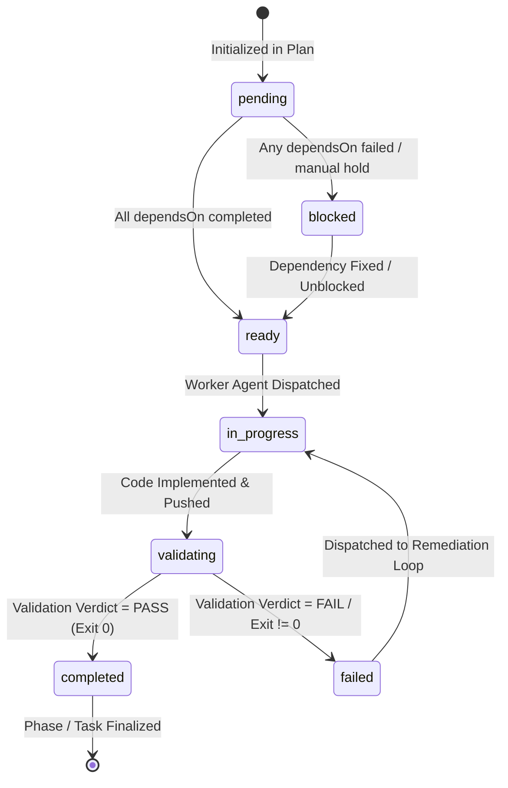
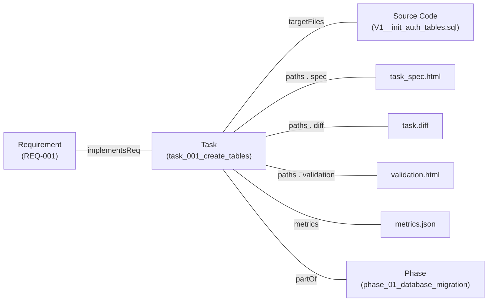
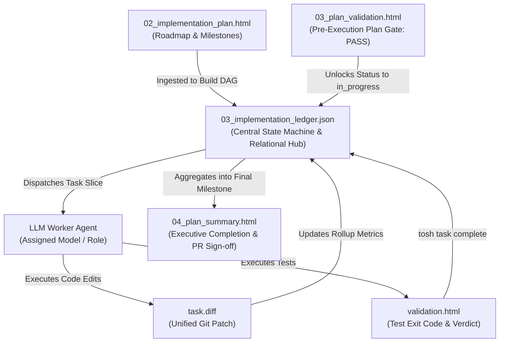

# Work Item Ledger Document Definition

The **Implementation Ledger** (`03_implementation_ledger.json`) is the authoritative Tier 1 state machine, dependency
Directed Acyclic Graph (DAG), and relational backbone of the **Token Optimized Software Harness (`tosh`)** work item
lifecycle. It unifies all phases, atomic tasks, requirement bindings, file touchpoints, artifact pointers, and token
metrics into a single, queryable source of truth.

The ledger eliminates filesystem crawling, guessing execution order, or parsing unstructured markdown to determine
project progress. It is the programmatic backbone utilized by orchestrators, human engineers, CI/CD pipelines, and most
critically, by LLM worker agents during task execution.

```
┌────────────────────────────────────────────────────────────────────────────────────────┐
│                              03_implementation_ledger.json                             │
│                                                                                        │
│   ┌─────────────────────┐    ┌─────────────────────┐    ┌──────────────────────────┐   │
│   │ 7-State Lifecycle   │    │ Dependency DAG &    │    │ Full Relational Graph    │   │
│   │ State Machine       │    │ Parallel Scheduling │    │ (Reqs, Files, Artifacts) │   │
│   └─────────────────────┘    └─────────────────────┘    └──────────────────────────┘   │
└───────────────────────────────────────────┬────────────────────────────────────────────┘
                                            │
               ┌────────────────────────────┴────────────────────────────┐
               ▼                                                         ▼
┌──────────────────────────────┐                         ┌───────────────────────────────┐
│  Harness / Orchestrator      │                         │  LLM Worker Agent Context     │
│  - Evaluates dependencies    │                         │  - Ingests focused task slice │
│  - Enforces parallel safety  │                         │  - Knows explicit target files│
│  - Dispatches workers        │                         │  - Receives exact inputs/deps │
└──────────────────────────────┘                         └───────────────────────────────┘
```

The ledger serves two essential operational roles:

1. **Orchestration & Ordering Engine:** Dictates the precise topological order of implementation, determines which tasks
   or phases can run concurrently in parallel, blocks unready tasks, and enforces execution gates (e.g. pre-execution
   plan validation, phase gating, task verification).
2. **LLM Context & Task Dispatch Backbone:** Provides worker LLMs with a lightweight, focused execution contract ("task
   slice") containing exact file boundaries, prerequisite outputs, and acceptance criteria without bloating the agent's
   context window with the entire repository or historical logs.

---

## Core Planning Paradigm: Applying the 4 Dimensions to the Ledger

In `tosh`, the implementation ledger mechanically enforces the four foundational planning dimensions across the entire
software execution lifecycle:

| Plan Dimension  | Human Engineer Focus                                                                  | AI Coding Tool Focus                                                                              | `tosh` Implementation Ledger Manifestation                                                                                                                                  |
|:----------------|:--------------------------------------------------------------------------------------|:--------------------------------------------------------------------------------------------------|:----------------------------------------------------------------------------------------------------------------------------------------------------------------------------|
| **Context**     | Relies on tacit codebase conventions and tribal memory.                               | Needs explicit file paths, referenced patterns, and strict "do not touch" constraints.            | Formally catalogs all declared `targetFiles`, imports prerequisite task artifact paths, and records repo-wide protected boundaries to guarantee disjoint worker workspaces. |
| **Granularity** | Focuses on high-level patterns and architecture; details left to implementation time. | Requires atomic, single-responsibility sub-tasks with deterministic inputs/outputs.               | Decomposes complex features into an indexed hierarchy: Work Item $\rightarrow$ Phases $\rightarrow$ Atomic Tasks, tracking exact index ordinals and dependency arrays.      |
| **Validation**  | Manual PR review, local exploratory debugging, automated CI.                          | Explicit terminal commands with deterministic output parsing (lint, test, build) after each step. | Binds every task and phase to its authoritative validation artifact, exit code, and verification verdict (`pass`, `fail`, `warn`), blocking state advancement on failure.   |
| **Edge Cases**  | Usually caught through intuitive testing or code review cycles.                       | Must be exhaustively itemized upfront to prevent naive happy-path assumptions.                    | Tracks failure states, retry budgets, remediation tasks, and explicit dependency failure propagation across the DAG.                                                        |

---

## Table of Contents

1. [File Location & Organization Standard](#1-file-location--organization-standard)
2. [Complete JSON Schema Definition](#2-complete-json-schema-definition)
3. [Canonical Implementation Ledger Example](#3-canonical-implementation-ledger-example)
4. [The 7-State Lifecycle State Machine](#4-the-7-state-lifecycle-state-machine)
    - 4.1. [State Definitions & Descriptions](#41-state-definitions--descriptions)
    - 4.2. [State Transition Matrix & Invariants](#42-state-transition-matrix--invariants)
    - 4.3. [Remediation & Defect State Handling](#43-remediation--defect-state-handling)
5. [Execution Ordering & DAG Scheduling Engine](#5-execution-ordering--dag-scheduling-engine)
    - 5.1. [Topological Dependency Resolution (`dependsOn`)](#51-topological-dependency-resolution-dependson)
    - 5.2. [Parallel vs. Sequential Execution Semantics (
      `executionMode`)](#52-parallel-vs-sequential-execution-semantics-executionmode)
    - 5.3. [Concurrency Safety & Disjoint File Set Invariant](#53-concurrency-safety--disjoint-file-set-invariant)
    - 5.4. [Parallel Execution Waves Calculation](#54-parallel-execution-waves-calculation)
6. [Relational Data Graph & Traceability](#6-relational-data-graph--traceability)
    - 6.1. [1:1 Requirement Traceability (`implementsReq`)](#61-11-requirement-traceability-implementsreq)
    - 6.2. [Code Modification Boundaries (`targetFiles`)](#62-code-modification-boundaries-targetfiles)
    - 6.3. [Artifact Pointer Registry](#63-artifact-pointer-registry)
7. [LLM Consumption & Context Slicing Protocol](#7-llm-consumption--context-slicing-protocol)
    - 7.1. [Why LLMs Must Never Ingest Monolithic Ledgers](#71-why-llms-must-never-ingest-monolithic-ledgers)
    - 7.2. [The Canonical Task Context Slice](#72-the-canonical-task-context-slice)
    - 7.3. [Harness-Mediated CLI Mutation Protocol](#73-harness-mediated-cli-mutation-protocol)
8. [Concurrency Control & Atomic Mutation Protocols](#8-concurrency-control--atomic-mutation-protocols)
9. [CLI & Query Tooling Patterns](#9-cli--query-tooling-patterns)
10. [Lineage, Rollup & Lifecycle Integration](#10-lineage-rollup--lifecycle-integration)
11. [Rules & Constraints](#11-rules--constraints)
12. [Revisions](#12-revisions)

---

## 1. File Location & Organization Standard

The implementation ledger resides at the root of the work item directory, acting as the relational anchor for all child
directories and artifacts:

```text
.tosh/
└── work_items/
    └── {YYYYMMDDTHHMMSSZ}_{work_item_slug}/
        ├── 00_requirements.html
        ├── 01_design_spec.html
        ├── 02_implementation_plan.html
        ├── 03_implementation_ledger.json       # Canonical Ledger & State Machine
        ├── 03_plan_validation.html
        ├── 04_plan_summary.html
        ├── 05_plan_conversation_summary.html
        ├── 06_plan_conversation_metrics.json
        └── phases/
            ├── phase_01_{phase_slug}/
            │   ├── phase_spec.html
            │   ├── phase_validation.html
            │   ├── phase_summary.html
            │   └── tasks/
            │       ├── task_001_{task_slug}/
            │       │   ├── task_spec.html
            │       │   ├── validation.html
            │       │   ├── task.diff
            │       │   ├── summary.html
            │       │   ├── conversation.jsonl
            │       │   └── metrics.json
            │       └── ...
            └── ...
```

- **File Name:** `03_implementation_ledger.json`
- **Format:** Strict JSON (UTF-8 encoded, schema-validated against JSON Schema 2020-12).
- **Mutator Authority:** Strictly written and mutated by the `tosh` harness/CLI or authorized orchestrator scripts.
  Worker LLMs do not directly edit this file; they interact with it via CLI commands or receive context slices.
- **Relational Anchor:** Binds all Tier 1, Tier 2, and Tier 3 artifacts into a deterministic dependency tree.

---

## 2. Complete JSON Schema Definition

The ledger schema strictly adheres to JSON Schema Draft 2020-12:

```json
{
  "$schema": "https://json-schema.org/draft/2020-12/schema",
  "$id": "https://tosh.dev/schemas/work-items/03_implementation_ledger.json",
  "title": "ToshImplementationLedger",
  "description": "Authoritative state machine, dependency DAG, and relational index for a tosh work item.",
  "type": "object",
  "required": [
    "$schema",
    "schemaVersion",
    "ledgerVersion",
    "workItemId",
    "status",
    "executionMode",
    "timestamps",
    "metricsRollup",
    "phases"
  ],
  "properties": {
    "$schema": {
      "type": "string",
      "format": "uri"
    },
    "schemaVersion": {
      "type": "string",
      "pattern": "^[0-9]+\\.[0-9]+\\.[0-9]+$"
    },
    "ledgerVersion": {
      "type": "integer",
      "minimum": 1,
      "description": "Monotonically increasing sequence number for optimistic concurrency control."
    },
    "workItemId": {
      "type": "string",
      "pattern": "^[0-9]{8}T[0-9]{6}Z_[a-z0-9_]+$"
    },
    "status": {
      "type": "string",
      "enum": [
        "pending",
        "ready",
        "in_progress",
        "validating",
        "completed",
        "failed",
        "blocked"
      ]
    },
    "executionMode": {
      "type": "string",
      "enum": [
        "sequential",
        "parallel"
      ],
      "description": "Defines whether phases with satisfied dependencies can execute concurrently."
    },
    "timestamps": {
      "type": "object",
      "required": [
        "createdAt",
        "updatedAt"
      ],
      "properties": {
        "createdAt": {
          "type": "string",
          "format": "date-time"
        },
        "startedAt": {
          "type": [
            "string",
            "null"
          ],
          "format": "date-time"
        },
        "updatedAt": {
          "type": "string",
          "format": "date-time"
        },
        "completedAt": {
          "type": [
            "string",
            "null"
          ],
          "format": "date-time"
        }
      }
    },
    "metricsRollup": {
      "type": "object",
      "required": [
        "totalPhases",
        "completedPhases",
        "totalTasks",
        "completedTasks",
        "failedTasks",
        "totalTokensUsed",
        "totalCostUsd",
        "totalDurationMs"
      ],
      "properties": {
        "totalPhases": {
          "type": "integer",
          "minimum": 1
        },
        "completedPhases": {
          "type": "integer",
          "minimum": 0
        },
        "totalTasks": {
          "type": "integer",
          "minimum": 1
        },
        "completedTasks": {
          "type": "integer",
          "minimum": 0
        },
        "failedTasks": {
          "type": "integer",
          "minimum": 0
        },
        "totalTokensUsed": {
          "type": "integer",
          "minimum": 0
        },
        "totalCostUsd": {
          "type": "number",
          "minimum": 0.0
        },
        "totalDurationMs": {
          "type": "integer",
          "minimum": 0
        }
      }
    },
    "phases": {
      "type": "array",
      "minItems": 1,
      "items": {
        "type": "object",
        "required": [
          "phaseId",
          "index",
          "title",
          "status",
          "executionMode",
          "dependsOn",
          "paths",
          "tasks"
        ],
        "properties": {
          "phaseId": {
            "type": "string",
            "pattern": "^phase_[0-9]{2}_[a-z0-9_]+$"
          },
          "index": {
            "type": "integer",
            "minimum": 1
          },
          "title": {
            "type": "string",
            "minLength": 1
          },
          "status": {
            "type": "string",
            "enum": [
              "pending",
              "ready",
              "in_progress",
              "validating",
              "completed",
              "failed",
              "blocked"
            ]
          },
          "executionMode": {
            "type": "string",
            "enum": [
              "sequential",
              "parallel"
            ],
            "description": "Defines whether tasks within this phase with satisfied dependencies can execute concurrently."
          },
          "dependsOn": {
            "type": "array",
            "items": {
              "type": "string"
            },
            "description": "Array of prerequisite phase IDs that must be completed before this phase unlocks."
          },
          "paths": {
            "type": "object",
            "required": [
              "spec",
              "validation",
              "summary"
            ],
            "properties": {
              "spec": {
                "type": "string"
              },
              "validation": {
                "type": "string"
              },
              "summary": {
                "type": "string"
              }
            }
          },
          "tasks": {
            "type": "array",
            "minItems": 1,
            "items": {
              "type": "object",
              "required": [
                "taskId",
                "index",
                "title",
                "category",
                "status",
                "dependsOn",
                "implementsReq",
                "targetFiles",
                "validationVerdict",
                "paths"
              ],
              "properties": {
                "taskId": {
                  "type": "string",
                  "pattern": "^task_[0-9]{3}_[a-z0-9_]+$"
                },
                "index": {
                  "type": "integer",
                  "minimum": 1
                },
                "title": {
                  "type": "string",
                  "minLength": 1
                },
                "category": {
                  "type": "string",
                  "enum": [
                    "database",
                    "backend",
                    "frontend",
                    "infrastructure",
                    "test",
                    "docs",
                    "refactor"
                  ]
                },
                "status": {
                  "type": "string",
                  "enum": [
                    "pending",
                    "ready",
                    "in_progress",
                    "validating",
                    "completed",
                    "failed",
                    "blocked"
                  ]
                },
                "dependsOn": {
                  "type": "array",
                  "items": {
                    "type": "string"
                  },
                  "description": "Array of prerequisite task IDs within this or earlier phases that must be completed."
                },
                "executionWave": {
                  "type": "integer",
                  "minimum": 1,
                  "description": "Calculated parallel execution wave based on dependency depth."
                },
                "implementsReq": {
                  "type": "array",
                  "items": {
                    "type": "string",
                    "pattern": "^REQ-[0-9]{3}$"
                  },
                  "minItems": 1,
                  "description": "Requirements verified by this task."
                },
                "targetFiles": {
                  "type": "array",
                  "items": {
                    "type": "string"
                  },
                  "minItems": 1,
                  "description": "Explicit source files modified or created by this task."
                },
                "assignedAgent": {
                  "type": "object",
                  "properties": {
                    "role": {
                      "type": "string"
                    },
                    "model": {
                      "type": "string"
                    },
                    "conversationId": {
                      "type": "string"
                    }
                  }
                },
                "validationVerdict": {
                  "type": "string",
                  "enum": [
                    "pending",
                    "pass",
                    "fail",
                    "warn"
                  ]
                },
                "paths": {
                  "type": "object",
                  "required": [
                    "spec",
                    "validation",
                    "diff",
                    "summary",
                    "conversation",
                    "metrics"
                  ],
                  "properties": {
                    "spec": {
                      "type": "string"
                    },
                    "validation": {
                      "type": "string"
                    },
                    "diff": {
                      "type": "string"
                    },
                    "summary": {
                      "type": "string"
                    },
                    "conversation": {
                      "type": "string"
                    },
                    "metrics": {
                      "type": "string"
                    }
                  }
                },
                "metrics": {
                  "type": "object",
                  "properties": {
                    "durationMs": {
                      "type": "integer",
                      "minimum": 0
                    },
                    "tokens": {
                      "type": "integer",
                      "minimum": 0
                    },
                    "costUsd": {
                      "type": "number",
                      "minimum": 0.0
                    },
                    "exitCode": {
                      "type": "integer"
                    }
                  }
                }
              }
            }
          }
        }
      }
    }
  }
}
```

---

## 3. Canonical Implementation Ledger Example

Below is a complete, production-grade example of `03_implementation_ledger.json` modeling a work item with both parallel
and sequential tasks and phases:

```json
{
  "$schema": "https://json-schema.org/draft/2020-12/schema",
  "schemaVersion": "1.0.0",
  "ledgerVersion": 14,
  "workItemId": "20260830T170936Z_user_auth_service",
  "status": "in_progress",
  "executionMode": "sequential",
  "timestamps": {
    "createdAt": "2026-08-30T17:40:00Z",
    "startedAt": "2026-08-30T17:45:00Z",
    "updatedAt": "2026-08-30T18:02:15Z",
    "completedAt": null
  },
  "metricsRollup": {
    "totalPhases": 3,
    "completedPhases": 1,
    "totalTasks": 6,
    "completedTasks": 3,
    "failedTasks": 0,
    "totalTokensUsed": 48210,
    "totalCostUsd": 0.1446,
    "totalDurationMs": 103400
  },
  "phases": [
    {
      "phaseId": "phase_01_database_migration",
      "index": 1,
      "title": "Database Schema & Migration",
      "status": "completed",
      "executionMode": "sequential",
      "dependsOn": [],
      "paths": {
        "spec": "phases/phase_01_database_migration/phase_spec.html",
        "validation": "phases/phase_01_database_migration/phase_validation.html",
        "summary": "phases/phase_01_database_migration/phase_summary.html"
      },
      "tasks": [
        {
          "taskId": "task_001_create_tables",
          "index": 1,
          "title": "Create User & Token Tables",
          "category": "database",
          "status": "completed",
          "executionWave": 1,
          "dependsOn": [],
          "implementsReq": [
            "REQ-001"
          ],
          "targetFiles": [
            "src/main/resources/db/migration/V1__init_auth_tables.sql"
          ],
          "assignedAgent": {
            "role": "agent:database-specialist",
            "model": "flash",
            "conversationId": "subagent-c7f8a12e"
          },
          "validationVerdict": "pass",
          "paths": {
            "spec": "phases/phase_01_database_migration/tasks/task_001_create_tables/task_spec.html",
            "validation": "phases/phase_01_database_migration/tasks/task_001_create_tables/validation.html",
            "diff": "phases/phase_01_database_migration/tasks/task_001_create_tables/task.diff",
            "summary": "phases/phase_01_database_migration/tasks/task_001_create_tables/summary.html",
            "conversation": "phases/phase_01_database_migration/tasks/task_001_create_tables/conversation.jsonl",
            "metrics": "phases/phase_01_database_migration/tasks/task_001_create_tables/metrics.json"
          },
          "metrics": {
            "durationMs": 26200,
            "tokens": 12400,
            "costUsd": 0.0372,
            "exitCode": 0
          }
        },
        {
          "taskId": "task_002_seed_roles",
          "index": 2,
          "title": "Seed Initial RBAC Roles",
          "category": "database",
          "status": "completed",
          "executionWave": 2,
          "dependsOn": [
            "task_001_create_tables"
          ],
          "implementsReq": [
            "REQ-001"
          ],
          "targetFiles": [
            "src/main/resources/db/migration/V2__seed_rbac_roles.sql"
          ],
          "assignedAgent": {
            "role": "agent:database-specialist",
            "model": "flash",
            "conversationId": "subagent-e4d2b910"
          },
          "validationVerdict": "pass",
          "paths": {
            "spec": "phases/phase_01_database_migration/tasks/task_002_seed_roles/task_spec.html",
            "validation": "phases/phase_01_database_migration/tasks/task_002_seed_roles/validation.html",
            "diff": "phases/phase_01_database_migration/tasks/task_002_seed_roles/task.diff",
            "summary": "phases/phase_01_database_migration/tasks/task_002_seed_roles/summary.html",
            "conversation": "phases/phase_01_database_migration/tasks/task_002_seed_roles/conversation.jsonl",
            "metrics": "phases/phase_01_database_migration/tasks/task_002_seed_roles/metrics.json"
          },
          "metrics": {
            "durationMs": 18400,
            "tokens": 8900,
            "costUsd": 0.0267,
            "exitCode": 0
          }
        }
      ]
    },
    {
      "phaseId": "phase_02_backend_services",
      "index": 2,
      "title": "Core Authentication Services",
      "status": "in_progress",
      "executionMode": "parallel",
      "dependsOn": [
        "phase_01_database_migration"
      ],
      "paths": {
        "spec": "phases/phase_02_backend_services/phase_spec.html",
        "validation": "phases/phase_02_backend_services/phase_validation.html",
        "summary": "phases/phase_02_backend_services/phase_summary.html"
      },
      "tasks": [
        {
          "taskId": "task_003_password_hasher",
          "index": 1,
          "title": "Implement Argon2id Password Hasher",
          "category": "backend",
          "status": "completed",
          "executionWave": 1,
          "dependsOn": [],
          "implementsReq": [
            "REQ-001"
          ],
          "targetFiles": [
            "src/main/java/com/example/auth/security/Argon2PasswordHasher.java",
            "src/test/java/com/example/auth/security/Argon2PasswordHasherTest.java"
          ],
          "assignedAgent": {
            "role": "agent:backend-worker",
            "model": "flash",
            "conversationId": "subagent-f1a94321"
          },
          "validationVerdict": "pass",
          "paths": {
            "spec": "phases/phase_02_backend_services/tasks/task_003_password_hasher/task_spec.html",
            "validation": "phases/phase_02_backend_services/tasks/task_003_password_hasher/validation.html",
            "diff": "phases/phase_02_backend_services/tasks/task_003_password_hasher/task.diff",
            "summary": "phases/phase_02_backend_services/tasks/task_003_password_hasher/summary.html",
            "conversation": "phases/phase_02_backend_services/tasks/task_003_password_hasher/conversation.jsonl",
            "metrics": "phases/phase_02_backend_services/tasks/task_003_password_hasher/metrics.json"
          },
          "metrics": {
            "durationMs": 22100,
            "tokens": 11200,
            "costUsd": 0.0336,
            "exitCode": 0
          }
        },
        {
          "taskId": "task_004_jwt_token_service",
          "index": 2,
          "title": "Implement JWT Token Provider",
          "category": "backend",
          "status": "in_progress",
          "executionWave": 1,
          "dependsOn": [],
          "implementsReq": [
            "REQ-002"
          ],
          "targetFiles": [
            "src/main/java/com/example/auth/security/JwtTokenProvider.java",
            "src/test/java/com/example/auth/security/JwtTokenProviderTest.java"
          ],
          "assignedAgent": {
            "role": "agent:backend-worker",
            "model": "flash",
            "conversationId": "subagent-b2c89012"
          },
          "validationVerdict": "pending",
          "paths": {
            "spec": "phases/phase_02_backend_services/tasks/task_004_jwt_token_service/task_spec.html",
            "validation": "phases/phase_02_backend_services/tasks/task_004_jwt_token_service/validation.html",
            "diff": "phases/phase_02_backend_services/tasks/task_004_jwt_token_service/task.diff",
            "summary": "phases/phase_02_backend_services/tasks/task_004_jwt_token_service/summary.html",
            "conversation": "phases/phase_02_backend_services/tasks/task_004_jwt_token_service/conversation.jsonl",
            "metrics": "phases/phase_02_backend_services/tasks/task_004_jwt_token_service/metrics.json"
          }
        },
        {
          "taskId": "task_005_user_auth_facade",
          "index": 3,
          "title": "Implement Authentication Service Facade",
          "category": "backend",
          "status": "pending",
          "executionWave": 2,
          "dependsOn": [
            "task_003_password_hasher",
            "task_004_jwt_token_service"
          ],
          "implementsReq": [
            "REQ-001",
            "REQ-002",
            "REQ-003"
          ],
          "targetFiles": [
            "src/main/java/com/example/auth/service/AuthService.java",
            "src/test/java/com/example/auth/service/AuthServiceTest.java"
          ],
          "validationVerdict": "pending",
          "paths": {
            "spec": "phases/phase_02_backend_services/tasks/task_005_user_auth_facade/task_spec.html",
            "validation": "phases/phase_02_backend_services/tasks/task_005_user_auth_facade/validation.html",
            "diff": "phases/phase_02_backend_services/tasks/task_005_user_auth_facade/task.diff",
            "summary": "phases/phase_02_backend_services/tasks/task_005_user_auth_facade/summary.html",
            "conversation": "phases/phase_02_backend_services/tasks/task_005_user_auth_facade/conversation.jsonl",
            "metrics": "phases/phase_02_backend_services/tasks/task_005_user_auth_facade/metrics.json"
          }
        }
      ]
    },
    {
      "phaseId": "phase_03_api_and_security",
      "index": 3,
      "title": "REST Endpoints & Security Filters",
      "status": "pending",
      "executionMode": "sequential",
      "dependsOn": [
        "phase_02_backend_services"
      ],
      "paths": {
        "spec": "phases/phase_03_api_and_security/phase_spec.html",
        "validation": "phases/phase_03_api_and_security/phase_validation.html",
        "summary": "phases/phase_03_api_and_security/phase_summary.html"
      },
      "tasks": [
        {
          "taskId": "task_006_auth_controller",
          "index": 1,
          "title": "Expose Login & Refresh REST Endpoints",
          "category": "backend",
          "status": "pending",
          "executionWave": 1,
          "dependsOn": [],
          "implementsReq": [
            "REQ-002",
            "REQ-003"
          ],
          "targetFiles": [
            "src/main/java/com/example/auth/controller/AuthController.java",
            "src/test/java/com/example/auth/controller/AuthControllerTest.java"
          ],
          "validationVerdict": "pending",
          "paths": {
            "spec": "phases/phase_03_api_and_security/tasks/task_006_auth_controller/task_spec.html",
            "validation": "phases/phase_03_api_and_security/tasks/task_006_auth_controller/validation.html",
            "diff": "phases/phase_03_api_and_security/tasks/task_006_auth_controller/task.diff",
            "summary": "phases/phase_03_api_and_security/tasks/task_006_auth_controller/summary.html",
            "conversation": "phases/phase_03_api_and_security/tasks/task_006_auth_controller/conversation.jsonl",
            "metrics": "phases/phase_03_api_and_security/tasks/task_006_auth_controller/metrics.json"
          }
        }
      ]
    }
  ]
}
```

---

## 4. The 7-State Lifecycle State Machine

Every task and phase in the ledger transitions through a deterministic, strictly enforced finite state machine.

### 4.1. State Definitions & Descriptions



| State         | Scope        | Description                                                   | Trigger Condition                                                                                            |
|:--------------|:-------------|:--------------------------------------------------------------|:-------------------------------------------------------------------------------------------------------------|
| `pending`     | Phase / Task | Registered in the ledger, awaiting prerequisite completion.   | Initial state upon plan creation, or when one or more items in `dependsOn` are not yet `completed`.          |
| `ready`       | Phase / Task | Eligible for immediate dispatch. All prerequisites satisfied. | Evaluated automatically when all IDs in `dependsOn` reach `status: "completed"`.                             |
| `in_progress` | Phase / Task | Actively assigned and currently executing.                    | An orchestrator or worker agent claims the task/phase (`tosh task start`).                                   |
| `validating`  | Phase / Task | Coding complete; automated verification suite running.        | Worker finishes file edits; validation suite (`validation.html` / `phase_validation.html`) begins execution. |
| `completed`   | Phase / Task | Fully verified and certified. Immutable milestone.            | Validation suite passes with exit code `0`, `validationVerdict: "pass"`, and unified diff recorded.          |
| `failed`      | Phase / Task | Verification failure or execution exception.                  | Verification command exits with non-zero code, assertion failure occurs, or boundary check fails.            |
| `blocked`     | Phase / Task | Execution halted due to upstream failure or manual hold.      | An upstream dependency reaches `failed`, or a human operator sets an administrative hold.                    |

### 4.2. State Transition Matrix & Invariants

| From State    | Allowed Target States    | Enforced Invariants & Guard Checks                                                                                                                                                                 |
|:--------------|:-------------------------|:---------------------------------------------------------------------------------------------------------------------------------------------------------------------------------------------------|
| `pending`     | `ready`, `blocked`       | Can only move to `ready` if $\forall d \in \text{dependsOn}: \text{status}(d) == \text{"completed"}$. Moves to `blocked` if $\exists d \in \text{dependsOn}: \text{status}(d) == \text{"failed"}$. |
| `ready`       | `in_progress`, `blocked` | Requires assigned worker agent and model configuration (`assignedAgent`).                                                                                                                          |
| `in_progress` | `validating`, `failed`   | File modifications must strictly belong to declared `targetFiles`.                                                                                                                                 |
| `validating`  | `completed`, `failed`    | `completed` strictly requires exit code `0` and `validationVerdict: "pass"`.                                                                                                                       |
| `failed`      | `in_progress`, `blocked` | Entering `in_progress` increments the task retry counter; dispatches structured remediation task.                                                                                                  |
| `blocked`     | `pending`, `ready`       | Unblocking re-evaluates dependency graph status.                                                                                                                                                   |
| `completed`   | *(terminal)*             | Completed tasks are immutable. Re-opening a completed task requires an explicit ledger revision event.                                                                                             |

### 4.3. Remediation & Defect State Handling

When a task transitions to `failed`:

1. The harness immediately halts downstream tasks dependent on this task, transitioning them to `blocked`.
2. The task failure details (exit code, failing assertions, stdout/stderr snippets from `validation.html`) are packaged
   into an automated remediation payload.
3. The harness resets the task from `failed` to `in_progress`, incrementing its retry counter.
4. If a task exceeds its maximum retry threshold (default: 3 retries), the task remains `failed`, the parent phase
   transitions to `failed`, and the harness escalates to human intervention.

---

## 5. Execution Ordering & DAG Scheduling Engine

The ledger is not a passive flat record; it is an active Directed Acyclic Graph (DAG) that dictates the precise
execution sequence for LLM agents.

### 5.1. Topological Dependency Resolution (`dependsOn`)

Every task and phase lists explicit IDs in its `dependsOn` array:

- **Phase-level `dependsOn`:** Cross-phase dependencies (e.g., Phase 2 depends on Phase 1). A phase cannot reach `ready`
  until all prerequisite phases are `completed`.
- **Task-level `dependsOn`:** Intra-phase or cross-phase task dependencies. A task cannot reach `ready` until all listed
  prerequisite tasks are `completed`.
- **DAG Invariant:** The graph formed by `dependsOn` links must be strictly acyclic. The `tosh` harness executes cycle
  detection (Tarjan's or Kahn's topological sort algorithm) during pre-execution plan validation. Any detected cycle
  aborts plan approval.

### 5.2. Parallel vs. Sequential Execution Semantics (`executionMode`)

The `executionMode` property governs concurrency at both the work item and phase levels:

```
Work Item (executionMode: "sequential")
│
├── Phase 1 (Database Migration) [executionMode: "sequential"]
│   ├── Task 001 (Create Tables)  ──────► Completed
│   └── Task 002 (Seed Roles)     ──────► Completed (dependsOn: Task 001)
│
└── Phase 2 (Backend Services) [executionMode: "parallel"]
    ├── Task 003 (Password Hasher) ──┐
    │                                ├──► EXECUTING CONCURRENTLY (Wave 1)
    ├── Task 004 (JWT Provider)    ──┘
    │
    └── Task 005 (Auth Facade)    ──────► WAITING (Wave 2, dependsOn: [Task 003, Task 004])
```

- **`executionMode: "sequential"`:**
    - Tasks (or phases) execute one at a time in strict index order.
    - An agent will never be dispatched to Task $N+1$ until Task $N$ is `completed`.
- **`executionMode: "parallel"`:**
    - All tasks (or phases) with an empty `dependsOn` array, or whose dependencies are 100% `completed`, immediately
      transition to `ready`.
    - The harness can spawn multiple concurrent subagents in parallel to execute ready tasks simultaneously.

### 5.3. Concurrency Safety & Disjoint File Set Invariant

To guarantee that parallel LLM worker agents never clobber each other's code modifications or produce merge conflicts,
the ledger enforces the **Disjoint File Set Invariant**:

$$\forall T_i, T_j \in \text{Ready Tasks} \text{ where } T_i \ne T_j: \quad \text{targetFiles} (T_i) \cap \text{targetFiles} (T_j) = \emptyset$$

- If two tasks declare overlapping `targetFiles`, the harness mechanically disallows parallel execution between them.
- The harness automatically forces a synthetic dependency ($T_j \text{ dependsOn } T_i$) or schedules them into separate
  sequential execution waves.

### 5.4. Parallel Execution Waves Calculation

The harness automatically partitions tasks within a phase into discrete **Execution Waves** based on dependency depth:

- **Wave 1:** All tasks where `dependsOn` is empty (`[]`). These run immediately in parallel upon phase activation.
- **Wave 2:** All tasks whose dependencies only point to Wave 1 tasks. These unlock concurrently the moment Wave 1 tasks
  complete.
- **Wave $N$:** Tasks dependent on Wave $N-1$ tasks.

The `executionWave` integer in the task schema allows human engineers and LLMs to immediately perceive the parallel
execution tier.

---

## 6. Relational Data Graph & Traceability

The ledger acts as the relational database connecting every dimension of the work item:



### 6.1. 1:1 Requirement Traceability (`implementsReq`)

Every task explicitly itemizes the requirement IDs from [
`00_requirements.html`](file:///C:/Users/samue/IdeaProjects/tosh/build-docs/docs/work-items/requirements.md) that it
fulfills:

- Enables instant calculation of requirement completion percentages.
- Allows orchestrators to identify which tasks must be re-run if a business requirement is updated.
- Enforces that no requirement from `00_requirements.html` is left orphaned without at least one implementing task.

### 6.2. Code Modification Boundaries (`targetFiles`)

Every task explicitly itemizes the repository file paths it is authorized to create or modify:

- **Sandbox Boundary:** Worker agents are provided this array in their system prompt as an invariant boundary.
- **Diff Verification:** When `task.diff` is generated, the harness validates that only files listed in `targetFiles`
  appear in the diff. Unannounced file modifications trigger validation failure.

### 6.3. Artifact Pointer Registry

Every phase and task maintains deterministic relative paths to all its associated Tier 2 and Tier 3 artifacts:

- `spec`: Target implementation specification (`task_spec.html`).
- `validation`: Verification command execution logs and assertions (`validation.html`).
- `diff`: Authoritative unified diff patch (`task.diff`).
- `summary`: Human-readable task delivery summary (`summary.html`).
- `conversation`: Verbatim LLM conversation transcript (`conversation.jsonl`).
- `metrics`: Fine-grained token counts, latencies, and API cost accounting (`metrics.json`).

---

## 7. LLM Consumption & Context Slicing Protocol

### 7.1. Why LLMs Must Never Ingest Monolithic Ledgers

In complex enterprise work items, `03_implementation_ledger.json` can span hundreds of tasks, thousands of file paths,
and extensive metrics, totaling 20,000+ tokens.

Dumping the entire monolithic ledger into a worker agent's context window causes severe problems:

1. **Context Window Exhaustion:** Wastes high-cost input tokens on irrelevant completed or future tasks.
2. **Attention Drift & Hallucination:** The agent may lose focus on its specific assignment and attempt to edit files
   belonging to other tasks.
3. **Prefix Cache Invalidation:** Constantly mutating metrics and timestamps at the ledger root invalidates the agent's
   prompt cache prefix.

### 7.2. The Canonical Task Context Slice

To maintain token optimization and strict agent discipline, the `tosh` harness extracts a compact, focused **Task
Context Slice** and injects only this slice into the worker LLM:

```json
{
  "workItemId": "20260830T170936Z_user_auth_service",
  "phase": {
    "phaseId": "phase_02_backend_services",
    "title": "Core Authentication Services",
    "executionMode": "parallel"
  },
  "activeTask": {
    "taskId": "task_003_password_hasher",
    "index": 1,
    "title": "Implement Argon2id Password Hasher",
    "category": "backend",
    "implementsReq": [
      "REQ-001"
    ],
    "targetFiles": [
      "src/main/java/com/example/auth/security/Argon2PasswordHasher.java",
      "src/test/java/com/example/auth/security/Argon2PasswordHasherTest.java"
    ],
    "paths": {
      "spec": "phases/phase_02_backend_services/tasks/task_003_password_hasher/task_spec.html",
      "validation": "phases/phase_02_backend_services/tasks/task_003_password_hasher/validation.html"
    }
  },
  "prerequisiteDeliverables": [
    {
      "taskId": "task_001_create_tables",
      "summary": "Created user and refresh token database tables in V1__init_auth_tables.sql",
      "diff": "phases/phase_01_database_migration/tasks/task_001_create_tables/task.diff"
    }
  ]
}
```

- **Token Footprint:** Typically under 400 tokens (vs. 20,000+ tokens for the full ledger).
- **Zero Ambiguity:** The worker agent knows precisely what file boundaries it owns, what requirements it must satisfy,
  and where to inspect prerequisite deliverables.

### 7.3. Harness-Mediated CLI Mutation Protocol

Worker LLMs must never edit `03_implementation_ledger.json` directly. All state transitions and telemetry recordings are
performed via atomic `tosh` CLI commands:

```bash
# Agent signals beginning of work
tosh task start --task-id task_003_password_hasher

# Agent signals verification execution
tosh task validate --task-id task_003_password_hasher

# Agent completes task, committing diff and metrics
tosh task complete --task-id task_003_password_hasher \
  --verdict pass \
  --exit-code 0 \
  --tokens 11200 \
  --duration-ms 22100
```

---

## 8. Concurrency Control & Atomic Mutation Protocols

When multiple worker agents execute tasks in parallel (under `executionMode: "parallel"`), concurrent updates to
`03_implementation_ledger.json` can cause race conditions and lost updates.

The ledger employs two defensive mechanisms:

1. **File-Level Advisory Locking:**
   The `tosh` CLI acquires an exclusive filesystem lock (`.tosh/work_items/{id}/.ledger.lock`) before reading and
   mutating `03_implementation_ledger.json`, releasing the lock immediately after flushing changes to disk.
2. **Optimistic Concurrency Control (`ledgerVersion`):**
    - The ledger carries an integer `ledgerVersion` that increments by `1` on every write.
    - Any process mutating the ledger must verify that `read_version + 1 == new_version`. If a mismatch occurs, the
      mutation retries with exponential backoff.

---

## 9. CLI & Query Tooling Patterns

Human operators, orchestrator agents, and CI pipelines query the ledger using standard CLI tools and `jq`:

### Querying the Next Ready Tasks for Dispatch

```bash
jq -r '.phases[].tasks[] | select(.status == "ready") | .taskId' 03_implementation_ledger.json
```

### Checking Overall Work Item Progress Percentage

```bash
jq -r '(.metricsRollup.completedTasks / .metricsRollup.totalTasks) * 100 | tostring + "%"' 03_implementation_ledger.json
```

### Retrieving All Target Files for Parallel Collision Detection

```bash
jq -r '.phases[].tasks[] | select(.status == "ready" or .status == "in_progress") | {taskId: .taskId, files: .targetFiles}' 03_implementation_ledger.json
```

### Extracting a Task Slice via the Tosh CLI

```bash
tosh ledger slice --task-id task_003_password_hasher --format json
```

### Auditing Total Financial Expenditure to Date

```bash
jq -r '.metricsRollup.totalCostUsd' 03_implementation_ledger.json
```

---

## 10. Lineage, Rollup & Lifecycle Integration

The ledger sits at the exact center of the `tosh` document ecosystem, linking pre-execution plans to real-time execution
and final delivery:



- **Plan Validation Gate:** The ledger's root `status` remains `pending` and all phases remain locked until [
  `03_plan_validation.html`](file:///C:/Users/samue/IdeaProjects/tosh/build-docs/docs/work-items/plan-validation.md)
  records `validation-verdict="pass"`.
- **Phase Validation Gate:** Phase $N+1$ cannot transition from `pending` to `ready` until Phase $N$'s [
  `phase_validation.html`](file:///C:/Users/samue/IdeaProjects/tosh/build-docs/docs/work-items/phase-validation.md)
  records `pass`.
- **Summary Generation:** When all tasks and phases reach `completed`, the ledger's aggregated metrics, task lists, and
  file registries are compiled into [
  `04_plan_summary.html`](file:///C:/Users/samue/IdeaProjects/tosh/build-docs/docs/work-items/plan-summary.md).

---

## 11. Rules & Constraints

1. **Strict Monotonic Progress:** A task cannot regress from `completed` to any earlier state unless an explicit
   rollback event is recorded in the revisions log.
2. **Immutable Dependency Invariant:** Dependencies listed in `dependsOn` cannot be modified while the work item is
   `in_progress`.
3. **Strict Disjoint Files for Parallelism:** Tasks marked for concurrent parallel execution must have mutually
   exclusive `targetFiles` arrays.
4. **Harness Mutator Exclusivity:** Worker LLMs must never edit `03_implementation_ledger.json` directly via
   file-writing tools. All modifications must be mediated via the `tosh` CLI or orchestrator APIs.
5. **JSON Schema Conformance:** Every write to `03_implementation_ledger.json` must validate against the JSON Schema
   Draft 2020-12 definition. Any malformed write is rejected.
6. **No Historical Deliberation:** The ledger contains only facts, states, paths, metrics, and relationships. Narrative
   debates belong strictly in [
   `05_plan_conversation_summary.html`](file:///C:/Users/samue/IdeaProjects/tosh/build-docs/docs/work-items/plan-conversation-summary.md).

---

## 12. Revisions

| Date       | Version | Description                                                                                                                                                                                                                                                                                   | Source                |
|:-----------|:--------|:----------------------------------------------------------------------------------------------------------------------------------------------------------------------------------------------------------------------------------------------------------------------------------------------|:----------------------|
| 2026-09-06 | 1.0.0   | Authoritative specification for Work Item Implementation Ledger (`03_implementation_ledger.json`) establishing the 7-state lifecycle, parallel/sequential execution modes, execution waves, DAG resolution, context slicing protocol, concurrency controls, and full relational graph schema. | Feature Specification |
| 2026-08-30 | 0.1.0   | Initial baseline JSON schema stub.                                                                                                                                                                                                                                                            | Initial Specification |