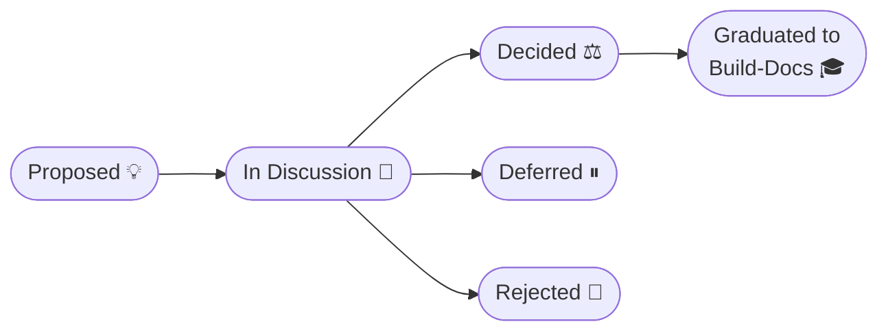

# Topics: Product Ideation & Architectural Decision Framework

Welcome to the `topics/` workspace for **`tosh` (Token Optimized Software Harness)**.

During the initial product ideation stage and throughout the project's evolution, this directory serves as the
collaborative incubator for brainstorming, architectural evaluation, trade-off analysis, and consensus-building across
the team.

Once discussion resolves and consensus is reached on a topic, its conclusions graduate into authoritative specifications
housed in the [`build-docs/`](../build-docs/README.md) directory.

---

## Table of Contents

1. [Role & Relationship: Topics vs. Build-Docs](#role--relationship-topics-vs-build-docs)
2. [Topic Lifecycle & State Machine](#topic-lifecycle--state-machine)
3. [File Naming & Organization Conventions](#file-naming--organization-conventions)
4. [Structured Topic Template](#structured-topic-template)
5. [Conversion Pipeline: From Topic to Build-Docs](#conversion-pipeline-from-topic-to-build-docs)
6. [Build-Docs Domain Mapping Guide](#build-docs-domain-mapping-guide)
7. [Topic Registry](topic-registry.md)

---

## Role & Relationship: Topics vs. Build-Docs

Understanding the boundary between `topics/` and [`build-docs/`](../build-docs/README.md) is critical for maintaining
documentation hygiene:

| Dimension            | `topics/` (Ideation & Deliberation)                                                                                 | `build-docs/` (Canonical Specification)                                                  |
|:---------------------|:--------------------------------------------------------------------------------------------------------------------|:-----------------------------------------------------------------------------------------|
| **Purpose**          | Explore ideas, debate alternatives, evaluate token economics, capture consensus.                                    | Authoritative blueprint and specification for constructing `tosh`.                       |
| **State**            | Divergent, exploratory, collaborative.                                                                              | Convergent, normative, prescriptive.                                                     |
| **History & Debate** | Preserves discussions, rejected alternatives, trade-offs, and "why" decisions were made.                            | **Void of past decisions or alternatives**. Represents only current-state design.        |
| **Lifecycle**        | Moves through states (`PROPOSED` &rarr; `GRADUATED` / `REJECTED`). Once graduated, acts as an immutable ADR record. | Living documents maintained throughout software development; updated only via revisions. |
| **Primary Audience** | Product designers, architects, engineers in ideation.                                                               | Implementers, agentic LLMs executing tasks, automated code generators.                   |

> [!IMPORTANT]
> As defined in [`build-docs/README.md`](../build-docs/README.md), all documents in `build-docs/` must represent the
**current state of the design** and be **void of references to past decisions**. The `topics/` directory is where the
debate and history live permanently.

---

## Topic Lifecycle & State Machine

Every topic moves through a structured progression from inception to graduation:



### State Definitions

1. **`PROPOSED`**: The topic has been introduced with a problem statement, context, and initial motivation. Open for
   initial team review.
2. **`IN_DISCUSSION`**: Active discussion underway. Options, technical spikes, token-efficiency models, and
   architectural implications are being weighed.
3. **`DECIDED`**: The team has reached consensus or an architectural decision. The chosen solution and rationale are
   documented; open questions are resolved.
4. **`GRADUATED`**: The decision has been transcribed into canonical specifications inside [
   `build-docs/`](../build-docs/README.md). The topic document is updated with cross-references and locked.
5. **`DEFERRED`**: Valid topic, but postponed to a subsequent milestone or post-MVP phase.
6. **`REJECTED`**: Explored and rejected. The rationale is preserved for future reference to avoid re-litigating settled
   decisions.

---

## File Naming & Organization Conventions

- **File Path**: `topics/TOPIC-###-<kebab-case-slug>.md`
- **Topic Numbering**: Three-digit sequential numbering padded with zeros (`001`, `002`, `003`, ...).
- **Template**: Copy from [`template.md`](template.md).

### Examples:

- `topics/TOPIC-001-cli-command-tree-and-dispatch.md`
- `topics/TOPIC-002-xhtml-schema-tag-structure.md`
- `topics/TOPIC-003-mcp-vs-rest-service-layering.md`
- `topics/TOPIC-004-static-ui-viewer-technology.md`

---

## Structured Topic Template

Every topic document must follow this standardized format to ensure thorough analysis and streamlined conversion into
`build-docs/`:

```markdown
# TOPIC-###: <Topic Title>

| Metadata               | Value                                                                                           |
|:-----------------------|:------------------------------------------------------------------------------------------------|
| **Topic ID**           | `TOPIC-###`                                                                                     |
| **Status**             | `PROPOSED` \| `IN_DISCUSSION` \| `DECIDED` \| `GRADUATED` \| `DEFERRED` \| `REJECTED`           |
| **Facilitator**        | @username                                                                                       |
| **Participants**       | @username1, @username2                                                                          |
| **Created Date**       | YYYY-MM-DD                                                                                      |
| **Last Updated**       | YYYY-MM-DD                                                                                      |
| **Target Build-Docs**  | `build-docs/...`                                                                                |
| **Impacted Domains**   | `CLI` \| `MCP` \| `REST API` \| `Static UI` \| `Work Items` \| `Wiki` \| `OpenAPI` \| `SDK/API` |

---

## 1. Problem Statement & Context

- **Problem**: What problem are we solving? What pain point or capability does this address?
- **Context**: Why are we addressing this during the product ideation stage? What triggered this topic?

## 2. Goals & Non-Goals

- **Goals**: What must this topic accomplish?
- **Non-Goals**: What is deliberately out of scope for this topic?

## 3. Token Optimization & Performance Impact

*Because `tosh` is built for token conservation and speed, how does this topic align with those core tenets?*

- Estimated impact on LLM token consumption (prompt size, response overhead, context window usage).
- Speed / local processing benefits (e.g., local XHTML parsing vs. remote cloud calls).

## 4. Proposed Options & Trade-Off Analysis

### Option A: <Name>

- **Description**: Summary of the approach.
- **Pros**:
    - Point 1
    - Point 2
- **Cons**:
    - Point 1
    - Point 2
- **Token / Latency Cost**: Evaluation of overhead.

### Option B: <Name>

- **Description**: Summary of the approach.
- **Pros**: ...
- **Cons**: ...
- **Token / Latency Cost**: ...

## 5. Open Questions & Spikes

- [ ] Question 1 (Owner: @user)
- [ ] Question 2 (Owner: @user)

## 6. Discussion Log

*Record chronological summaries of key meetings, comments, or agent debates.*

- **YYYY-MM-DD**: Summary of discussion, disagreements, insights.

## 7. Decision & Rationale

*(Filled when transitioning to `DECIDED`)*

- **Chosen Option**: Option A / Hybrid / etc.
- **Rationale**: Core technical and economic reasons for this decision.
- **Key Trade-offs Accepted**: What concessions were accepted in exchange for this solution.

## 8. Build-Docs Conversion Plan

*(Filled when preparing to graduate into `build-docs/`)*

- [ ] **Target Files**:
    - `build-docs/path/to/target.md` (Update / Create)
- [ ] **Content to Author**:
    - [ ] Canonical specification / current-state design.
    - [ ] Architecture diagrams / schema definitions.
    - [ ] Revision history entry added.
- [ ] **Hygiene Check**:
    - [ ] Verified that past decisions, alternative comparisons, and debate have been excluded from `build-docs`.
    - [ ] Document represents only the pure, prescriptive current state.
- [ ] **Graduation Sign-Off**: Facilitator confirmed and linked to merged build-doc (s).
```

---

## Conversion Pipeline: From Topic to Build-Docs

When a topic reaches consensus (`DECIDED`), follow this step-by-step pipeline to convert and graduate it into [
`build-docs/`](../build-docs/README.md):

```
┌─────────────────────────────────────────────────────────────┐
│ 1. Deliberation in topics/                                  │
│    - Status: IN_DISCUSSION -> DECIDED                       │
│    - Rationale, trade-offs, and decisions finalized         │
└──────────────────────────────┬──────────────────────────────┘
                               │
                               ▼
┌─────────────────────────────────────────────────────────────┐
│ 2. Specification Drafting in build-docs/                    │
│    - Translate outcome into prescriptive technical specs    │
│    - Comply with rules: void of past decisions/debate       │
│    - Add revision log entry at bottom of build-doc          │
└──────────────────────────────┬──────────────────────────────┘
                               │
                               ▼
┌─────────────────────────────────────────────────────────────┐
│ 3. Graduation & Linkage                                     │
│    - Update topic Status to: GRADUATED                      │
│    - Add pointer in topic to target build-doc(s)            │
│    - Update Topic Registry in topics/topic-registry.md      │
└─────────────────────────────────────────────────────────────┘
```

### Conversion Rules & Quality Standards

1. **Purge Deliberative Language**: Do **not** copy statements like *"We decided on SQLite over Postgres because..."*
   into `build-docs/`. Instead write: *"The persistence layer uses SQLite with the following schema..."*. The historical
   reasoning remains preserved in the topic.
2. **Prescriptive Completeness**: Ensure the build-doc contains concrete technical specs (interfaces, commands, schemas,
   metadata tags, directory structures, data flows).
3. **Traceability**: In the build-doc's `## Revisions` section at the bottom, reference the originating topic ID:
   ```markdown
   ## Revisions
   | Date         | Version  | Description            | Source Topic      |
   |:-------------|:-------- |:---------------------- |:----------------- |
   |  2026-09-05  | 0.1.0    | Initial specification  | [TOPIC-001](../topics/TOPIC-001-cli-architecture.md)  |
   ```
4. **Close the Loop**: Update the topic file's status to `GRADUATED` and link to the generated build-docs.

---

## Build-Docs Domain Mapping Guide

Refer to this directory map when determining where topic outcomes belong within [
`build-docs/`](../build-docs/README.md):

| Domain               | Target Path in `build-docs/`                                             | Scope & Content Type                                                                 |
|:---------------------|:-------------------------------------------------------------------------|:-------------------------------------------------------------------------------------|
| **Overview & Rules** | [`build-docs/README.md`](../build-docs/README.md)                        | Core build-doc rules, high-level project vision.                                     |
| **CLI Binary**       | [`build-docs/cli/`](../build-docs/cli/README.md)                         | CLI command tree, flags, parsing engine, local document querying, checklist manager. |
| **MCP Server**       | [`build-docs/mcp/`](../build-docs/mcp/README.md)                         | Model Context Protocol tools, resources, prompts, agent integration.                 |
| **REST API**         | [`build-docs/rest-api/`](../build-docs/rest-api/README.md)               | Local daemon endpoints, OpenAPI schema generation, 3rd party integration.            |
| **Static UI**        | [`build-docs/static-ui/`](../build-docs/static-ui/README.md)             | HTML/CSS/JS templates, Material 3 components, single-pane documentation visualizer.  |
| **Work Items**       | [`build-docs/docs/work-items/`](../build-docs/docs/work-items/README.md) | XHTML metadata standards, requirements, designs, phase/task specs, ledger formats.   |
| **Project Wiki**     | [`build-docs/docs/wiki/`](../build-docs/docs/wiki/README.md)             | Coding guidelines, setup guides, architectural standards, repository conventions.    |
| **SDK & API**        | [`build-docs/docs/sdk-api/`](../build-docs/docs/sdk-api/README.md)       | Internal and client library interfaces, package structures.                          |
| **OpenAPI**          | [`build-docs/docs/open-api/`](../build-docs/docs/open-api/README.md)     | Upstream and downstream service API specs.                                           |
| **Reports**          | [`build-docs/docs/report/`](../build-docs/docs/report/README.md)         | Telemetry, token burn-down, audit, and benchmark reporting models.                   |

---

## Topic Registry

All product ideation topics and architectural decisions are centrally tracked in the [Topic Registry](topic-registry.md). Consult that document to view active, decided, and graduated topics or to register a new one.
